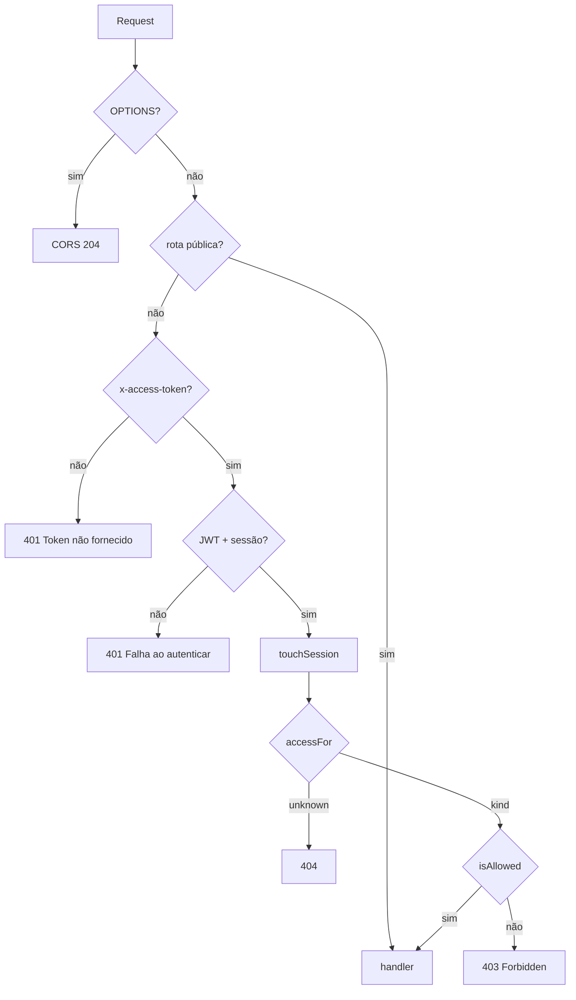

# Tutorial — ACL (quem pode chamar o quê)

ACL = *access control list*: depois do JWT válido, o Gateway decide se **este perfil** pode usar **este método + path**. Os MSs repetem a regra com `X-User-CPF` / `X-User-Tipo` (posse fina). HATEOAS só esconde botão; não é autorização.

JWT: [00-JWT.md](./00-JWT.md). Links: [00-HATEOAS.md](./00-HATEOAS.md). Pipeline: [00-GATEWAY.md](./00-GATEWAY.md).

---

## 0. Por que duas camadas

| Camada | Pergunta | Se falhar |
|---|---|---|
| Gateway [`acl.ts`](../backend/gateway/src/auth/acl.ts) | Este **tipo** pode esta **rota pública**? | 403 ou 404 **sem** acordar o MS |
| MS `Identity.kt` | Este **CPF** é dono / gerente desta **conta/cadastro**? | 403 do Kotlin, espelhado pelo proxy |
| Handler extra | Casos pontuais (R15 auto-remoção, dono do job) | 403 síncrono |

O Gateway não sabe se a conta `0950` pertence ao CPF do token: o número não está no JWT. Quem sabe é o read model do MS Conta.

---

## 1. Onde está o código

| Peça | Arquivo |
|---|---|
| Tabela método+path → `kind` | [`auth/acl.ts`](../backend/gateway/src/auth/acl.ts) |
| Chamada no hook | [`auth/hook.ts`](../backend/gateway/src/auth/hook.ts) (depois de sessão Redis) |
| Cliente | [`cliente/.../Identity.kt`](../backend/services/cliente/src/main/kotlin/br/ufpr/dac/bantads/cliente/web/Identity.kt) |
| Gerente | [`gerente/.../Identity.kt`](../backend/services/gerente/src/main/kotlin/br/ufpr/dac/bantads/gerente/web/Identity.kt) |
| Conta | [`conta/.../Identity.kt`](../backend/services/conta/src/main/kotlin/br/ufpr/dac/bantads/conta/web/Identity.kt) |
| R15 “não se delete” | [`routes/remover-gerente.ts`](../backend/gateway/src/routes/remover-gerente.ts) |
| Job só do dono | [`routes/jobs.ts`](../backend/gateway/src/routes/jobs.ts) `isJobOwner` |

---

## 2. Os `kind` do Gateway

```3:9:backend/gateway/src/auth/acl.ts
export type Access =
  | { kind: 'public' }
  | { kind: 'auth' }
  | { kind: 'gerente' }
  | { kind: 'cliente' }
  | { kind: 'gerenteOrSelf' };
```

[`isAllowed`](../backend/gateway/src/auth/acl.ts):

| `kind` | Quem passa |
|---|---|
| `public` | ninguém precisa de token (o hook nem chega aqui) |
| `auth` | qualquer JWT com sessão (logout, jobs) |
| `gerente` | `user.tipo === GERENTE` |
| `cliente` | `user.tipo === CLIENTE` |
| `gerenteOrSelf` | gerente **ou** cliente cujo CPF está no path `/clientes/{cpf}` |
| `unknown` | path fora do contrato → **404** (não 403: não vazar que a rota “existe para outro perfil”) |

`selfCpfFromPath` só extrai CPF de `/clientes/{11 dígitos}` e `/clientes/{cpf}/conta`. Em `GET /contas/1291` o `kind` é `gerenteOrSelf` mas **não há CPF no path**: qualquer `CLIENTE` autenticado passa no Gateway. A posse (“1291 é a sua conta?”) é o MS (`requireGerenteOrOwner` / `requireClienteOwner`). Extrato e depósito são `kind: cliente`: gerente toma 403 **já no Gateway**.

---

## 3. Mapa de rotas

Rotas **públicas** (método tem de bater; `GET /login` não é público):

```11:16:backend/gateway/src/auth/acl.ts
const PUBLIC = [
  { method: 'GET', path: '/health' },
  { method: 'POST', path: '/login' },
  { method: 'POST', path: '/reboot' },
  { method: 'POST', path: '/solicitacoes' },
];
```

| Método e path | `kind` | Transação |
|---|---|---|
| `POST /logout`, `/jobs/...` | `auth` | R2B, jobs |
| `GET /clientes`, `/solicitacoes...`, `/gerentes...`, `/relatorios...` | `gerente` | R8, R11–R16, CAD-02 |
| `GET /clientes/{cpf}`, `.../conta`, `GET /contas/{n}` | `gerenteOrSelf` | CAD-01, R3 |
| `POST .../deposito\|saque\|transferencia`, `GET .../extrato` | `cliente` | R4–R7 |
| Qualquer outra combinação | `unknown` → 404 | — |

`POST /solicitacoes/{cpf}/aprovacao` cai em `path.startsWith('/solicitacoes/')` → só gerente. Autocadastro é só o POST **exato** `/solicitacoes`.

Ordem em `accessFor` importa: `/clientes/{cpf}` é testado **antes** de `/clientes`, senão a lista engoliria o detalhe.

---

## 4. Fluxo no hook



```46:52:backend/gateway/src/auth/hook.ts
    const access = accessFor(request.method, path);
    if (access.kind === 'unknown') {
      return reply.code(404).send(Erros.notFound());
    }
    if (!isAllowed(access, user, path)) {
      return reply.code(403).send(Erros.forbidden());
    }
```

403 do Gateway: `{ status: 403, erro: "Forbidden", mensagem: "Acesso negado" }`. O MS ainda não rodou.

---

## 5. O MS confere de novo (`Identity`)

Controllers leem headers injetados pelo proxy, **não** o JWT.

Cliente — listar só gerente; detalhe gerente ou o próprio CPF:

```21:28:backend/services/cliente/src/main/kotlin/br/ufpr/dac/bantads/cliente/cadastro/CadastroController.kt
    fun listar(...): ClientesListModel {
        Identity.requireGerente(userTipo)
        return assembler.clientes(service.buscar(busca))
    }
    // GET /{cpf}
        Identity.requireGerenteOrSelf(userTipo, userCpf, cpf)
```

Conta — depósito só se o CPF do header for o dono da conta no read model:

```6:14:backend/services/conta/src/main/kotlin/br/ufpr/dac/bantads/conta/web/Identity.kt
    fun requireClienteOwner(
        tipo: String,
        userCpf: String,
        cpfCliente: String?,
    ) {
        if (tipo != Perfil.CLIENTE.wire || cpfCliente == null || cpfCliente != userCpf) {
            throw ApiException(ErroBody.forbidden("Acesso negado"))
        }
    }
```

Gerente: `GET/PUT /gerentes` → `requireGerente`. Não existe “cliente consulta gerente por CPF” no contrato.

Exemplo: cliente A autenticado faz `POST /contas/0950/deposito` (conta do Cleuddônio). Gateway: `kind: cliente` → passa. MS Conta: dono ≠ A → **403**. Cliente A em `GET /clientes/{cpfB}`: Gateway `gerenteOrSelf` compara CPF do path → **403** sem ir ao MS.

---

## 6. Regras que não cabem na tabela `kind`

**R15** — gerente autenticado em `DELETE /gerentes/{cpf}`: `kind` é `gerente` (passa). O handler ainda recusa se `request.user.cpf === cpf` **antes** de publicar a SAGA:

```19:21:backend/gateway/src/routes/remover-gerente.ts
    if (request.user?.cpf === cpf) {
      return reply.code(403).send(Erros.forbidden('Não é permitido remover a si mesmo'));
    }
```

**Jobs** — `kind: auth` (cliente e gerente entram). [`isJobOwner`](../backend/gateway/src/routes/jobs.ts) compara `job.cpf` com o CPF do token. Outro usuário com JWT válido não lê o status da SAGA alheia.

**HATEOAS** — gerente sem rel `deposito` na conta. Se o front inventar o POST, ACL `cliente` no Gateway responde 403. Links são UX; ACL é a fechadura.

---

## 7. Exemplo ponta a ponta (gerente tenta sacar)

```http
POST /contas/1291/saque HTTP/1.1
x-access-token: <jwt tipo=GERENTE>
Content-Type: application/json

{"valor":"10.00"}
```

1. CORS / JWT / sessão OK.  
2. `accessFor` → `kind: 'cliente'`.  
3. `isAllowed` → `GERENTE !== CLIENTE` → **403** `{ erro: "Forbidden" }`.  
4. MS Conta **não** é chamado.

O mesmo saque com JWT da Catharyna (dona de `1291`): Gateway passa; MS `requireClienteOwner` passa; event store grava.

---

## Arquivos-chave

- [`backend/gateway/src/auth/acl.ts`](../backend/gateway/src/auth/acl.ts)  
- [`backend/gateway/src/auth/hook.ts`](../backend/gateway/src/auth/hook.ts)  
- [`Identity.kt` conta](../backend/services/conta/src/main/kotlin/br/ufpr/dac/bantads/conta/web/Identity.kt) · [cliente](../backend/services/cliente/src/main/kotlin/br/ufpr/dac/bantads/cliente/web/Identity.kt)  
- Testes de auth/ACL: [`gateway/test/auth.test.ts`](../backend/gateway/test/auth.test.ts)
