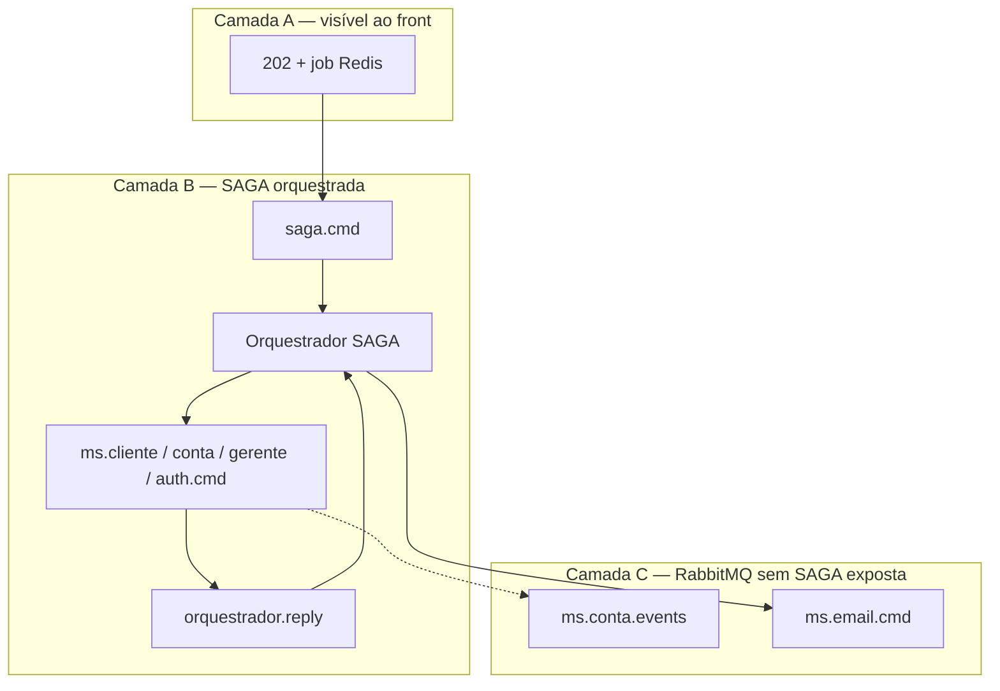
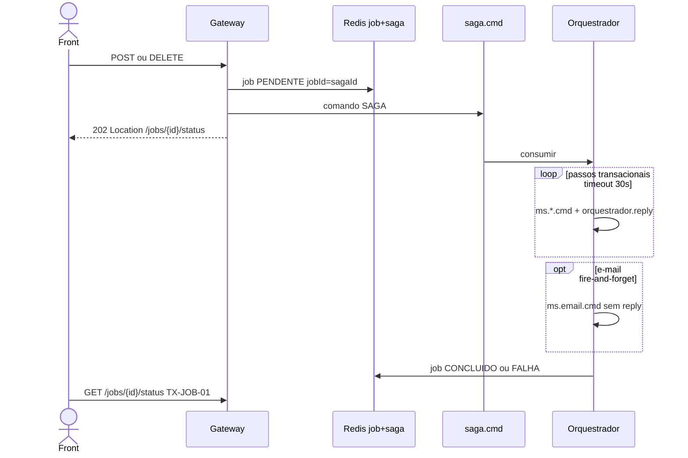
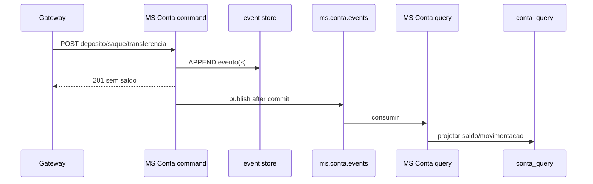

# Tutorial — operações assíncronas e RabbitMQ

Este arquivo é o **compêndio** de tudo que é assíncrono no BANTADS: o que o front percebe como **202 + job**, o que roda em **SAGA orquestrada**, o que é **composition assíncrona sem SAGA** e os **outros usos de RabbitMQ** que o cliente HTTP não enxerga como SAGA.

Cada operação aponta para o tutorial de transação correspondente em [`transacoes/`](./00-GERAL.md). Para request/response JSON e passos no HTTPie Desktop, use o link **HTTPie** de cada `TX-*`.

Fontes canônicas: [enunciado §5.3](../docs/bantads.md) · [Swagger](../docs/swagger_bantads.md) · [agente SAGA](../.cursor/agents/ms-saga.md) · [agente Gateway](../.cursor/agents/gateway.md).

---

## 0. Três camadas de “assíncrono”

No BANTADS, “assíncrono” aparece em **três níveis diferentes**. Confundir os níveis é a causa mais comum de erro na defesa.

| Camada | O que o front vê | Mecanismo | Exemplos |
|---|---|---|---|
| **A — Job HTTP 202** | `202 Accepted` + `Location: /jobs/{id}/status` + polling | Redis `job:{uuid}` | R9, R13, R15, R16 |
| **B — SAGA orquestrada** | (dentro da camada A para R9/R13/R15) | `saga.cmd` → Orquestrador → `ms.*.cmd` → `orquestrador.reply` | R9, R13, R15 |
| **C — Mensageria interna** | Resposta HTTP **síncrona** (200/201); efeito colateral depois | Filas AMQP sem `saga.cmd` | CQRS `ms.conta.events`; e-mail `ms.email.cmd` |

**Regra prática:** só R9, R13 e R15 são **SAGA + 202**. R16 é **202 sem SAGA**. R4/R5/R6/R10 são **HTTP síncrono** com trabalho **assíncrono nos bastidores** (camada C).

Infraestrutura comum de polling: [TX-JOB-01](./TX-JOB-01-status.md) (status) e [TX-JOB-02](./TX-JOB-02-result.md) (resultado inline).

---

## 1. Assíncronas com SAGA orquestrada (HTTP 202)

Estas três operações são **transações distribuídas**: tocam **vários microsserviços** (Cliente, Gerente, Conta, Auth e, opcionalmente, Email). Não existe transação ACID global entre Postgres, Mongo e Redis — o padrão exigido é **SAGA orquestrada** via RabbitMQ.

### Por que precisam ser assíncronas

1. **Latência imprevisível** — vários passos sequenciais, cada um com I/O de rede e banco; segurar a conexão HTTP do gerente por 10–30 s seria frágil (timeout de proxy/browser).
2. **Compensação** — se um passo falha (e-mail duplicado no Auth, último gerente ativo, colisão de conta), o orquestrador executa passos compensatórios na ordem inversa. Isso não cabe num request/response síncrono simples.
3. **Desacoplamento** — o Gateway publica em `saga.cmd` e devolve **202 na hora**; o Orquestrador SAGA coordena os MSs sem bloquear o Fastify.
4. **Contrato do enunciado** — R9, R13 e R15 estão marcados explicitamente como `[SAGA]`; falhas de negócio vão no **job** (`FALHA`), não no status HTTP inicial.

### Fluxo comum (R9, R13, R15)

| Detalhe | Valor |
|---|---|
| Fila de entrada | `saga.cmd` (só o Gateway publica) |
| Estado da SAGA | Redis `saga:{id}` TTL 1 h (**sem senha** no payload) |
| Job | Redis `job:{id}` TTL 5 min — **mesmo UUID** que `sagaId` |
| Respostas dos MSs | `orquestrador.reply` |
| Timeout | 30 s por passo transacional (Cliente, Gerente, Conta, Auth) |
| E-mail | `ms.email.cmd` — fire-and-forget, **sem** timeout, **não** aborta SAGA |
| Compensação | Ordem inversa; idempotente por `(sagaId, etapa)` |

---

### 1.1 `TX-R9` — Aprovar cliente

| Campo | Valor |
|---|---|
| **Requisito** | R9 |
| **Endpoint** | `POST /solicitacoes/{cpf}/aprovacao` |
| **Perfil** | GERENTE |
| **Tipo SAGA** | `aprovar-cliente` |
| **Tutorial** | [TX-R9 — Aprovar cliente](./TX-R9-aprovar-cliente.md) |
| **HTTPie** | [`httpie/TX-R9-aprovar-cliente.md`](../httpie/TX-R9-aprovar-cliente.md) |
| **Resultado do job** | `resultType=resource`, `dominio=clientes`, `resourceId=cpf` → `GET /clientes/{cpf}` ([TX-CAD-01](./TX-CAD-01-consultar-cliente.md)) |

**O que a SAGA faz (7 passos):** marca solicitação aprovada → lista gerentes ativos → escolhe gerente com menos clientes → cria cadastro no MS Cliente → cria usuário Auth (senha aleatória) → cria conta (número aleatório único) → e-mail com senha (FF).

**Por que assíncrona:** cria registros em **quatro serviços** (Cliente, Gerente via consulta, Conta, Auth) mais envio de e-mail. Qualquer falha (ex.: e-mail/login já usado no Auth) exige compensação ou marcação `NAO_APROVADA` — o gerente não pode ficar esperando num POST bloqueado.

**Caso especial:** e-mail duplicado no Auth → solicitação `NAO_APROVADA` com motivo automático; job `FALHA` (o **202 já foi enviado**).

**Registro:** [`SagaRegistry.aprovarCliente`](../backend/services/saga/src/main/kotlin/br/ufpr/dac/bantads/saga/engine/SagaRegistry.kt) · Gateway: [`aprovacao.ts`](../backend/gateway/src/routes/aprovacao.ts).

---

### 1.2 `TX-R13` — Inserir gerente

| Campo | Valor |
|---|---|
| **Requisito** | R13 |
| **Endpoint** | `POST /gerentes` |
| **Perfil** | GERENTE |
| **Tipo SAGA** | `inserir-gerente` |
| **Tutorial** | [TX-R13 — Inserção de gerente](./TX-R13-inserir-gerente.md) |
| **HTTPie** | [`httpie/TX-R13-inserir-gerente.md`](../httpie/TX-R13-inserir-gerente.md) |
| **Resultado do job** | `resultType=resource`, `dominio=gerentes` → `GET /gerentes/{cpf}` ([TX-CAD-02](./TX-CAD-02-consultar-gerente.md)) |

**O que a SAGA faz:** insere gerente ativo → cria Auth (senha **do formulário**) → identifica conta para transferir (regra R13: gerente com mais contas, menor saldo entre eles) → *se houver conta:* atribui conta, obtém nomes dos clientes, e-mail de troca (FF) → *se `semConta`:* pula atribuição e e-mail; SAGA termina com sucesso.

**Por que assíncrona:** além de Gerente + Auth, pode envolver **rebalanceamento de conta** entre gerentes (MS Conta + MS Cliente) e notificação por e-mail. A regra de “qual conta transferir” exige consultas e escrita distribuída.

**Caso especial:** e-mail duplicado → job `FALHA` após o 202 (unicidade garantida pelo MS Auth dentro da SAGA).

**Registro:** [`SagaRegistry.inserirGerente`](../backend/services/saga/src/main/kotlin/br/ufpr/dac/bantads/saga/engine/SagaRegistry.kt) · Gateway: [`inserir-gerente.ts`](../backend/gateway/src/routes/inserir-gerente.ts).

---

### 1.3 `TX-R15` — Remover gerente

| Campo | Valor |
|---|---|
| **Requisito** | R15 |
| **Endpoint** | `DELETE /gerentes/{cpf}` |
| **Perfil** | GERENTE |
| **Tipo SAGA** | `remover-gerente` |
| **Tutorial** | [TX-R15 — Remoção de gerente](./TX-R15-remover-gerente.md) |
| **HTTPie** | [`httpie/TX-R15-remover-gerente.md`](../httpie/TX-R15-remover-gerente.md) |
| **Resultado do job** | `resultType=inline` → `GET /jobs/{id}/result` ([TX-JOB-02](./TX-JOB-02-result.md)) |

**O que a SAGA faz:** inativa gerente (falha se último ativo) → desativa Auth → **passo LOCAL:** `DEL` sessão Redis (logout forçado) → lista gerentes ativos → transfere todas as contas ao gerente com menos clientes → *se havia contas:* obtém clientes e envia e-mails FF.

**Por que assíncrona:** remoção lógica + Auth + invalidação de sessão + transferência em massa de contas + N e-mails. Volume de trabalho proporcional ao número de clientes do gerente.

**Pré-condição síncrona (não é SAGA):** gerente removendo a si mesmo → **403** no Gateway **antes** de publicar `saga.cmd` ([`remover-gerente.ts`](../backend/gateway/src/routes/remover-gerente.ts)).

**Registro:** [`SagaRegistry.removerGerente`](../backend/services/saga/src/main/kotlin/br/ufpr/dac/bantads/saga/engine/SagaRegistry.kt) · Gateway: [`remover-gerente.ts`](../backend/gateway/src/routes/remover-gerente.ts).

---

## 2. Assíncrona sem SAGA (HTTP 202)

### 2.1 `TX-R16` — Relatório de clientes

| Campo | Valor |
|---|---|
| **Requisito** | R16 |
| **Endpoint** | `GET /relatorios/clientes` |
| **Perfil** | GERENTE |
| **Tutorial** | [TX-R16 — Relatório de clientes](./TX-R16-relatorio-clientes.md) |
| **HTTPie** | [`httpie/TX-R16-relatorio-clientes.md`](../httpie/TX-R16-relatorio-clientes.md) |
| **Resultado do job** | `resultType=inline` — lista agregada em `/jobs/{id}/result` |

**O que faz:** o Gateway cria job no Redis e, em background (`setImmediate`), executa **API Composition**: paraleliza `GET /clientes`, `GET /internal/saldos` (MS Conta query) e `GET /gerentes`, monta o relatório em português e grava `CONCLUIDO` no job. **Não** publica em `saga.cmd`; **não** há compensação.

**Por que assíncrona (sem SAGA):**

1. **Agregação pesada** — três chamadas REST + merge em memória; em bases grandes o tempo ultrapassa o conforto de um GET síncrono.
2. **Sem transação distribuída** — são **somente leituras**; não há estado a compensar se um MS falhar no meio (o job vai para `FALHA`).
3. **Mesmo contrato de UX** — o enunciado exige o padrão 202 + polling também para R16, alinhado às SAGAs ([TX-JOB-01](./TX-JOB-01-status.md)).
4. **Não precisa de orquestrador** — um único processo (Gateway) já tem visão de todas as URLs internas; RabbitMQ seria overhead sem benefício de compensação.

**Gateway:** [`relatorio.ts`](../backend/gateway/src/routes/relatorio.ts) · composição: [`composition.ts`](../backend/gateway/src/routes/composition.ts).

**Contraste com R11:** [TX-R11](./TX-R11-consultar-clientes.md) lista clientes de forma **síncrona** (composition menor, sem job). R16 é a versão “relatório completo” com saldo e gerente por linha.

---

## 3. RabbitMQ sem SAGA (camada interna)

Estas operações **não** retornam 202 ao front. O HTTP responde na hora (200 ou 201); o RabbitMQ desacopla trabalho **dentro** de um MS ou entre lados command/query do mesmo domínio.

### 3.1 CQRS — fila `ms.conta.events`

| ID | Operação | HTTP ao front | Tutorial |
|---|---|---|---|
| **`TX-R4`** | Depósito | `201` síncrono | [TX-R4 — Depósito](./TX-R4-deposito.md) |
| **`TX-R5`** | Saque | `201` síncrono | [TX-R5 — Saque](./TX-R5-saque.md) |
| **`TX-R6`** | Transferência | `201` síncrono | [TX-R6 — Transferência](./TX-R6-transferencia.md) |

**Fluxo:** MS Conta **command** persiste no event store (`conta_command`) → após commit publica evento(s) em `ms.conta.events` → MS Conta **query** projeta em `conta_query` ([`EventProjector`](../backend/services/conta/src/main/kotlin/br/ufpr/dac/bantads/conta/query/project/EventProjector.kt)).

**Por que assíncrono (internamente):**

1. **CQRS obrigatório** — write model (event sourcing) e read model (consultas/extrato) são bancos lógicos separados; sincronizar via fila é o padrão do enunciado.
2. **Um único serviço** — transferência (R6) grava dois eventos **atomicamente** no command; **não é SAGA** porque não há coordenação entre microsserviços.
3. **Consistência eventual** — a `201` **não** traz saldo atualizado; o front reconsulta conta ([TX-R3A](./TX-R3A-consultar-conta-cpf.md) / [TX-R3B](./TX-R3B-consultar-conta-numero.md)) ou extrato ([TX-R7](./TX-R7-extrato.md)) até o projector aplicar o evento.
4. **Desempenho do command** — o path de escrita não espera a projeção terminar; menor latência na operação financeira.

**Leituras afetadas (indiretamente):** [TX-R3A](./TX-R3A-consultar-conta-cpf.md), [TX-R3B](./TX-R3B-consultar-conta-numero.md), [TX-R7](./TX-R7-extrato.md) — leem o read model; podem ver saldo “atrasado” por alguns segundos após R4/R5/R6.

**DLQ:** `ms.conta.events.dlq` — **não** dispara compensação SAGA; reprocessamento **manual** no console (projeção idempotente).

---

### 3.2 E-mail fire-and-forget — fila `ms.email.cmd`

| ID | Operação | HTTP ao front | Quem publica | Tutorial |
|---|---|---|---|---|
| **`TX-R10`** | Rejeitar solicitação | `200` síncrono | MS Cliente | [TX-R10 — Rejeitar cliente](./TX-R10-rejeitar-cliente.md) |
| *(passo SAGA)* | Senha do cliente aprovado | `202` (job R9) | Orquestrador | [TX-R9](./TX-R9-aprovar-cliente.md) |
| *(passo SAGA)* | Falha na aprovação | `202` (job R9) | Orquestrador | [TX-R9](./TX-R9-aprovar-cliente.md) |
| *(passo SAGA)* | Troca de gerente (R13/R15) | `202` (jobs R13/R15) | Orquestrador | [TX-R13](./TX-R13-inserir-gerente.md) · [TX-R15](./TX-R15-remover-gerente.md) |

**Fluxo:** publicador envia comando em `ms.email.cmd` → MS Email consome e envia SMTP (ou grava em `outbox/` com `MAIL_DEV`). **Sem** `orquestrador.reply`. **Sem** `sagaId` obrigatório fora dos passos de SAGA.

**Por que assíncrono (internamente):**

1. **SMTP é lento e falível** — não bloquear a thread HTTP do MS Cliente nem o passo transacional da SAGA.
2. **Não crítico** — falha de e-mail **não** desfaz rejeição (R10) nem aborta SAGA (passos FF).
3. **Fire-and-forget** — padrão explícito do enunciado para envio de e-mail.

**R10 em uma linha:** update `NAO_APROVADA` no Postgres é **síncrono**; só o e-mail vai para a fila ([`SolicitacaoService.rejeitar`](../backend/services/cliente/src/main/kotlin/br/ufpr/dac/bantads/cliente/solicitacao/SolicitacaoService.kt)).

---

## 4. Mapa de filas RabbitMQ

| Fila | Publicador | Consumidor | SAGA? | Operações / tutoriais |
|---|---|---|---|---|
| `saga.cmd` | Gateway | Orquestrador SAGA | Sim | R9, R13, R15 |
| `ms.cliente.cmd` | Orquestrador | MS Cliente | Sim (passos) | TX-R9, TX-R13, TX-R15 |
| `ms.conta.cmd` | Orquestrador | MS Conta | Sim (passos) | TX-R9, TX-R13, TX-R15 |
| `ms.gerente.cmd` | Orquestrador | MS Gerente | Sim (passos) | TX-R9, TX-R13, TX-R15 |
| `ms.auth.cmd` | Orquestrador | MS Auth | Sim (passos) | TX-R9, TX-R13, TX-R15 |
| `orquestrador.reply` | MSs | Orquestrador | Sim | TX-R9, TX-R13, TX-R15 |
| `ms.email.cmd` | Orquestrador / MS Cliente | MS Email | Não (FF) | TX-R10; passos de e-mail em TX-R9/R13/R15 |
| `ms.conta.events` | MS Conta command | MS Conta query | Não (CQRS) | TX-R4, TX-R5, TX-R6 |

DLQs de comando (`ms.*.cmd.dlq`): podem gerar compensação SAGA **uma vez** por etapa. DLQ de `ms.conta.events`: **sem** compensação — reprocessar manualmente.

---

## 5. Tabela resumo — o que estudar para a defesa

| ID | Nome | 202? | SAGA? | RabbitMQ? | Por que assíncrono |
|---|---|:---:|:---:|:---:|---|
| **TX-R9** | Aprovar cliente | Sim | Sim | `saga.cmd` + `ms.*.cmd` | Transação distribuída 4 MSs + compensação + e-mail |
| **TX-R13** | Inserir gerente | Sim | Sim | idem | Gerente + Auth + possível transferência de conta |
| **TX-R15** | Remover gerente | Sim | Sim | idem | Inativação + logout + transferência em massa + e-mails |
| **TX-R16** | Relatório clientes | Sim | Não | Não | Composition pesada só leitura; mesmo UX de job |
| **TX-R4** | Depósito | Não | Não | `ms.conta.events` | CQRS: projetar read model após commit |
| **TX-R5** | Saque | Não | Não | `ms.conta.events` | idem |
| **TX-R6** | Transferência | Não | Não | `ms.conta.events` | idem (2 eventos atômicos no command) |
| **TX-R10** | Rejeitar cliente | Não | Não | `ms.email.cmd` | E-mail SMTP fora do caminho crítico do 200 |
| **TX-JOB-01** | Status do job | — | — | — | Polling de R9, R13, R15, R16 |
| **TX-JOB-02** | Resultado inline | — | — | — | Resultado de R15 e R16 |

---

## 6. O que **não** é assíncrono (referência rápida)

Para não confundir na prova: login ([TX-R2A](./TX-R2A-login.md)), depósito/saque/transferência **do ponto de vista HTTP** respondem na mesma requisição; autocadastro ([TX-R1](./TX-R1-autocadastro.md)), rejeição ([TX-R10](./TX-R10-rejeitar-cliente.md)), CRUD síncrono de gerente ([TX-R14](./TX-R14-atualizar-gerente.md)), compositions leves ([TX-R11](./TX-R11-consultar-clientes.md), [TX-R12](./TX-R12-listar-gerentes.md)) são REST síncrono puro via Gateway → MS.

Pipeline geral do Gateway (CORS, JWT, proxy, SAGA): [00-GATEWAY](./00-GATEWAY.md). Compositions: [00-COMPOSITION](./00-COMPOSITION.md).

---

## 7. Arquivos-chave

| Papel | Arquivo |
|---|---|
| Publicar SAGA | [`backend/gateway/src/amqp/publisher.ts`](../backend/gateway/src/amqp/publisher.ts) |
| Rotas 202 SAGA | [`aprovacao.ts`](../backend/gateway/src/routes/aprovacao.ts), [`inserir-gerente.ts`](../backend/gateway/src/routes/inserir-gerente.ts), [`remover-gerente.ts`](../backend/gateway/src/routes/remover-gerente.ts) |
| Rota 202 composition | [`relatorio.ts`](../backend/gateway/src/routes/relatorio.ts) |
| Jobs Redis | [`backend/gateway/src/redis/jobs.ts`](../backend/gateway/src/redis/jobs.ts), [`routes/jobs.ts`](../backend/gateway/src/routes/jobs.ts) |
| Definição das SAGAs | [`SagaRegistry.kt`](../backend/services/saga/src/main/kotlin/br/ufpr/dac/bantads/saga/engine/SagaRegistry.kt) |
| Motor SAGA | [`SagaEngine.kt`](../backend/services/saga/src/main/kotlin/br/ufpr/dac/bantads/saga/engine/SagaEngine.kt) |
| CQRS publish | [`ContaEventPublisher.kt`](../backend/services/conta/src/main/kotlin/br/ufpr/dac/bantads/conta/command/publish/ContaEventPublisher.kt) |
| CQRS consume | [`ContaEventListener.kt`](../backend/services/conta/src/main/kotlin/br/ufpr/dac/bantads/conta/query/amqp/ContaEventListener.kt) |
| E-mail AMQP | [`EmailCommandPublisher.kt`](../backend/services/cliente/src/main/kotlin/br/ufpr/dac/bantads/cliente/email/EmailCommandPublisher.kt), [`EmailCommandListener.kt`](../backend/services/email/src/main/kotlin/br/ufpr/dac/bantads/email/amqp/EmailCommandListener.kt) |
| Nomes de filas | [`backend/gateway/src/types/queues.ts`](../backend/gateway/src/types/queues.ts) |
