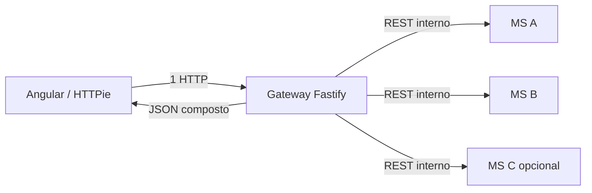
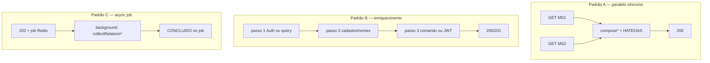
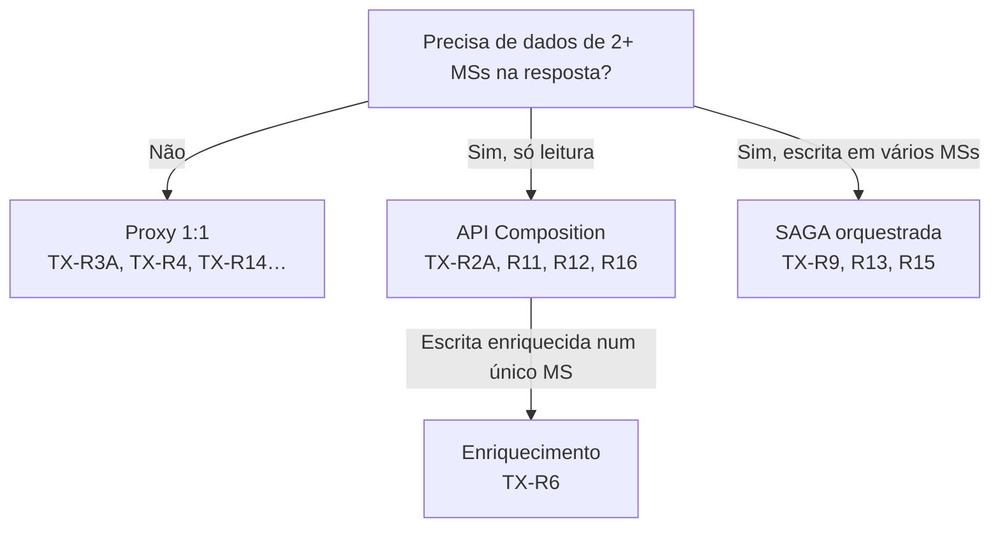

# Tutorial — transações com API Composition

Este arquivo é o **compêndio** de todas as rotas do Gateway que **agregam dados de dois ou mais microsserviços** num único JSON de contrato. O front fala **só** com `http://localhost:3000` e não sabe quantas chamadas internas ocorreram.

Cada operação aponta para o tutorial de transação em [`transacoes/`](./00-GERAL.md). Para JSON e passos no HTTPie Desktop, use o link **HTTPie** de cada `TX-*`.

Fontes canônicas: [enunciado §5.9](../docs/bantads.md) · [Swagger](../docs/swagger_bantads.md) · [agente Gateway](../.cursor/agents/gateway.md) · pipeline geral: [00-GATEWAY](./00-GATEWAY.md).

Operações assíncronas (SAGA vs composition): [00-ASSINCRONAS](./00-ASSINCRONAS.md).

---

## 0. O que é API Composition aqui

No BANTADS cada MS tem **banco próprio** (Database per Service). Não existe `JOIN` entre Postgres `cliente` e `conta_query` na camada pública. Quando o contrato Swagger exige campos de domínios diferentes na **mesma resposta**, o **API Gateway** implementa **API Composition**: chama os MSs necessários, junta os DTOs e devolve um único payload ao browser.



**Onde mora o código:** quase tudo em [`composition.ts`](../backend/gateway/src/routes/composition.ts), com duas exceções em módulos dedicados — login ([`login.ts`](../backend/gateway/src/routes/login.ts)) e transferência ([`proxy.ts`](../backend/gateway/src/routes/proxy.ts) função `transferir`).

**O que não é composition:**

| Padrão | Diferença |
|---|---|
| **Proxy 1:1** | Um path do Gateway → um MS, sem merge (ex.: `GET /clientes/{cpf}`, depósito, saque) |
| **SAGA** | Escrita distribuída com compensação via RabbitMQ (R9, R13, R15) — ver [00-ASSINCRONAS](./00-ASSINCRONAS.md) |
| **`POST /reboot`** | Fan-out paralelo para seed; não é rota de negócio do contrato |

---

## 1. Três padrões de composition no Gateway

| Padrão | HTTP ao front | Paralelismo | Quando usar |
|---|---|---|---|
| **A — Leitura paralela** | `200` síncrono | `Promise.all` | Duas ou mais consultas independentes (R11, R12, corpo do R16) |
| **B — Enriquecimento sequencial** | `200`/`201` síncrono | awaits em cadeia | Comando precisa de dados de outros MSs antes de seguir (R2A login, R6 transferência) |
| **C — Leitura pesada em background** | `202` + job | `setImmediate` + `Promise.all` | Agregação grande; mesmo contrato de polling das SAGAs (R16) |



---

## 2. Catálogo por transação

### 2.1 `TX-R2A` — Login (composition sequencial)

| Campo | Valor |
|---|---|
| **Requisito** | R2 (autenticação) |
| **Endpoint** | `POST /login` |
| **Público** | Sim (sem JWT) |
| **Tutorial** | [TX-R2A — Login](./TX-R2A-login.md) |
| **HTTPie** | [`httpie/TX-R2A-login.md`](../httpie/TX-R2A-login.md) |
| **Padrão** | B — enriquecimento sequencial |

**MSs agregados:**

1. **MS Auth** — `POST /auth/verificar` → `{ cpf, tipo }` ou 401
2. **MS Cliente** *ou* **MS Gerente** — `GET /clientes/{cpf}` ou `GET /gerentes/{cpf}` → `nome`, `email`

**Por que composition:** o Mongo (Auth) guarda login, hash e perfil; **nome e e-mail** vivem no Postgres de Cliente/Gerente. O contrato de login exige `usuario: { cpf, nome, email }` num único `200` — o Gateway monta isso depois de validar a senha.

**Detalhes:**

- JWT assinado **somente** no Gateway (`cpf`, `tipo`, `jti`).
- Sessão Redis criada após composition (`sessao:{jti}`, `sessao:cpf:{cpf}`).
- Resposta **sem** `_links` (exceção do contrato).
- Se Auth OK mas cadastro inexistente → trata como 401 (`Login inválido!`).

**Código:** [`loadUsuario` + `registerLogin`](../backend/gateway/src/routes/login.ts).

---

### 2.2 `TX-R11` — Listar clientes (composition paralela)

| Campo | Valor |
|---|---|
| **Requisito** | R11 |
| **Endpoint** | `GET /clientes` (query `?busca=` opcional) |
| **Perfil** | GERENTE |
| **Tutorial** | [TX-R11 — Consultar todos os clientes](./TX-R11-consultar-clientes.md) |
| **HTTPie** | [`httpie/TX-R11-consultar-clientes.md`](../httpie/TX-R11-consultar-clientes.md) |
| **Padrão** | A — leitura paralela |

**MSs agregados (em paralelo):**

| Chamada interna | Dados trazidos |
|---|---|
| `GET /clientes?busca=` → MS Cliente | CPF, nome, endereço (cidade, UF) |
| `GET /internal/saldos` → MS Conta query | mapa `{ [cpf]: { saldo } }` |

**Função de merge:** [`composeClientes`](../backend/gateway/src/routes/composition.ts) — monta `ClienteResumo` com `saldo` string `"800.00"`, `_links.self` e `_links.conta`, ordenação [`sortByNome`](../backend/gateway/src/http/pt-br.ts) (`Intl.Collator('pt-BR')`).

**Por que composition:** nenhum MS sozinho expõe “lista de clientes **com saldo**”. Cliente não tem saldo; Conta não tem endereço. O enunciado exige as colunas juntas na tela do gerente.

**Tratamento de erro:** se a lista do Cliente ≠ 200, repassa esse status/corpo; senão, se saldos ≠ 200, repassa o erro da Conta ([`listarClientes`](../backend/gateway/src/routes/composition.ts)).

**Consistência:** saldo vem do read model CQRS — pode estar defasado segundos após depósito/saque ([TX-R4](./TX-R4-deposito.md)).

---

### 2.3 `TX-R12` — Listar gerentes (composition paralela)

| Campo | Valor |
|---|---|
| **Requisito** | R12 |
| **Endpoint** | `GET /gerentes` |
| **Perfil** | GERENTE |
| **Tutorial** | [TX-R12 — Listagem de gerentes](./TX-R12-listar-gerentes.md) |
| **HTTPie** | [`httpie/TX-R12-listar-gerentes.md`](../httpie/TX-R12-listar-gerentes.md) |
| **Padrão** | A — leitura paralela |

**MSs agregados (em paralelo):**

| Chamada interna | Dados trazidos |
|---|---|
| `GET /gerentes` → MS Gerente | gerentes **ativos** (cadastro) |
| `GET /internal/contagem-por-gerente` → MS Conta query | mapa `{ [cpfGerente]: quantidade }` |

**Função de merge:** [`composeGerentes`](../backend/gateway/src/routes/composition.ts) — injeta `quantidadeClientes` em cada linha (0 se ausente no mapa).

**Por que composition:** `quantidadeClientes` não é coluna do schema `gerente`; é derivada das contas no MS Conta (regra R12/R13).

**HATEOAS extra:** [`applyHateoas`](../backend/gateway/src/http/hateoas.ts) adiciona `criacao` na lista e **remove** `remocao` na linha do gerente logado (não pode remover a si mesmo na UI).

---

### 2.4 `TX-R6` — Transferência (composition de enriquecimento)

| Campo | Valor |
|---|---|
| **Requisito** | R6 |
| **Endpoint** | `POST /contas/{numero}/transferencia` |
| **Perfil** | CLIENTE (titular da conta origem) |
| **Tutorial** | [TX-R6 — Transferência](./TX-R6-transferencia.md) |
| **HTTPie** | [`httpie/TX-R6-transferencia.md`](../httpie/TX-R6-transferencia.md) |
| **Padrão** | B — enriquecimento sequencial |

**O front envia só:** `{ "contaDestino": "0950", "valor": "100.00" }`.

**Passos internos do Gateway (`transferir` em [`proxy.ts`](../backend/gateway/src/routes/proxy.ts)):**

1. Valida body; **422** se origem == destino
2. `GET /internal/contas/{destino}` → MS Conta query → CPF do titular destino
3. `GET /clientes/nomes?cpfs={origem},{destino}` → MS Cliente → nomes para o extrato
4. `POST /contas/{origem}/transferencia` → MS Conta **command** com body enriquecido:

```json
{
  "valor": "100.00",
  "origem": { "numeroConta": "...", "cpf": "...", "nome": "..." },
  "destino": { "numeroConta": "...", "cpf": "...", "nome": "..." }
}
```

**Por que composition:** o event store grava nomes nos eventos de transferência (extrato legível). O cliente não digita nomes; o Gateway os busca antes do comando.

**Não é SAGA:** origem e destino são gravados **atomicamente** numa única transação local do MS Conta (dois `append` no mesmo `tx.execute`). Não há orquestrador RabbitMQ.

**Resposta:** `201` com objeto `destino` preenchido; **sem** saldo (CQRS — ver [TX-R4](./TX-R4-deposito.md)).

---

### 2.5 `TX-R16` — Relatório de clientes (composition assíncrona)

| Campo | Valor |
|---|---|
| **Requisito** | R16 |
| **Endpoint** | `GET /relatorios/clientes` |
| **Perfil** | GERENTE |
| **Tutorial** | [TX-R16 — Relatório de clientes](./TX-R16-relatorio-clientes.md) |
| **HTTPie** | [`httpie/TX-R16-relatorio-clientes.md`](../httpie/TX-R16-relatorio-clientes.md) |
| **Padrão** | C — job 202 + background |
| **Polling** | [TX-JOB-01](./TX-JOB-01-status.md) · [TX-JOB-02](./TX-JOB-02-result.md) |

**MSs agregados (em paralelo, em background):**

| Chamada interna | Dados |
|---|---|
| `GET /clientes` | CPF, nome, e-mail, salário |
| `GET /internal/saldos` | número da conta, saldo, `cpfGerente` |
| `GET /gerentes` | mapa CPF → nome do gerente |

**Função de merge:** [`composeRelatorioClientes`](../backend/gateway/src/routes/composition.ts) — linhas com 8 colunas; **sem** `_links` (exceção de jobs).

**Por que composition:** relatório = superset de R11 (e-mail, salário, conta, gerente) — três fontes.

**Por que assíncrona (202):** três GETs + merge; o enunciado modela relatórios volumosos como job. **Não** usa SAGA — só leitura, sem compensação. Detalhes: [00-ASSINCRONAS §2](./00-ASSINCRONAS.md).

**Contraste com R11:** R11 responde `200` na hora (duas fontes, payload menor). R16 usa o mesmo motor de composition (`collectRelatorioClientes`) mas devolve resultado via job.

---

## 3. Endpoints internos (só o Gateway chama)

Estes paths **não** são contrato público para o Angular; existem para composition:

| Path | MS | Usado em |
|---|---|---|
| `GET /internal/saldos` | Conta query | TX-R11, TX-R16 |
| `GET /internal/contagem-por-gerente` | Conta query | TX-R12 |
| `GET /internal/contas/{numero}` | Conta query | TX-R6 |
| `GET /clientes/nomes?cpfs=` | Cliente | TX-R6 |

Implementação Conta: [`InternalQueryController.kt`](../backend/services/conta/src/main/kotlin/br/ufpr/dac/bantads/conta/query/http/InternalQueryController.kt).

O Gateway repassa `X-User-CPF` e `X-User-Tipo` nas chamadas autenticadas ([`identityHeaders`](../backend/gateway/src/routes/composition.ts)).

---

## 4. Regras transversais

### 4.1 Paralelismo e timeout

- Compositions usam [`msRequest`](../backend/gateway/src/http/ms-client.ts) com timeout **5 s** por chamada.
- `Promise.all` (R11, R12, R16): latência ≈ **max** dos MSs, não a soma.
- Login e transferência: latência ≈ **soma** dos passos (sequencial).

### 4.2 Dinheiro e ordenação

- Saldos e valores sempre **string** `^\d+\.\d{2}$` após merge ([`dinheiro()`](../backend/gateway/src/routes/composition.ts)).
- Listas ordenadas por nome com collation pt-BR.

### 4.3 HATEOAS

- R11 e R12: [`applyHateoas`](../backend/gateway/src/http/hateoas.ts) reescreve `href` interno → `GATEWAY_PUBLIC_URL` e aplica links condicionais por perfil.
- R2A, R16 (resultado do job): **sem** `_links`.

### 4.4 Cache

- `GET /clientes/{cpf}` e `GET /gerentes/{cpf}` usam cache Redis no proxy ([00-REDIS-CACHE](./00-REDIS-CACHE.md)).
- **Listas** R11/R12 e **saldos** `/internal/*` **não** são cacheados — sempre dados frescos na composition.

### 4.5 Falha parcial

| Cenário | Comportamento |
|---|---|
| Um MS retorna 4xx/5xx em R11/R12 | Gateway repassa o **primeiro** erro relevante (lista antes de saldos/contagens) |
| Falha em `collectRelatorioClientes` (R16) | Job vai para `FALHA` com mensagem genérica |
| Auth OK, cadastro ausente no login | 401 unificado (não vaza qual passo falhou) |

Não há “melhor esforço” (retornar lista sem saldo): ou compõe completo ou erro.

---

## 5. Composition vs SAGA vs Proxy



| Critério | Composition | SAGA |
|---|---|---|
| Objetivo | Montar **resposta** agregada | **Transação distribuída** com compensação |
| HTTP típico | 200/201 (ou 202 só R16) | 202 + job |
| RabbitMQ | Não (exceto CQRS depois de R6) | `saga.cmd` + `ms.*.cmd` |
| Rollback | Não aplicável (leitura) ou um MS só (R6) | Compensação por passo |
| Exemplo | Juntar cliente + saldo | Criar cliente + conta + auth |

---

## 6. Tabela resumo

| ID | Nome | Endpoint | Padrão | MSs | Tutorial |
|---|---|---|---|---|---|
| **TX-R2A** | Login | `POST /login` | B sequencial | Auth + Cliente **ou** Gerente | [TX-R2A](./TX-R2A-login.md) |
| **TX-R11** | Listar clientes | `GET /clientes` | A paralelo | Cliente + Conta | [TX-R11](./TX-R11-consultar-clientes.md) |
| **TX-R12** | Listar gerentes | `GET /gerentes` | A paralelo | Gerente + Conta | [TX-R12](./TX-R12-listar-gerentes.md) |
| **TX-R6** | Transferência | `POST /contas/{n}/transferencia` | B enriquecimento | Conta query + Cliente + Conta command | [TX-R6](./TX-R6-transferencia.md) |
| **TX-R16** | Relatório | `GET /relatorios/clientes` | C async job | Cliente + Conta + Gerente | [TX-R16](./TX-R16-relatorio-clientes.md) |

---

## 7. Arquivos-chave

| Papel | Arquivo |
|---|---|
| Compositions R11, R12, R16 (funções puras + handlers lista) | [`composition.ts`](../backend/gateway/src/routes/composition.ts) |
| Composition login | [`login.ts`](../backend/gateway/src/routes/login.ts) |
| Composition transferência | [`proxy.ts`](../backend/gateway/src/routes/proxy.ts) (`transferir`) |
| Job assíncrono R16 | [`relatorio.ts`](../backend/gateway/src/routes/relatorio.ts) |
| Cliente HTTP interno | [`ms-client.ts`](../backend/gateway/src/http/ms-client.ts) |
| HATEOAS pós-composition | [`hateoas.ts`](../backend/gateway/src/http/hateoas.ts) |
| Ordenação pt-BR | [`pt-br.ts`](../backend/gateway/src/http/pt-br.ts) |
| Registro de rotas | [`proxy.ts`](../backend/gateway/src/routes/proxy.ts) (`GET /clientes`, `GET /gerentes`) |

Pipeline completo do Gateway (CORS, JWT, quando usar proxy vs composition): [00-GATEWAY §8](./00-GATEWAY.md).
