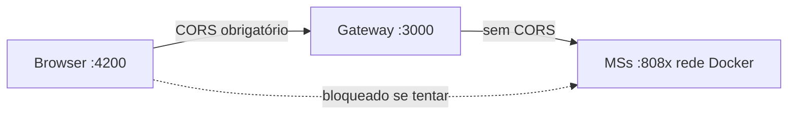
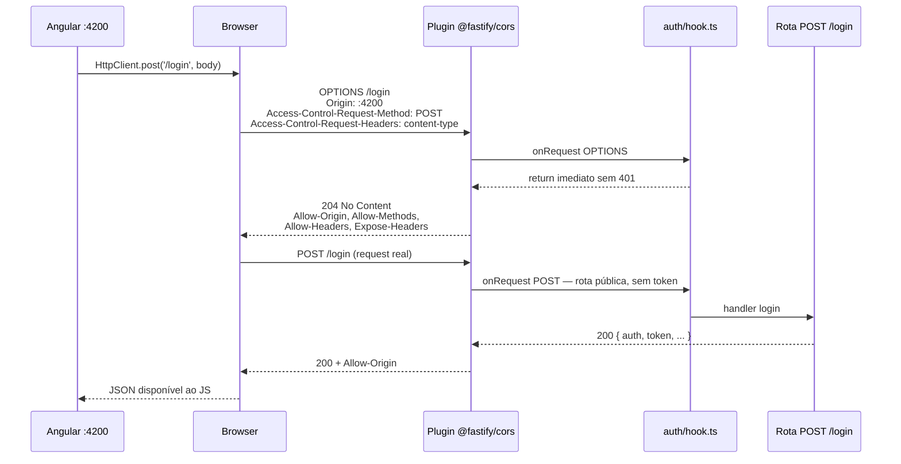

# Tutorial — CORS no API Gateway

Este arquivo explica **todo o código** que faz o CORS funcionar no BANTADS: de onde vem a configuração, o que o plugin `@fastify/cors` faz em cada request, por que o hook JWT ignora `OPTIONS`, e como o header `Location` dos jobs 202 fica visível ao JavaScript do Angular.

O CORS existe **somente no Gateway** (`backend/gateway/`). Os microsserviços Kotlin **não** implementam CORS — e isso é intencional.

Pipeline geral: [00-GATEWAY](./00-GATEWAY.md) · JWT: [00-JWT](./00-JWT.md) · ACL: [00-ACL](./00-ACL.md).

---

## 0. Por que existe CORS neste projeto

| Quem | URL típica | Papel |
|---|---|---|
| Angular (`ng serve`) | `http://localhost:4200` | Origem da página (SPA) |
| API Gateway | `http://localhost:3000` | API REST do contrato |

Porta diferente = **origem diferente** para o browser. Sem headers `Access-Control-*` na resposta do `:3000`, o JavaScript rodando em `:4200` **não pode ler** o JSON — o DevTools mostra erro de CORS e a UI fica em branco.

**Quem não usa CORS:** HTTPie, curl, pytest e o próprio Gateway chamando MSs com `undici` — são clientes HTTP “de servidor”, fora da Same-Origin Policy do browser.

**Regra do enunciado:** o front fala **só** com o Gateway. CORS é configurado uma vez, num único lugar público.



---

## 1. Mapa de arquivos (tudo que participa do CORS)

| Arquivo | Papel no CORS |
|---|---|
| [`package.json`](../backend/gateway/package.json) | Dependência `@fastify/cors` |
| [`src/config.ts`](../backend/gateway/src/config.ts) | Lê `CORS_ORIGIN` do ambiente |
| [`.env.example`](../.env.example) | Documenta variável para dev local |
| [`docker-compose.yml`](../docker-compose.yml) | Injeta `CORS_ORIGIN` no contêiner `gateway` |
| [`src/app.ts`](../backend/gateway/src/app.ts) | Registra o plugin CORS (coração da config) |
| [`src/auth/hook.ts`](../backend/gateway/src/auth/hook.ts) | Pula JWT em `OPTIONS` (preflight) |
| [`src/index.ts`](../backend/gateway/src/index.ts) | Sobe o processo que carrega `buildApp` |
| Rotas 202 | Setam `Location` — só útil no browser se `exposedHeaders` incluir `Location` |
| [`test/auth.test.ts`](../backend/gateway/test/auth.test.ts) | Teste de regressão do preflight |

Não há código CORS em `frontend/` (ainda não no repositório), nem nos MSs Kotlin.

---

## 2. Dependência — `package.json`

```17:18:backend/gateway/package.json
  "dependencies": {
    "@fastify/cors": "^11.3.0",
```

**O que faz:** traz o plugin oficial do Fastify que:

- Intercepta requests `OPTIONS` e responde com os headers `Access-Control-Allow-*` corretos (preflight).
- Em requests “reais” (`GET`, `POST`, …), adiciona `Access-Control-Allow-Origin` na **resposta** para o browser liberar o corpo ao JavaScript.
- Implementa a lógica de `Vary: Origin` e validação da origem configurada.

Sem este pacote, seria necessário implementar manualmente cada header CORS em um hook — o plugin evita erros sutis (especialmente no preflight).

---

## 3. Configuração de ambiente

### 3.1 `config.ts` — de onde vem a origem permitida

```7:19:backend/gateway/src/config.ts
export type AppConfig = {
  port: number;
  host: string;
  jwtSecret: string;
  publicUrl: string;
  corsOrigin: string;
  redisUrl: string;
  // ...
};
```

```28:33:backend/gateway/src/config.ts
  return {
    port: Number(env.PORT ?? 3000),
    host: env.HOST ?? '0.0.0.0',
    jwtSecret: env.JWT_SECRET ?? 'change-me-to-a-long-random-string',
    publicUrl: (env.GATEWAY_PUBLIC_URL ?? 'http://localhost:3000').replace(/\/$/, ''),
    corsOrigin: env.CORS_ORIGIN ?? 'http://localhost:4200',
```

| Linha / campo | O que faz |
|---|---|
| `corsOrigin: string` no tipo | Garante que `buildApp` sempre recebe uma string (TypeScript) |
| `env.CORS_ORIGIN ?? 'http://localhost:4200'` | Lê a variável de ambiente; se ausente, assume Angular local padrão |
| **Não** é lista de origens | Só **uma** origem é aceita — suficiente para o SPA da equipe |

**Efeito HTTP:** o plugin compara o header `Origin` de cada request com `config.corsOrigin`. Se bater → inclui `Access-Control-Allow-Origin: http://localhost:4200`. Se não bater → **omite** o header → o browser bloqueia a leitura da resposta (proteção básica contra outros sites).

### 3.2 `.env.example`

```6:6:.env.example
CORS_ORIGIN=http://localhost:4200
```

**O que faz:** documenta para o desenvolvedor copiar para `.env` local. Se o Angular rodar em outra porta (ex.: `4201`), altere aqui e reinicie o Gateway.

### 3.3 `docker-compose.yml`

```133:133:docker-compose.yml
      CORS_ORIGIN: ${CORS_ORIGIN:-http://localhost:4200}
```

**O que faz:** passa a variável para o contêiner `gateway` em runtime Docker. O `${CORS_ORIGIN:-...}` usa o valor do `.env` na raiz do projeto ou o default `http://localhost:4200`.

**Por que importa no Docker:** o browser do aluno continua em `localhost:4200` no host; o Gateway está em `localhost:3000`. A origem CORS é a do **browser**, não a URL interna `http://gateway:3000` da rede Docker.

---

## 4. Bootstrap — `index.ts`

```1:11:backend/gateway/src/index.ts
import { buildApp } from './app.js';
import { connectRabbitPublisher } from './amqp/publisher.js';
import { loadConfig } from './config.js';

const config = loadConfig();
const publisher = await connectRabbitPublisher(config.rabbitUrl);
const app = await buildApp({ config, publisher });
// ...
await app.listen({ port: config.port, host: config.host });
```

**O que faz em relação ao CORS:**

1. `loadConfig()` — carrega `corsOrigin` do ambiente.
2. `buildApp({ config, ... })` — registra o plugin CORS **antes** de qualquer rota.
3. `listen({ host: '0.0.0.0' })` — escuta em todas as interfaces; o browser acessa via `localhost:3000` publicado no compose.

O CORS não é configurado em `index.ts` diretamente — tudo passa por `buildApp`.

---

## 5. Coração do CORS — `app.ts`

### 5.1 Import e ordem de registro

```1:1:backend/gateway/src/app.ts
import cors from '@fastify/cors';
```

```27:40:backend/gateway/src/app.ts
export async function buildApp(options: BuildAppOptions = {}): Promise<FastifyInstance> {
  const config = options.config ?? loadConfig();
  // ...
  const app = Fastify({ logger: options.store === undefined });

  await app.register(cors, {
    origin: config.corsOrigin,
    methods: ['GET', 'POST', 'PUT', 'PATCH', 'DELETE', 'OPTIONS'],
    allowedHeaders: ['Content-Type', 'Accept', 'x-access-token'],
    exposedHeaders: ['Location'],
  });

  registerAuthHook(app, { store, jwtSecret: config.jwtSecret });
```

**Ordem importa no Fastify:**

1. **Primeiro** `app.register(cors)` — o plugin instala hooks que tratam CORS em toda request.
2. **Depois** `registerAuthHook` — JWT/sessão/ACL.
3. **Por último** as rotas (`registerLogin`, `registerProxy`, …).

Assim, quando chega um `OPTIONS`, o plugin CORS responde **antes** do hook JWT exigir token.

### 5.2 Opção `origin: config.corsOrigin`

```typescript
origin: config.corsOrigin,  // ex.: 'http://localhost:4200'
```

| Request | Comportamento do plugin |
|---|---|
| Sem header `Origin` | Cliente não-browser (curl) — CORS não se aplica; plugin não bloqueia |
| `Origin: http://localhost:4200` | Resposta inclui `Access-Control-Allow-Origin: http://localhost:4200` |
| `Origin: http://evil.example` | **Sem** `Allow-Origin` — browser bloqueia JS |

Também adiciona `Vary: Origin` para caches intermediários não servirem resposta CORS errada a outra origem.

### 5.3 Opção `methods`

```typescript
methods: ['GET', 'POST', 'PUT', 'PATCH', 'DELETE', 'OPTIONS'],
```

**O que faz no preflight:** popula `Access-Control-Allow-Methods` na resposta `OPTIONS`.

| Método | Usado no BANTADS |
|---|---|
| `GET` | Consultas, relatório R16 |
| `POST` | Login, depósito, SAGAs (aprovação), autocadastro |
| `PUT` | Atualizar gerente R14 |
| `DELETE` | Remover gerente R15 |
| `PATCH` | Reservado no plugin (contrato pode evoluir) |
| `OPTIONS` | Preflight do browser — **obrigatório** na lista |

Se faltasse `DELETE`, o preflight de `DELETE /gerentes/{cpf}` falharia e R15 não funcionaria no browser.

### 5.4 Opção `allowedHeaders`

```typescript
allowedHeaders: ['Content-Type', 'Accept', 'x-access-token'],
```

**O que faz no preflight:** popula `Access-Control-Allow-Headers`.

O browser envia `Access-Control-Request-Headers` listando headers “não simples” que a request real vai usar. O plugin só autoriza os da lista.

| Header | Por quê |
|---|---|
| `Content-Type` | JSON (`application/json`) em POST/PUT — dispara preflight |
| `Accept` | Angular `HttpClient` costuma enviar |
| `x-access-token` | **Contrato BANTADS** — JWT customizado (não `Authorization: Bearer`) |

**Sem `x-access-token` aqui:** após o login, **toda** request autenticada falharia no preflight — o browser nunca mandaria o token.

**Nota:** `Authorization` **não** está na lista — o projeto não usa Bearer no header padrão.

### 5.5 Opção `exposedHeaders`

```typescript
exposedHeaders: ['Location'],
```

**O que faz:** popula `Access-Control-Expose-Headers: Location` na resposta.

Por padrão o browser **esconde** headers de resposta do JavaScript, exceto uma lista “safelisted” (`Cache-Control`, `Content-Type`, etc.). `Location` **não** é safelisted.

**Por que o BANTADS precisa:** operações assíncronas (R9, R13, R15, R16) respondem:

```http
HTTP/1.1 202 Accepted
Location: /jobs/{uuid}/status
```

O front deve ler `Location` para saber onde fazer polling ([TX-JOB-01](./TX-JOB-01-status.md)). Sem `exposedHeaders`, `response.headers.get('Location')` no Angular retornaria `null`.

### 5.6 `credentials` — ausência intencional

O plugin **não** define `credentials: true`. Portanto:

- Não envia `Access-Control-Allow-Credentials: true`
- O Angular **não** precisa `withCredentials: true`
- O JWT vai no header `x-access-token`, **não** em cookie

Isso simplifica CORS: com credentials, `Allow-Origin` não poderia ser `*` e a configuração ficaria mais restritiva.

---

## 6. Cooperação com JWT — `auth/hook.ts`

O CORS sozinho não basta: o hook de autenticação poderia quebrar o preflight se exigisse token num `OPTIONS`.

```13:16:backend/gateway/src/auth/hook.ts
  app.addHook('onRequest', async (request: FastifyRequest, reply: FastifyReply) => {
    if (request.method === 'OPTIONS') {
      return;
    }
```

**O que cada linha faz:**

| Linha | Efeito |
|---|---|
| `app.addHook('onRequest', ...)` | Roda no início de **cada** request, depois dos plugins (incluindo CORS) |
| `if (request.method === 'OPTIONS')` | Detecta preflight do browser |
| `return;` | Sai do hook **sem** `reply.send()` — Fastify continua o ciclo; o plugin CORS já enviou ou enviará `204` |

**Por que é necessário:** sem esse `return`, o hook chegaria em:

```typescript
const token = request.headers['x-access-token'];
if (!raw) {
  return reply.code(401).send(authError(...));  // ← preflight morto
}
```

O browser **não envia** `x-access-token` no `OPTIONS`. Resultado: preflight `401` → request real **nunca** dispara → erro CORS opaco no DevTools.

**Loop que isso evita:** para mandar `x-access-token` na request real, o browser precisa de preflight; o preflight não pode exigir `x-access-token`.

O restante do hook (token, sessão Redis, ACL) só roda em `GET`/`POST`/etc. — ver [00-JWT](./00-JWT.md).

---

## 7. Headers `Location` nas rotas (ligação com `exposedHeaders`)

O plugin CORS **expõe** o header; as rotas **setam** o valor.

| Arquivo | Quando seta `Location` |
|---|---|
| [`aprovacao.ts`](../backend/gateway/src/routes/aprovacao.ts) | `POST /solicitacoes/{cpf}/aprovacao` → 202 |
| [`inserir-gerente.ts`](../backend/gateway/src/routes/inserir-gerente.ts) | `POST /gerentes` → 202 |
| [`remover-gerente.ts`](../backend/gateway/src/routes/remover-gerente.ts) | `DELETE /gerentes/{cpf}` → 202 |
| [`relatorio.ts`](../backend/gateway/src/routes/relatorio.ts) | `GET /relatorios/clientes` → 202 |
| [`proxy.ts`](../backend/gateway/src/routes/proxy.ts) | Repassa `Location` de respostas dos MSs (ex.: `201` com redirect interno) |

Exemplo típico:

```36:37:backend/gateway/src/routes/aprovacao.ts
    reply.header('Location', `/jobs/${jobId}/status`);
    return reply.code(202).send(accepted);
```

**Fluxo no browser:**

1. Angular faz `POST` → recebe `202` + `Location` (visível graças a `exposedHeaders`).
2. Serviço de jobs lê `Location` ou usa `jobId` do body.
3. Poll em `GET /jobs/{id}/status` — essa request **também** passa por CORS + preflight com `x-access-token`.

---

## 8. Fluxo completo no browser (duas fases)

### 8.1 Preflight `OPTIONS`

Disparado quando a request é “não simples” — no BANTADS, quase sempre por `Content-Type: application/json` e/ou header `x-access-token`.



**Resposta típica do preflight:**

```http
HTTP/1.1 204 No Content
Access-Control-Allow-Origin: http://localhost:4200
Access-Control-Allow-Methods: GET, POST, PUT, PATCH, DELETE, OPTIONS
Access-Control-Allow-Headers: Content-Type, Accept, x-access-token
Access-Control-Expose-Headers: Location
Vary: Origin
```

### 8.2 Request autenticada (após login)

```http
GET /clientes HTTP/1.1
Host: localhost:3000
Origin: http://localhost:4200
x-access-token: eyJhbGciOiJIUzI1NiIs...
Accept: application/json
```

O browser manda **outro** preflight porque `x-access-token` não é header “simples”. O teste abaixo garante que esse preflight passa.

---

## 9. Teste automatizado — `auth.test.ts`

```211:232:backend/gateway/test/auth.test.ts
  it('CORS allows x-access-token from Angular origin', async () => {
    const app = await buildApp({
      config: testConfig(),
      store: new MemoryStore(),
      fetchImpl: seedFetch,
    });
    const response = await app.inject({
      method: 'OPTIONS',
      url: '/login',
      headers: {
        origin: 'http://localhost:4200',
        'access-control-request-method': 'POST',
        'access-control-request-headers': 'x-access-token',
      },
    });
    assert.equal(response.statusCode, 204);
    assert.equal(response.headers['access-control-allow-origin'], 'http://localhost:4200');
    const allowHeaders = String(
      response.headers['access-control-allow-headers'] ?? '',
    ).toLowerCase();
    assert.ok(allowHeaders.includes('x-access-token'));
    await app.close();
  });
```

**O que cada parte verifica:**

| Assert | Garante |
|---|---|
| `buildApp` com `testConfig()` | Plugin CORS registrado como em produção |
| `method: 'OPTIONS'` | Simula preflight do browser |
| Headers `origin` + `access-control-request-*` | Simula o que o Chrome/Firefox enviam |
| `statusCode === 204` | Preflight aceito (padrão `@fastify/cors`) |
| `access-control-allow-origin` | Origem Angular autorizada |
| `allow-headers` contém `x-access-token` | Requests autenticadas não morrem no preflight |

Rodar: `npm test` dentro de `backend/gateway/`.

Os outros arquivos de teste (`composition.test.ts`, `jobs.test.ts`, …) passam `CORS_ORIGIN: 'http://localhost:4200'` em `testConfig()` para o `buildApp` ter config completa — não testam CORS diretamente, mas dependem da mesma config.

---

## 10. O que **não** tem CORS (e por quê)

### 10.1 Microsserviços Kotlin

Não há `@CrossOrigin`, `CorsFilter` nem `WebMvcConfigurer.addCorsMappings` nos MSs.

| Motivo | Explicação |
|---|---|
| Browser não alcança MS | Portas 808x **não** publicadas no host — só `3000:3000` do Gateway |
| Gateway → MS é server-to-server | `undici` ignora CORS |
| Segurança em camadas | Se alguém expusesse um MS na LAN, o browser ainda bloquearia sem `Allow-Origin` |

### 10.2 Redis, RabbitMQ, Postgres, Mongo

Protocolos não-HTTP — CORS não se aplica.

### 10.3 Frontend Angular (futuro)

O SPA **não** configura CORS — ele **provoca** o preflight ao:

- Chamar `http://localhost:3000` a partir de `http://localhost:4200`
- Enviar `Content-Type: application/json`
- Adicionar interceptor com `x-access-token` em requests autenticadas

O Angular só precisa apontar `apiUrl` para o Gateway; a política CORS é responsabilidade do servidor.

---

## 11. Tabela de headers CORS (referência rápida)

| Header na resposta | Quem define | Significado |
|---|---|---|
| `Access-Control-Allow-Origin` | `@fastify/cors` | Origem autorizada a ler a resposta |
| `Access-Control-Allow-Methods` | `@fastify/cors` (`methods`) | Métodos permitidos no preflight |
| `Access-Control-Allow-Headers` | `@fastify/cors` (`allowedHeaders`) | Headers que a request real pode enviar |
| `Access-Control-Expose-Headers` | `@fastify/cors` (`exposedHeaders`) | Headers de resposta visíveis ao JS |
| `Vary: Origin` | `@fastify/cors` | Cache deve variar por `Origin` |
| `Location` | Rotas (202, proxy) | URL do job — **não** é header CORS; só precisa estar em `Expose` |

| Header na request (browser) | Quem envia | Significado |
|---|---|---|
| `Origin` | Browser | De qual site partiu o script (`:4200`) |
| `Access-Control-Request-Method` | Browser (preflight) | Método da request real |
| `Access-Control-Request-Headers` | Browser (preflight) | Headers extras da request real |

---

## 12. Diagnóstico — erros comuns

| Sintoma no DevTools | Causa provável | Onde olhar |
|---|---|---|
| `No 'Access-Control-Allow-Origin'` | `CORS_ORIGIN` não bate com a URL do `ng serve` | `.env`, `docker-compose.yml`, `config.ts` |
| Preflight `401` | Hook JWT bloqueando `OPTIONS` | `hook.ts` — falta `if (OPTIONS) return` |
| `Request header x-access-token is not allowed` | Falta header em `allowedHeaders` | `app.ts` |
| `202` ok mas `Location` é `null` no JS | Falta `exposedHeaders: ['Location']` | `app.ts` |
| CORS ok no login, falha depois | Origem mudou (ex.: IP em vez de localhost) | Alinhar `CORS_ORIGIN` com `Origin` real |
| HTTPie funciona, browser não | Esperado — HTTPie não aplica CORS | Testar com browser ou teste `auth.test.ts` |

**Checklist rápido na defesa:**

1. `echo $CORS_ORIGIN` ou variável no compose = URL exata do Angular (scheme + host + porta).
2. `OPTIONS` com `Origin` correto → `204` + `x-access-token` em `Allow-Headers`.
3. `POST /login` no browser → resposta legível no Network tab.
4. Após login, `GET` autenticado → sem erro CORS; header `x-access-token` na request.

---

## 13. Resumo — pipeline CORS no código

```
process.env.CORS_ORIGIN
       ↓
loadConfig() → config.corsOrigin
       ↓
buildApp() → app.register(@fastify/cors, { origin, methods, allowedHeaders, exposedHeaders })
       ↓
registerAuthHook() → if OPTIONS → return (não exige JWT)
       ↓
rotas → reply.header('Location', ...) em 202
       ↓
browser lê JSON + Location graças aos headers Access-Control-*
```

| Arquivo | Uma linha |
|---|---|
| `config.ts` | Lê `CORS_ORIGIN` |
| `app.ts` | Configura o plugin CORS |
| `hook.ts` | Libera preflight `OPTIONS` |
| `aprovacao.ts` / SAGAs / `relatorio.ts` | Setam `Location` nos 202 |
| `auth.test.ts` | Garante preflight com `x-access-token` |
| `docker-compose.yml` | Injeta env no contêiner |

Pipeline completo do Gateway: [00-GATEWAY §3](./00-GATEWAY.md).
