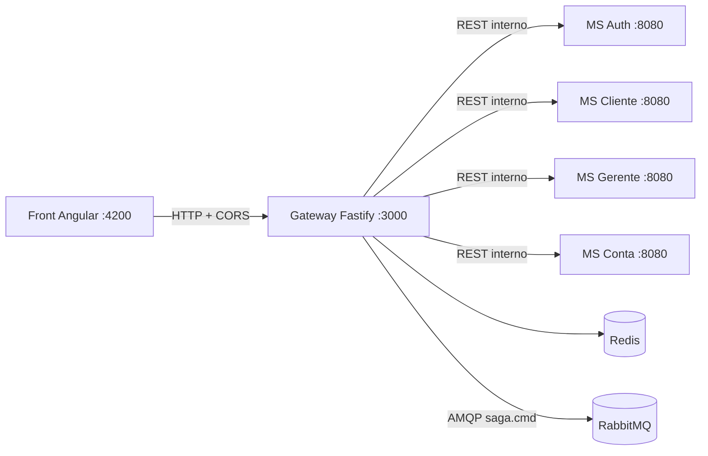
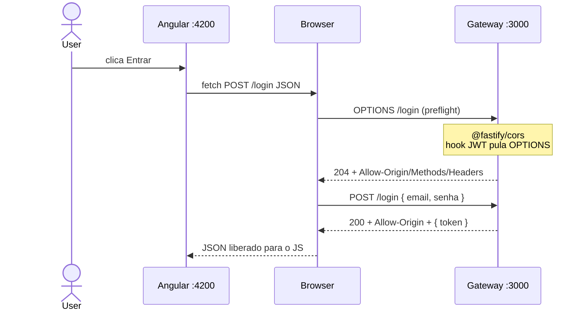
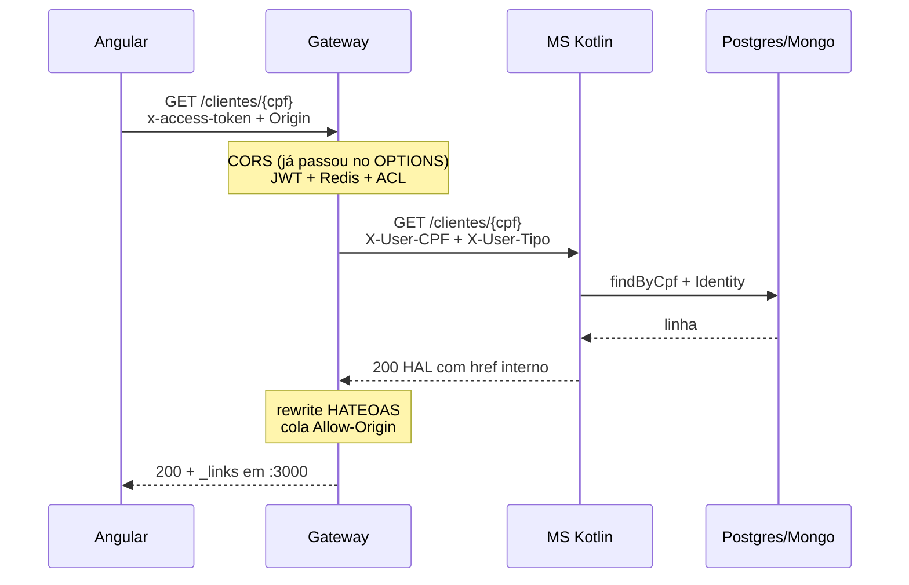

# Tutorial — o que o API Gateway Fastify faz

Este arquivo explica **o Gateway Node.js + Fastify** ponta a ponta: como o browser (Angular em `http://localhost:4200`) fala com `http://localhost:3000`, como o Fastify trata CORS (incluindo o **preflight OPTIONS**), autentica, redireciona aos microsserviços Kotlin e devolve a resposta ao front.

Não é uma transação de negócio (R1–R16). É o **pipeline comum** por trás de todas elas. Cada transação concreta está no [catálogo](./00-GERAL.md).

Fontes canônicas: [agente gateway](../.cursor/agents/gateway.md) · [Swagger](../docs/swagger_bantads.md) · enunciado [§5.3](../docs/bantads.md).

---

## 0. Por que existe um Gateway

O Angular **nunca** chama `auth:8080`, `cliente:8080`, etc. No Docker, esses MSs **não publicam porta no host** — só o Gateway escuta `3000:3000` ([`docker-compose.yml`](../docker-compose.yml)).

Isso resolve três problemas de uma vez:

1. **Same-origin / CORS** — o browser só precisa de permissão para falar com *uma* origem (`localhost:3000`).
2. **AuthN** — JWT é assinado e verificado **somente** no Gateway. Os MSs confiam em headers internos.
3. **Contrato único** — HATEOAS, jobs 202 e compositions (login, R11, R12, R16) nascem aqui.



Pipeline fixo (enunciado):

**CORS → JWT (`x-access-token`) → sessão Redis → sliding TTL 30 min → role (ACL) → injeta `X-User-CPF` / `X-User-Tipo` → handler (proxy / composition / SAGA)**

---

## 1. Mapa de módulos

Tudo vive em [`backend/gateway/src/`](../backend/gateway/src/). Cada pasta é um módulo.

| Módulo | Arquivos | Papel |
|---|---|---|
| Bootstrap | [`index.ts`](../backend/gateway/src/index.ts), [`app.ts`](../backend/gateway/src/app.ts), [`config.ts`](../backend/gateway/src/config.ts) | Sobe o Fastify, registra plugins e rotas |
| CORS | `@fastify/cors` em [`app.ts`](../backend/gateway/src/app.ts) | Preflight OPTIONS + headers `Access-Control-*` |
| Auth | [`auth/hook.ts`](../backend/gateway/src/auth/hook.ts), [`jwt.ts`](../backend/gateway/src/auth/jwt.ts), [`acl.ts`](../backend/gateway/src/auth/acl.ts) | Token, sessão, perfil |
| Redis | [`redis/session.ts`](../backend/gateway/src/redis/session.ts), [`cache.ts`](../backend/gateway/src/redis/cache.ts), [`jobs.ts`](../backend/gateway/src/redis/jobs.ts) | Sessão, cache cadastral, jobs 202 |
| HTTP interno | [`http/ms-client.ts`](../backend/gateway/src/http/ms-client.ts) | `undici` → MSs; timeout 5 s |
| HATEOAS | [`http/hateoas.ts`](../backend/gateway/src/http/hateoas.ts) | Reescreve `href` interno → URL pública |
| Erros | [`http/errors.ts`](../backend/gateway/src/http/errors.ts) | Corpos 400/401/403/404/409/422 |
| Proxy | [`routes/proxy.ts`](../backend/gateway/src/routes/proxy.ts) | Encaminha path/método/body ao MS certo |
| Composition | [`routes/composition.ts`](../backend/gateway/src/routes/composition.ts), [`login.ts`](../backend/gateway/src/routes/login.ts) | Agrega 2+ MSs numa resposta |
| SAGA / jobs | [`aprovacao.ts`](../backend/gateway/src/routes/aprovacao.ts), [`inserir-gerente.ts`](../backend/gateway/src/routes/inserir-gerente.ts), [`remover-gerente.ts`](../backend/gateway/src/routes/remover-gerente.ts), [`relatorio.ts`](../backend/gateway/src/routes/relatorio.ts), [`jobs.ts`](../backend/gateway/src/routes/jobs.ts), [`amqp/publisher.ts`](../backend/gateway/src/amqp/publisher.ts) | 202 + `Location` + polling |
| Infra de teste | [`reboot.ts`](../backend/gateway/src/routes/reboot.ts), `GET /health` | Seed e liveness |

---

## 2. Bootstrap — como o processo sobe

### 2.1 `index.ts` — processo

[`index.ts`](../backend/gateway/src/index.ts) carrega env, abre o publisher RabbitMQ, monta o app e escuta:

```1:11:backend/gateway/src/index.ts
import { buildApp } from './app.js';
import { connectRabbitPublisher } from './amqp/publisher.js';
import { loadConfig } from './config.js';

const config = loadConfig();
const publisher = await connectRabbitPublisher(config.rabbitUrl);
const app = await buildApp({ config, publisher });
app.addHook('onClose', async () => {
  await publisher.close();
});
await app.listen({ port: config.port, host: config.host });
```

`host: 0.0.0.0` (padrão em [`config.ts`](../backend/gateway/src/config.ts)) é o que permite o Docker publicar a porta 3000.

### 2.2 `config.ts` — de onde vêm as URLs

O Gateway **não hardcoda** os MSs. No compose, `AUTH_URL=http://auth:8080` etc. Fora do Docker, o default é `localhost:8081`–`8084`.

| Variável | Default | Uso |
|---|---|---|
| `PORT` / `HOST` | `3000` / `0.0.0.0` | Onde o Fastify escuta |
| `GATEWAY_PUBLIC_URL` | `http://localhost:3000` | Host escrito nos `_links` HATEOAS |
| `CORS_ORIGIN` | `http://localhost:4200` | Origem Angular permitida |
| `JWT_SECRET` | env | Assina/verifica JWT (**só aqui**) |
| `REDIS_URL` | `redis://127.0.0.1:6379` | Sessão, cache, jobs |
| `RABBIT_URL` | user/pass do compose | Publica `saga.cmd` |
| `AUTH_URL`, `CLIENTE_URL`, `GERENTE_URL`, `CONTA_URL` | `8081`–`8084` local | Destino do proxy |

### 2.3 `app.ts` — ordem de registro (importa)

O Fastify executa plugins e hooks **na ordem em que são registrados**. CORS entra **antes** do hook JWT, exatamente como o enunciado pede:

```27:53:backend/gateway/src/app.ts
export async function buildApp(options: BuildAppOptions = {}): Promise<FastifyInstance> {
  const config = options.config ?? loadConfig();
  const store = options.store ?? new RedisStore(connectRedis(config.redisUrl));
  const publisher = options.publisher ?? noopSagaPublisher;
  const app = Fastify({ logger: options.store === undefined });

  await app.register(cors, {
    origin: config.corsOrigin,
    methods: ['GET', 'POST', 'PUT', 'PATCH', 'DELETE', 'OPTIONS'],
    allowedHeaders: ['Content-Type', 'Accept', 'x-access-token'],
    exposedHeaders: ['Location'],
  });

  registerAuthHook(app, { store, jwtSecret: config.jwtSecret });

  app.get('/health', async () => ({ status: 'UP' }));
  registerLogin(app, { config, store, fetchImpl: options.fetchImpl });
  // ... logout, reboot, SAGAs, jobs, proxy
  return app;
}
```

A partir daqui, **toda** request HTTP passa por: plugin CORS → hook `onRequest` (JWT) → rota.

---

## 3. Módulo CORS — same-origin, preflight OPTIONS e headers

Este é o módulo que o browser enxerga **antes** de qualquer JSON de negócio.

### 3.1 O problema (two origins)

| Quem | Origem |
|---|---|
| SPA Angular (`ng serve`) | `http://localhost:4200` |
| Gateway | `http://localhost:3000` |

Porta diferente = **origem diferente**. O browser aplica a [Same-Origin Policy](https://developer.mozilla.org/en-US/docs/Web/Security/Same-origin_policy): um script em `:4200` **não lê** a resposta de `:3000` a menos que o servidor `:3000` autorize via headers CORS.

HTTPie, curl e pytest **não** são browsers — eles ignoram CORS. Por isso o preflight só aparece de verdade com o Angular (ou DevTools).

### 3.2 Request simples vs. preflight

O browser classifica a request:

**Simples** (sem OPTIONS extra) — só `GET`/`HEAD`/`POST` com `Content-Type` em `text/plain`, `application/x-www-form-urlencoded` ou `multipart/form-data`, **sem** headers customizados.

**Não-simples** → o browser **primeiro** manda `OPTIONS` (preflight). No BANTADS isso acontece o tempo todo, porque:

1. O JSON de login/depósito usa `Content-Type: application/json` (não é “simples”).
2. Depois do login, o interceptor manda o header customizado **`x-access-token`**. Qualquer header que não seja da lista CORS-safelisted dispara preflight.

Conclusão: **sim, o preflight OPTIONS está em uso**. O plugin `@fastify/cors` responde a ele. Há teste de regressão:

```211:232:backend/gateway/test/auth.test.ts
  it('CORS allows x-access-token from Angular origin', async () => {
    const response = await app.inject({
      method: 'OPTIONS',
      url: '/login',
      headers: {
        origin: 'http://localhost:4200',
        'access-control-request-method': 'POST',
        'access-control-request-headers': 'x-access-token',
      },
    });
    assert.equal(response.statusCode, 204);
    assert.equal(response.headers['access-control-allow-origin'], 'http://localhost:4200');
    assert.ok(allowHeaders.includes('x-access-token'));
  });
```

`204` = “pode mandar o POST de verdade”. Sem esse 204, o Angular **nunca** enviaria o `POST /login`.

### 3.3 Passo a passo de um preflight (login)

O usuário clica em Entrar. O `HttpClient` do Angular quer:

```http
POST /login HTTP/1.1
Host: localhost:3000
Origin: http://localhost:4200
Content-Type: application/json
Accept: application/json

{"email":"cli1@bantads.com","senha":"..."}
```

O browser **intercepta** e manda antes:

```http
OPTIONS /login HTTP/1.1
Host: localhost:3000
Origin: http://localhost:4200
Access-Control-Request-Method: POST
Access-Control-Request-Headers: content-type
```

O Fastify (plugin CORS) responde **sem** passar pelo JWT (veja §3.5):

```http
HTTP/1.1 204 No Content
Access-Control-Allow-Origin: http://localhost:4200
Access-Control-Allow-Methods: GET, POST, PUT, PATCH, DELETE, OPTIONS
Access-Control-Allow-Headers: Content-Type, Accept, x-access-token
Access-Control-Expose-Headers: Location
Vary: Origin
```

Só então o browser dispara o `POST /login` real. Na **resposta** do POST o plugin também cola `Access-Control-Allow-Origin: http://localhost:4200` — senão o JS do Angular não poderia ler `{ auth, token, ... }`.

Depois do login, o interceptor coloca `x-access-token`. O próximo `GET /clientes/{cpf}` gera **outro** preflight, agora com:

```http
Access-Control-Request-Headers: x-access-token
```

O teste acima cobre exatamente esse header.



### 3.4 O que cada opção do plugin faz

Código em [`app.ts`](../backend/gateway/src/app.ts):

```33:38:backend/gateway/src/app.ts
  await app.register(cors, {
    origin: config.corsOrigin,
    methods: ['GET', 'POST', 'PUT', 'PATCH', 'DELETE', 'OPTIONS'],
    allowedHeaders: ['Content-Type', 'Accept', 'x-access-token'],
    exposedHeaders: ['Location'],
  });
```

| Opção | Valor | Efeito no HTTP |
|---|---|---|
| `origin` | `CORS_ORIGIN` (`http://localhost:4200`) | Responde `Access-Control-Allow-Origin` **só** se o request `Origin` bater. Outra origem (ex.: `http://evil.example`) **não** recebe o header → o JS não lê a resposta. |
| `methods` | GET POST PUT PATCH DELETE OPTIONS | Vira `Access-Control-Allow-Methods` no preflight. Sem `PUT`/`DELETE`, o Angular não conseguiria R14/R15. Sem `OPTIONS`, o preflight quebraria. |
| `allowedHeaders` | `Content-Type`, `Accept`, `x-access-token` | Vira `Access-Control-Allow-Headers`. **Obrigatório** para o token customizado. Não inclui `Authorization` — o contrato **não** usa Bearer. |
| `exposedHeaders` | `Location` | Vira `Access-Control-Expose-Headers`. Sem isso o JS **não enxerga** `Location` após um 202 (jobs R9/R13/R15/R16). O browser sempre vê `Location` internamente para redirects, mas o JavaScript só lê headers listados aqui (além dos safelisted). |
| `credentials` | *não setado* → `false` | Não manda `Access-Control-Allow-Credentials`. O token vai no **header**, não em cookie — não precisa de credentials. |

Origem default e env do compose:

```33:33:backend/gateway/src/config.ts
    corsOrigin: env.CORS_ORIGIN ?? 'http://localhost:4200',
```

```133:133:docker-compose.yml
      CORS_ORIGIN: ${CORS_ORIGIN:-http://localhost:4200}
```

### 3.5 Por que o hook JWT ignora OPTIONS

Se o preflight precisasse de `x-access-token`, o browser cairia num loop: para mandar o token precisa de preflight; para o preflight passar precisaria do token.

[`hook.ts`](../backend/gateway/src/auth/hook.ts) corta o OPTIONS **antes** de olhar o token:

```13:16:backend/gateway/src/auth/hook.ts
  app.addHook('onRequest', async (request: FastifyRequest, reply: FastifyReply) => {
    if (request.method === 'OPTIONS') {
      return;
    }
```

`return` sem `reply.send` = “deixa o próximo plugin/rota continuar”. O `@fastify/cors` (registrado antes) já tratou o OPTIONS e responde 204. Nenhum handler de `/login` ou `/clientes` roda no preflight.

### 3.6 O backend Kotlin **não** faz CORS — e não precisa

Busca no repositório: **zero** `@CrossOrigin`, `WebMvcConfigurer` ou `CorsConfiguration` nos MSs.

Isso é correto:

1. CORS é uma restrição do **browser**. `undici` no Gateway é um cliente HTTP de servidor — a Same-Origin Policy **não se aplica**.
2. Os MSs só são alcançáveis na rede Docker (`http://cliente:8080`). O browser do aluno **não consegue** abrir `http://localhost:8082` porque essa porta **não está publicada**.
3. Se alguém ligasse o MS na máquina e o Angular chamasse direto, o browser bloquearia (sem `Access-Control-Allow-Origin`) — e isso é desejável: o contrato é “front só fala com o Gateway”.

O que o MS **faz** com headers não é CORS: é **identidade de confiança**. Ver módulo 7.

---

## 4. Módulo Auth — JWT, sessão Redis e ACL

Depois do CORS, o hook `onRequest` roda em **todas** as rotas que não são públicas e não são OPTIONS.

### 4.1 Rotas públicas (sem token)

[`acl.ts`](../backend/gateway/src/auth/acl.ts):

```11:16:backend/gateway/src/auth/acl.ts
const PUBLIC: Array<{ method: string; path: string }> = [
  { method: 'GET', path: '/health' },
  { method: 'POST', path: '/login' },
  { method: 'POST', path: '/reboot' },
  { method: 'POST', path: '/solicitacoes' },
];
```

`POST /solicitacoes` é o autocadastro (R1): o cliente ainda não tem JWT.

### 4.2 Passo a passo de uma request autenticada

Exemplo: `GET /clientes/12912861012` com o token do login.

```http
GET /clientes/12912861012 HTTP/1.1
Host: localhost:3000
Origin: http://localhost:4200
Accept: application/json
x-access-token: eyJhbGciOiJIUzI1NiIsInR5cCI6IkpXVCJ9...
```

O hook ([`hook.ts`](../backend/gateway/src/auth/hook.ts)):

1. Lê `request.headers['x-access-token']`. Ausente → `401 { auth: false, message: "Token não fornecido." }`.
2. `jwt.verify` com `JWT_SECRET` ([`jwt.ts`](../backend/gateway/src/auth/jwt.ts)). Assinatura inválida / `exp` vencido → `401 "Falha ao autenticar o token."`.
3. Claims exigidos: `cpf`, `tipo` (`CLIENTE`|`GERENTE`), `jti`, `exp`.
4. Redis `revogado:{jti}` — logout ainda dentro das 8 h do JWT.
5. Redis `sessao:{jti}` — inatividade de 30 min apaga a chave mesmo com JWT válido.
6. `touchSession` — sliding window: `EXPIRE` de novo em 30 min (`SESSION_TTL_SECONDS`).
7. `request.user = { cpf, tipo, jti, exp }` (tipo declarado em [`types/fastify.ts`](../backend/gateway/src/types/fastify.ts)).
8. ACL: perfil vs. path. Gerente em rota de cliente (saque) → `403`. Path desconhecido → `404`.

O `exp` do JWT é **absoluto** (8 h, não renova). Só o Redis desliza. Duas camadas: “token ainda assinado e não expirado” **e** “sessão viva”.

### 4.3 ACL em uma frase

[`accessFor`](../backend/gateway/src/auth/acl.ts) classifica o path:

| `kind` | Exemplos | Quem passa |
|---|---|---|
| `public` | login, health, reboot, POST solicitacoes | ninguém autenticado precisa |
| `auth` | logout, `/jobs/*` | qualquer JWT válido |
| `gerente` | lista clientes, solicitações, gerentes, relatório | só `GERENTE` |
| `cliente` | depósito, saque, transferência, extrato | só `CLIENTE` |
| `gerenteOrSelf` | `GET /clientes/{cpf}`, conta por CPF/número | gerente **ou** o próprio CPF no path |

A posse fina da conta (este CPF é dono do número `0950`?) **não** é o Gateway: o MS Conta lê `X-User-CPF` e confere no read model.

---

## 5. Módulo Redis

[`RedisStore`](../backend/gateway/src/redis/redis-store.ts) é um wrapper de `ioredis` (`GET`/`SET EX`/`DEL`/`EXPIRE`/`FLUSHDB`).

| Chave | TTL | Quem grava | Para quê |
|---|---|---|---|
| `sessao:{jti}` | 30 min, sliding | login | prova de sessão |
| `sessao:cpf:{cpf}` | 30 min, sliding | login | um login por CPF (o jti anterior some) |
| `revogado:{jti}` | restante do JWT | logout | impede reuso do token |
| `cache:cliente:{cpf}` | 5 min | GET cadastro | cache-aside; **nunca** saldo |
| `cache:gerente:{cpf}` | 5 min | GET gerente | idem |
| `job:{uuid}` | 5 min | SAGA / R16 | status e resultado do 202 |

`POST /reboot` dá `FLUSHDB` no Redis do BANTADS depois de reseedar os MSs.

---

## 6. Módulo HTTP interno — o Gateway como *cliente* dos MSs

O front fala Fastify. O Gateway fala com os MSs via [`msRequest`](../backend/gateway/src/http/ms-client.ts) (`undici`), **não** via `@fastify/http-proxy`. Cada chamada é um HTTP novo, server-to-server:

```15:30:backend/gateway/src/http/ms-client.ts
export async function msRequest(opts: {
  baseUrl: string;
  method: string;
  path: string;
  headers?: Record<string, string>;
  body?: unknown;
  timeoutMs?: number;
  fetchImpl?: MsFetch;
}): Promise<MsResponse> {
  const url = `${opts.baseUrl}${opts.path.startsWith('/') ? opts.path : `/${opts.path}`}`;
  const headers: Record<string, string> = { accept: 'application/json', ...(opts.headers ?? {}) };
```

Timeout padrão: **5 s** (`MS_TIMEOUT_MS`). Estouro → o Gateway devolve **504** ao front (não deixa o Angular pendurado). Rede caída → **502**.

O body do MS é parseado como JSON. O status HTTP do MS é **espelhado** na resposta ao front (salvo compositions que agregam). O header `Location` do MS é capturado para o HATEOAS reescrever.

Isso **não** é um proxy transparente de bytes: o Gateway escolhe headers, pode mudar o body (transferência R6, HATEOAS) e nunca encaminha `x-access-token` ao MS.

---

## 7. Front → Gateway → MS → Gateway → Front (proxy)

Este é o fluxo da maior parte das rotas síncronas (consulta de cliente, depósito, rejeição, etc.).

### 7.1 Receber do front

Fastify já fez parse do JSON (`Content-Type: application/json`). O hook autenticou e deixou `request.user`. A rota em [`proxy.ts`](../backend/gateway/src/routes/proxy.ts) escolhe o `baseUrl`:

```194:218:backend/gateway/src/routes/proxy.ts
export function registerProxy(app: FastifyInstance, deps: ProxyDeps): void {
  const cliente = (request: FastifyRequest, reply: FastifyReply) =>
    proxy(request, reply, deps, deps.config.clienteUrl);
  const gerente = (request: FastifyRequest, reply: FastifyReply) =>
    proxy(request, reply, deps, deps.config.gerenteUrl);
  const conta = (request: FastifyRequest, reply: FastifyReply) =>
    proxy(request, reply, deps, deps.config.contaUrl);

  app.post('/solicitacoes', cliente);
  app.get('/clientes/:cpf/conta', conta);
  app.post('/contas/:numero/deposito', conta);
  app.put('/gerentes/:cpf', /* forward + invalida cache */);
}
```

O path público do contrato **é o mesmo** path interno (`GET /clientes/:cpf` no Gateway vira `GET /clientes/:cpf` no MS Cliente). Exceções: compositions e rotas `/internal/*` que o Gateway chama sozinho (saldos, reboot).

### 7.2 Redirecionar ao backend (headers internos)

`forward` copia método + path + body, mas **troca** os headers:

```13:24:backend/gateway/src/routes/proxy.ts
function identityHeaders(request: FastifyRequest): Record<string, string> {
  const user = request.user;
  const headers: Record<string, string> = { accept: 'application/json' };
  if (user) {
    headers['X-User-CPF'] = user.cpf;
    headers['X-User-Tipo'] = user.tipo;
  }
  if (typeof request.headers['content-type'] === 'string') {
    headers['content-type'] = request.headers['content-type'];
  }
  return headers;
}
```

O que **não** vai para o MS:

- `x-access-token` / JWT — o MS não tem o `JWT_SECRET`.
- `Origin`, `Access-Control-Request-*` — CORS é assunto do Gateway.
- `Host: localhost:3000` — o `undici` manda `Host: cliente:8080`.

Request interna típica (depósito):

```http
POST /contas/3847/deposito HTTP/1.1
Host: conta:8080
Accept: application/json
Content-Type: application/json
X-User-CPF: 12912861012
X-User-Tipo: CLIENTE

{"valor":"100.00"}
```

O MS Conta **não** revalida JWT. Lê os dois `X-User-*` e aplica posse, por exemplo em [`Identity.kt`](../backend/services/conta/src/main/kotlin/br/ufpr/dac/bantads/conta/web/Identity.kt) (`requireClienteOwner`). O mesmo padrão existe em Cliente e Gerente.

Confiança de rede: só o Gateway está na mesh e conhece as URLs. Um atacante na internet não alcança `:8080`.

### 7.3 Receber do backend e reenviar ao front

`sendForwarded`:

```52:72:backend/gateway/src/routes/proxy.ts
function sendForwarded(
  reply: FastifyReply,
  forwarded: MsResponse,
  request: FastifyRequest,
  publicUrl: string,
): unknown {
  const location = rewriteLocation(forwarded.location, publicUrl);
  if (location) {
    reply.header('Location', location);
  }
  let body = forwarded.body;
  if (forwarded.status < 400 && body && typeof body === 'object') {
    body = applyHateoas(body, {
      publicUrl,
      user: request.user,
      requestUrl: request.url.startsWith('/') ? request.url : `/${request.url}`,
    });
  }
  reply.code(forwarded.status).send(body);
  return body;
}
```

Passos:

1. Status do MS → status ao front (200, 404, 422…).
2. `Location` interno (`http://cliente:8080/...`) → `http://localhost:3000/...`.
3. `_links.href` internos viram URL pública ([módulo 9](#9-módulo-hateoas)).
4. Fastify serializa JSON. O plugin CORS **adiciona de novo** `Access-Control-Allow-Origin` nesta resposta.
5. O browser entrega o JSON ao Angular.



Cache-aside ([`cachedGet`](../backend/gateway/src/routes/proxy.ts)): GET de cadastro tenta Redis antes. Hit → **não** chama o MS; ainda assim aplica HATEOAS (links dependem do perfil de *esta* request). Miss → MS → `SET` 5 min. Saldo/extrato **nunca** entram nesse cache.

---

## 8. Módulo composition — o Gateway agrega

Nem tudo é 1:1. O Gateway chama **dois ou mais** MSs e monta o JSON do contrato.

| Rota | MSs | Tutorial |
|---|---|---|
| `POST /login` | Auth + Cliente **ou** Gerente | [TX-R2A](./TX-R2A-login.md) |
| `GET /clientes?busca=` | Cliente + Conta `/internal/saldos` | [TX-R11](./TX-R11-consultar-clientes.md) |
| `GET /gerentes` | Gerente + Conta `/internal/contagem-por-gerente` | [TX-R12](./TX-R12-listar-gerentes.md) |
| `POST .../transferencia` | Conta (destino) + Cliente (nomes) + Conta (comando) | [TX-R6](./TX-R6-transferencia.md) |
| `GET /relatorios/clientes` | Cliente + Conta + Gerente, **async** (job) | [TX-R16](./TX-R16-relatorio-clientes.md) |

Exemplo R11 ([`listarClientes`](../backend/gateway/src/routes/composition.ts)): `Promise.all` nos dois GETs, junta `saldo` string `"800.00"`, ordena com `Intl.Collator('pt-BR')`, devolve `{ clientes, _links }`.

O front **não sabe** que houve duas idas ao backend. Vê um único HTTP para `:3000`.

---

## 9. Módulo HATEOAS

Os MSs geram HAL com host interno (`http://cliente:8080/clientes/12912861012`). Se isso vazasse, o Angular tentaria chamar uma origem que (a) não tem CORS e (b) não está publicada.

[`rewriteHref`](../backend/gateway/src/http/hateoas.ts) troca protocol+host quando o hostname está em `INTERNAL_HOSTS` (`cliente`, `gerente`, `localhost`, …) para `GATEWAY_PUBLIC_URL`.

Depois, [`applyConditionalLinks`](../backend/gateway/src/http/hateoas.ts) **corta** rels conforme perfil:

- Gerente olhando uma conta: remove `deposito`, `saque`, `transferencia`, `extrato` de escrita.
- Gerente olhando **a si mesmo**: remove `remocao`.

A UI Angular **não hardcoda** botões: se o rel não veio, o botão não existe. Login, jobs, `/health` e `/reboot` **não** levam `_links`.

---

## 10. Módulo SAGA / jobs (202)

Writes longos (R9 aprovar, R13 inserir gerente, R15 remover) **não** esperam o MS. O Gateway:

1. Gera UUID (`jobId === sagaId`).
2. Grava `job:{id}` no Redis (`PENDENTE`, TTL 5 min).
3. Publica JSON em `saga.cmd` ([`publisher.ts`](../backend/gateway/src/amqp/publisher.ts)).
4. Responde **202** com `Location: /jobs/{id}/status` — header que o CORS **expõe** ao JS.

```36:38:backend/gateway/src/routes/aprovacao.ts
    reply.header('Location', `/jobs/${jobId}/status`);
    return reply.code(202).send(accepted);
```

O orquestrador (outro processo Kotlin) atualiza o job. O front faz poll em [`routes/jobs.ts`](../backend/gateway/src/routes/jobs.ts). R16 é composition assíncrona **sem** Rabbit: `setImmediate` no próprio Gateway.

R15: se `X-User-CPF` == CPF do path, **403 síncrono**, SAGA nem começa.

---

## 11. Login e logout (composition + JWT)

Detalhe da transação: [TX-R2A](./TX-R2A-login.md) e [TX-R2B](./TX-R2B-logout.md).

Resumo do HTTP:

```http
POST /login HTTP/1.1
Content-Type: application/json

{"email":"...","senha":"..."}
```

Body validado com Zod (`loginInputSchema` — **não** aceita campo `login`). Gateway → `POST {authUrl}/auth/verificar` → Mongo/Argon2id. Depois `GET /clientes/{cpf}` ou `/gerentes/{cpf}` com `X-User-*` para montar `{ cpf, nome, email }`. `jwt.sign({ cpf, tipo, jti })` + `createSession`. Resposta **sem** `_links`:

```json
{ "auth": true, "token": "<jwt>", "tipo": "CLIENTE", "usuario": { "cpf": "...", "nome": "...", "email": "..." } }
```

Logout: precisa do token. Apaga sessão, grava `revogado:{jti}`, **204** sem body.

---

## 12. Catálogo de headers

### 12.1 Browser → Gateway (request)

| Header | Quem manda | O que faz |
|---|---|---|
| `Host` | browser | `localhost:3000` — escolhe o virtual host |
| `Origin` | browser, automático em CORS | Origem da página (`http://localhost:4200`). O plugin compara com `CORS_ORIGIN`. |
| `Referer` | browser | URL da página; o Gateway **não** usa. |
| `Accept` | Angular | Pede JSON. Listado em `allowedHeaders`. |
| `Content-Type` | Angular | `application/json` no POST/PUT. Dispara preflight. |
| `x-access-token` | interceptor Angular | JWT. **Não** é `Authorization: Bearer`. Ausente em rota protegida → 401. |
| `Access-Control-Request-Method` | browser, **só no OPTIONS** | “Quero fazer POST/PUT/DELETE depois.” |
| `Access-Control-Request-Headers` | browser, **só no OPTIONS** | Lista os headers não-simples (`content-type`, `x-access-token`). |

### 12.2 Gateway → browser (response)

| Header | Quem cola | O que faz |
|---|---|---|
| `Access-Control-Allow-Origin` | `@fastify/cors` | Libera o JS de `:4200` a ler o body. Valor ecoa a origem configurada. |
| `Access-Control-Allow-Methods` | CORS, no preflight | Métodos que o JS pode usar depois. |
| `Access-Control-Allow-Headers` | CORS, no preflight | Inclui `x-access-token`. |
| `Access-Control-Expose-Headers` | CORS | Sem `Location` o `HttpClient` não lê o header do 202. |
| `Vary: Origin` | CORS | Caches intermediários não misturam respostas de origens diferentes. |
| `Content-Type` | Fastify | `application/json; charset=utf-8` nas respostas JSON. |
| `Location` | handler 202 / MS | URL relativa `/jobs/{id}/status` ou href reescrito. |

Não há `Access-Control-Allow-Credentials`: o token não vai em cookie.

### 12.3 Gateway → MS (request interna)

| Header | Valor | O que faz |
|---|---|---|
| `Accept` | `application/json` | MS responde JSON. |
| `Content-Type` | `application/json` | Body de POST/PUT. |
| `X-User-CPF` | 11 dígitos do JWT | Identidade. MS usa em posse (`Identity.require*`). |
| `X-User-Tipo` | `CLIENTE` ou `GERENTE` | Perfil. MS **não** confere assinatura JWT. |

Rotas públicas internas (verificar senha, reboot) podem ir sem `X-User-*`.

### 12.4 MS → Gateway (response interna)

Status + JSON + às vezes `Location` e `_links` com host Docker. O Gateway traduz isso para o contrato público.

---

## 13. Erros HTTP (o front vê o Gateway, não o MS)

| Situação | Status | Corpo |
|---|---|---|
| Zod recusa o JSON | 400 | `{ status, erro, mensagem }` |
| Sem `x-access-token` | 401 | `{ auth: false, message: "Token não fornecido." }` |
| JWT/sessão inválidos | 401 | `{ auth: false, message: "Falha ao autenticar o token." }` |
| Login errado/inativo | 401 | `{ auth: false, message: "Login inválido!" }` |
| Perfil/posse (Gateway ou MS) | 403 | `{ status, erro, mensagem }` |
| Não achou | 404 | idem |
| Job ainda `PENDENTE` no result | 409 | idem |
| Regra de negócio síncrona (saldo, conta destino) | 422 | idem |
| SAGA aceita | 202 | `{ jobId, status: "PENDENTE" }` + `Location` |
| MS fora / timeout | 502 / 504 | gerado em `ms-client.ts` |

Falha de **negócio** numa SAGA não vem no POST: o POST já foi 202; o job vira `FALHA` com `erro`.

---

## 14. Exemplo completo — depósito (R4)

1. Angular em `:4200` tem o JWT. `HttpClient` POST `/contas/3847/deposito` com `{ "valor": "100.00" }` e `x-access-token`.
2. Browser manda **OPTIONS** (JSON + header customizado). Gateway 204 + Allow-Headers incluindo `x-access-token`. Hook JWT **não** roda.
3. Browser manda o **POST**. CORS ok. Hook: verifica JWT, Redis, ACL `kind: cliente`.
4. `identityHeaders` monta `X-User-CPF` / `X-User-Tipo`. `msRequest` POST em `http://conta:8080/contas/3847/deposito` (timeout 5 s).
5. MS Conta: `Identity.requireClienteOwner`, event sourcing, 201/200 **sem** saldo novo no body (contrato).
6. Gateway: `applyHateoas` nos `_links` (`conta`, talvez `extrato`), status do MS, `Access-Control-Allow-Origin`.
7. Angular lê a resposta, **não** atualiza saldo pelo body (não vem). Segue `_links.conta` e reconsulta ([TX-R4](./TX-R4-deposito.md)).

---

## Arquivos-chave

- [`backend/gateway/src/app.ts`](../backend/gateway/src/app.ts) — CORS + registro de rotas  
- [`backend/gateway/src/auth/hook.ts`](../backend/gateway/src/auth/hook.ts) — JWT, OPTIONS skip, ACL  
- [`backend/gateway/src/routes/proxy.ts`](../backend/gateway/src/routes/proxy.ts) — front ↔ MS  
- [`backend/gateway/src/http/ms-client.ts`](../backend/gateway/src/http/ms-client.ts) — HTTP interno  
- [`backend/gateway/src/http/hateoas.ts`](../backend/gateway/src/http/hateoas.ts) — rewrite de links  
- [`backend/gateway/test/auth.test.ts`](../backend/gateway/test/auth.test.ts) — preflight OPTIONS  
- [`docker-compose.yml`](../docker-compose.yml) — só o Gateway publica `3000`  
- Kotlin: [`Identity.kt` (cliente)](../backend/services/cliente/src/main/kotlin/br/ufpr/dac/bantads/cliente/web/Identity.kt) — sem CORS, só `X-User-*`
