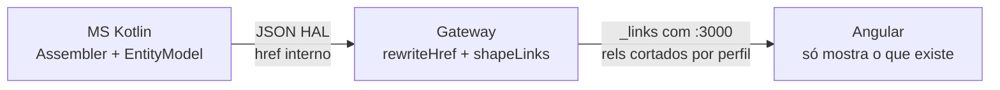
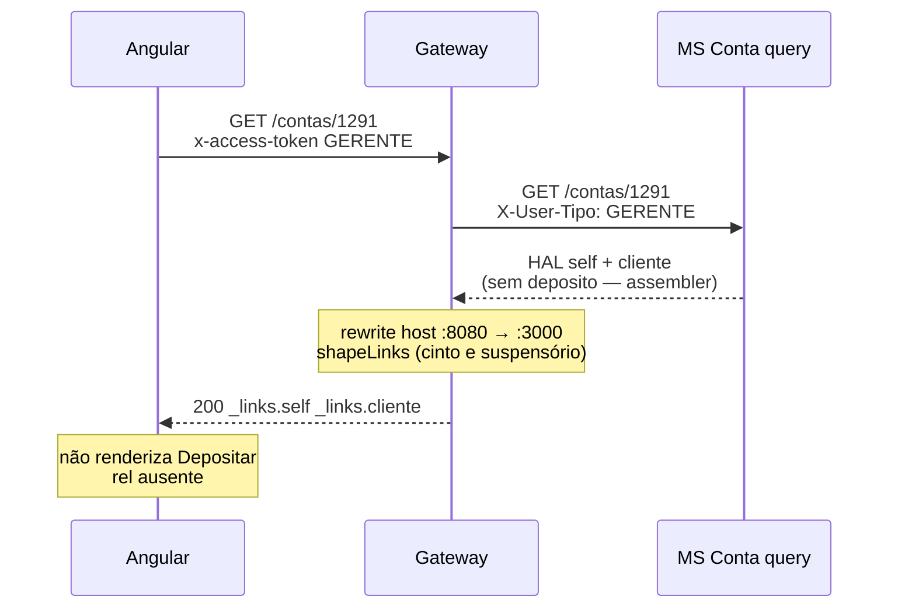

# Tutorial — HATEOAS e hypermedia links

Como o BANTADS usa Richardson **nível 3**: o JSON de negócio traz `_links`, o Angular **não hardcoda** botões, os MSs geram `href` internos e o Gateway **reescreve** tudo para `http://localhost:3000`.

Pipeline: [00-GATEWAY.md](./00-GATEWAY.md). Contrato: [Swagger `Links`](../docs/swagger_bantads.md). UI: [agente frontend](../.cursor/agents/frontend-angular.md).

---

## 0. Por que HATEOAS neste projeto

O enunciado exige Spring HATEOAS e que a interface se oriente pelos links. Sem isso:

- A tela de solicitações teria `if (status === 'PENDENTE') mostrar Aprovar` duplicado no front — e quebraria se a regra mudasse.
- O gerente veria “Depositar” na conta do cliente.
- O Angular apontaria para `http://cliente:8080/...`, origem sem CORS e sem porta publicada.

HATEOAS resolve as três: **estado + perfil → rels presentes ou ausentes**; **href sempre no Gateway**.

Exceções oficiais (**sem** `_links`): login, jobs (202 / status / result), `GET /health`, `POST /reboot`.

---

## 1. Onde cada rel nasce

Dois andares:



| Recurso | Assembler no MS | Extra no Gateway |
|---|---|---|
| Cliente / lista / solicitação | [`ClienteAssembler.kt`](../backend/services/cliente/src/main/kotlin/br/ufpr/dac/bantads/cliente/hateoas/ClienteAssembler.kt) | rewrite; lista R11 monta `self`/`conta` na composition |
| Gerente / lista | [`GerenteAssembler.kt`](../backend/services/gerente/src/main/kotlin/br/ufpr/dac/bantads/gerente/hateoas/GerenteAssembler.kt) | tira `remocao` de si mesmo de novo (cache + perfil) |
| Conta / extrato | [`ContaQueryAssembler.kt`](../backend/services/conta/src/main/kotlin/br/ufpr/dac/bantads/conta/query/http/ContaQueryAssembler.kt) | gerente: apaga `deposito`/`saque`/`transferencia`/`extrato` |
| Depósito/saque/transf. | [`OperacaoAssembler.kt`](../backend/services/conta/src/main/kotlin/br/ufpr/dac/bantads/conta/command/http/OperacaoAssembler.kt) | rewrite `conta` e `extrato` |
| Listas R11/R12 | Gateway [`composition.ts`](../backend/gateway/src/routes/composition.ts) | já usa `publicUrl`; `applyHateoas` no envelope |

Motor do Gateway: [`http/hateoas.ts`](../backend/gateway/src/http/hateoas.ts). Chamado em `sendForwarded`, `cachedGet` e compositions.

---

## 2. O MS gera links (Spring HAL)

Spring HATEOAS serializa `EntityModel` como `{ ...campos, "_links": { "self": { "href": "..." } } }`.

Solicitação **PENDENTE** ganha `aprovacao` e `rejeicao`; depois da decisão, esses rels somem — a UI some os botões sem `if` de status no Angular:

```27:35:backend/services/cliente/src/main/kotlin/br/ufpr/dac/bantads/cliente/hateoas/ClienteAssembler.kt
    fun solicitacao(entity: SolicitacaoEntity): EntityModel<SolicitacaoView> {
        val model = EntityModel.of(toView(entity))
        model.add(linkTo(SolicitacaoController::class.java).slash(entity.cpf).withSelfRel())
        if (entity.status == StatusSolicitacao.PENDENTE) {
            val base = linkTo(SolicitacaoController::class.java).slash(entity.cpf)
            model.add(base.slash("aprovacao").withRel("aprovacao"))
            model.add(base.slash("rejeicao").withRel("rejeicao"))
        }
        return model
    }
```

Cadastro de cliente: `self` + `conta` (leva a [TX-R3A](./TX-R3A-consultar-conta-cpf.md)).

Gerente ativo: `atualizacao`; `remocao` só se `userCpf != entity.cpf` (não se auto-remove na UI; o Gateway ainda bloqueia R15 no handler).

Conta: o MS **já** omite escrita se `userTipo == GERENTE`. O Gateway repete o corte (defesa se o cache/HAL vier completo):

```18:23:backend/services/conta/src/main/kotlin/br/ufpr/dac/bantads/conta/query/http/ContaQueryAssembler.kt
        if (userTipo == Perfil.CLIENTE.wire) {
            model.add(conta.slash("deposito").withRel("deposito"))
            model.add(conta.slash("saque").withRel("saque"))
            model.add(conta.slash("transferencia").withRel("transferencia"))
            model.add(conta.slash("extrato").withRel("extrato"))
        }
```

`linkTo(Controller::class)` usa o host do MS (`http://cliente:8080/...`). Isso **não** pode vazar para o browser.

---

## 3. O Gateway reescreve o host

```27:39:backend/gateway/src/http/hateoas.ts
export function rewriteHref(href: string, publicUrl: string): string {
  try {
    const current = new URL(href);
    if (!INTERNAL_HOSTS.has(current.hostname)) {
      return href;
    }
    const pub = new URL(publicUrl);
    current.protocol = pub.protocol;
    current.host = pub.host;
    return current.toString();
  } catch {
    return href;
  }
}
```

`INTERNAL_HOSTS`: `cliente`, `gerente`, `conta`, `auth`, `localhost`, `127.0.0.1`, …. Path e query **permanecem**. Só protocol+host viram `GATEWAY_PUBLIC_URL` (`http://localhost:3000` no compose).

`rewriteLinks` percorre o JSON recursivamente e troca **qualquer** chave `href` (HAL aninhado em listas). `rewriteLocation` faz o mesmo no header `Location` (201 do autocadastro).

`applyHateoas` = rewrite + `self` de listas + `shapeLinks` condicional.

---

## 4. Links que dependem de quem está logado (Gateway)

Mesmo depois do rewrite, [`shapeLinks`](../backend/gateway/src/http/hateoas.ts):

- Recurso gerente `ativo === true`: garante `atualizacao`; `remocao` só se `user.cpf !== resource.cpf`.
- Gerente inativo: tira `atualizacao` e `remocao`.
- Recurso conta + usuário `GERENTE`: `delete` em `deposito`, `saque`, `transferencia`, `extrato`.

Isso roda **no hit de cache também**. O Redis guarda links “completos”; a response da *esta* request é moldada de novo ([00-REDIS-CACHE.md](./00-REDIS-CACHE.md)).

Listas: `GET /gerentes` ganha `self` da URL pedida + `criacao` → `POST /gerentes` (R13). `GET /clientes` e `/solicitacoes` ganham `self`.

---

## 5. Catálogo de rels (o que a UI deve seguir)

| Rel | Onde aparece | Ação no front |
|---|---|---|
| `self` | quase todo recurso | reconsultar este documento |
| `conta` | cliente, operação, extrato | ir para a conta (R3) |
| `cliente` | conta | cadastro do dono |
| `deposito` / `saque` / `transferencia` / `extrato` | conta do **CLIENTE** | telas R4–R7 |
| `aprovacao` / `rejeicao` | solicitação `PENDENTE` | R9 / R10 |
| `atualizacao` / `remocao` | gerente ativo (não eu) | R14 / R15 |
| `criacao` | lista de gerentes | R13 |

Depois de R4/R5/R6 o body **não** traz saldo novo. O contrato manda seguir `conta` e GET de novo (consistência eventual CQRS).

Jobs usam header `Location: /jobs/{id}/status`, não `_links`. CORS expõe `Location` ao JavaScript ([00-GATEWAY.md](./00-GATEWAY.md)).

---

## 6. Fluxo ponta a ponta (gerente abre uma conta)



JSON típico para o **cliente** dono (rels de escrita presentes):

```json
{
  "numero": "1291",
  "cpfCliente": "12912861012",
  "saldo": "800.00",
  "_links": {
    "self": { "href": "http://localhost:3000/contas/1291" },
    "cliente": { "href": "http://localhost:3000/clientes/12912861012/conta" },
    "deposito": { "href": "http://localhost:3000/contas/1291/deposito" },
    "saque": { "href": "http://localhost:3000/contas/1291/saque" },
    "transferencia": { "href": "http://localhost:3000/contas/1291/transferencia" },
    "extrato": { "href": "http://localhost:3000/contas/1291/extrato" }
  }
}
```

HATEOAS **não substitui** ACL. Esconder o botão é UX; `POST /contas/1291/deposito` com JWT de gerente ainda cai em 403 ([00-ACL.md](./00-ACL.md)).

---

## Arquivos-chave

- [`backend/gateway/src/http/hateoas.ts`](../backend/gateway/src/http/hateoas.ts)  
- [`ClienteAssembler.kt`](../backend/services/cliente/src/main/kotlin/br/ufpr/dac/bantads/cliente/hateoas/ClienteAssembler.kt)  
- [`GerenteAssembler.kt`](../backend/services/gerente/src/main/kotlin/br/ufpr/dac/bantads/gerente/hateoas/GerenteAssembler.kt)  
- [`ContaQueryAssembler.kt`](../backend/services/conta/src/main/kotlin/br/ufpr/dac/bantads/conta/query/http/ContaQueryAssembler.kt)  
- Testes: [`gateway/test/hateoas.test.ts`](../backend/gateway/test/hateoas.test.ts)
