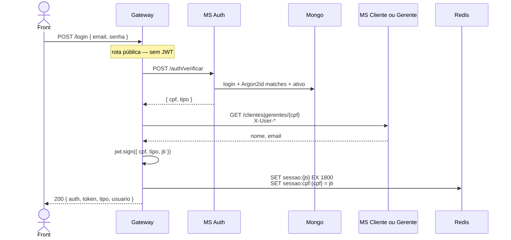

# Tutorial — JWT (`x-access-token`)

Como o Gateway **assina** o token no login, **verifica** em toda rota protegida, por que o JWT sozinho não basta (sessão Redis), e por que os microsserviços **nunca** veem o token.

Visão do pipeline: [00-GATEWAY.md](./00-GATEWAY.md). Login ponta a ponta: [TX-R2A](./TX-R2A-login.md). Logout: [TX-R2B](./TX-R2B-logout.md).

Fontes: [agente gateway](../.cursor/agents/gateway.md) · enunciado [§5.4](../docs/bantads.md) · Swagger (header `x-access-token`, **não** `Authorization: Bearer`).

---

## 0. Por que JWT — e por que só no Gateway

Dois perfis (`CLIENTE` / `GERENTE`) e dezenas de rotas. Sem um comprovante, cada MS teria de conhecer senha. O BANTADS separa:

| Camada | Responsável | O que prova |
|---|---|---|
| Senha Argon2id | MS Auth + Mongo | “este e-mail/senha existem e o usuário está ativo” |
| JWT | **somente o Gateway** (`JWT_SECRET`) | “este pedido veio de um login recente, com este CPF e tipo” |
| Sessão Redis | Gateway | “não houve logout / inatividade de 30 min / reboot” |
| Headers `X-User-*` | Gateway → MS | identidade **já** autenticada; MS só faz posse |

O front guarda o JWT no browser (permitido). **Não** persiste saldo/cadastro em Local Storage.

---

## 1. Onde está o código

| Peça | Arquivo |
|---|---|
| `sign` / `verify` / claims | [`auth/jwt.ts`](../backend/gateway/src/auth/jwt.ts) |
| Hook em toda request | [`auth/hook.ts`](../backend/gateway/src/auth/hook.ts) |
| Emissão no login | [`routes/login.ts`](../backend/gateway/src/routes/login.ts) |
| Revogação no logout | [`routes/logout.ts`](../backend/gateway/src/routes/logout.ts) + [`redis/session.ts`](../backend/gateway/src/redis/session.ts) |
| Segredo e TTL | [`config.ts`](../backend/gateway/src/config.ts) `JWT_SECRET`, `JWT_EXPIRES_IN = '8h'` |
| Tipo em `request.user` | [`types/fastify.ts`](../backend/gateway/src/types/fastify.ts) |

Biblioteca: `jsonwebtoken` (HMAC, default HS256). O MS Auth **não** importa JWT.

---

## 2. O que vai dentro do token

```12:16:backend/gateway/src/auth/jwt.ts
export function signAccessToken(secret: string, claims: JwtClaims): string {
  return jwt.sign({ cpf: claims.cpf, tipo: claims.tipo, jti: claims.jti }, secret, {
    expiresIn: JWT_EXPIRES_IN,
  });
}
```

| Claim | Origem | Para quê |
|---|---|---|
| `cpf` | MS Auth (`POST /auth/verificar`) | identidade; vira `X-User-CPF` |
| `tipo` | mesmo (`CLIENTE` \| `GERENTE`) | ACL + `X-User-Tipo` |
| `jti` | `randomUUID()` no login | liga o token à chave `sessao:{jti}` e à lista de revogados |
| `exp` | biblioteca (`8h` a partir do `sign`) | vida **absoluta**. Não desliza. |
| `iat` | biblioteca | instante da emissão |

Não entram nome, e-mail nem senha. O objeto `usuario` do login é JSON **ao lado** do token, não dentro dele.

`verifyAccessToken` exige os quatro campos; payload incompleto = token inválido.

---

## 3. Fluxo de emissão (login)



Trecho:

```76:85:backend/gateway/src/routes/login.ts
    const jti = randomUUID();
    const token = signAccessToken(deps.config.jwtSecret, { cpf, tipo: tipoRaw, jti });
    const exp = tokenExpiry(token);
    await createSession(deps.store, { cpf, tipo: tipoRaw, jti, exp });
    return reply.code(200).send({
      auth: true,
      token,
      tipo: tipoRaw,
      usuario,
    });
```

Senha errada, usuário inativo (R15) ou cadastro sumiu → Gateway responde `401 { auth: false, message: "Login inválido!" }` **sem** token. O MS Auth nunca devolve o hash.

Um CPF só tem **uma** sessão viva: [`createSession`](../backend/gateway/src/redis/session.ts) lê `sessao:cpf:{cpf}`; se houver outro `jti`, apaga `sessao:{jtiAntigo}`. Login novo derruba o token antigo mesmo que o JWT ainda não tenha expirado (a sessão some → próximo request 401).

O Angular passa a mandar em **todo** request autenticado:

```http
x-access-token: eyJhbGciOiJIUzI1NiIsInR5cCI6IkpXVCJ9...
```

Não use `Authorization: Bearer`. CORS libera especificamente `x-access-token` ([00-GATEWAY.md](./00-GATEWAY.md) módulo CORS).

---

## 4. Fluxo de verificação (request protegida)

Depois do plugin CORS, o hook `onRequest`:

```13:52:backend/gateway/src/auth/hook.ts
  app.addHook('onRequest', async (request, reply) => {
    if (request.method === 'OPTIONS') {
      return; // preflight não carrega token
    }
    const path = pathnameOf(request.url);
    if (isPublicRoute(request.method, path)) {
      return;
    }
    const token = request.headers['x-access-token'];
    // ausente → 401 "Token não fornecido."
    user = verifyAccessToken(deps.jwtSecret, raw);
    // assinatura / exp / payload → 401 "Falha ao autenticar o token."
    if (await isRevoked(deps.store, user.jti)) { /* 401 */ }
    const session = await readSession(deps.store, user.jti);
    if (!session) { /* 401 inatividade ou login em outro lugar */ }
    await touchSession(deps.store, user.cpf, user.jti);
    request.user = user;
    // ACL — ver 00-ACL.md
  });
```

Checklist, nesta ordem:

1. **OPTIONS** — pula (preflight).  
2. **Rota pública** — login, health, reboot, POST `/solicitacoes`. Sem token.  
3. **Header presente?** Não → `Token não fornecido.`  
4. **`jwt.verify(secret)`** — assinatura HMAC + `exp`. Relógio do servidor. Token adulterado ou com mais de 8 h → falha.  
5. **`revogado:{jti}`** — logout ainda dentro das 8 h.  
6. **`sessao:{jti}`** — sliding window. Sumiu = 30 min sem request (ou reboot `FLUSHDB`, ou login novo no mesmo CPF).  
7. **`touchSession`** — `EXPIRE` de novo em 30 min nas duas chaves (`sessao:{jti}` e `sessao:cpf:{cpf}`). O `exp` do JWT **não** anda.  
8. **`request.user`** — handlers e `identityHeaders` leem daqui.  
9. **ACL** — [00-ACL.md](./00-ACL.md).

Duas vidas independentes:

```
JWT  ████████████████████ 8 h (absoluto)
Redis ████ 30 min, renovado a cada request autenticada
```

Usuário ocioso 31 min: JWT ainda válido, Redis vazio → 401 `"Falha ao autenticar o token."` (mesma mensagem de token furado, de propósito: não vazar se a sessão caiu ou o JWT é falso).

---

## 5. Logout e reboot

Logout ([`logout.ts`](../backend/gateway/src/routes/logout.ts)): precisa de JWT válido. `revokeSession` apaga as duas chaves de sessão e grava `revogado:{jti} = 1` com TTL = segundos que faltam para `exp`. Resposta **204** sem body.

Enquanto `revogado:{jti}` existir, reenviar o mesmo JWT falha no passo 5 — mesmo se alguém recriasse `sessao:{jti}` à mão.

`POST /reboot` faz `FLUSHDB`: todas as sessões morrem. Tokens que o HTTPie ainda tinha deixam de valer. É preciso [logar de novo](./TX-R2A-login.md).

SAGA R15, ao concluir, chama `cache.deleteSessions(cpf)` do gerente inativado ([`RedisCacheInvalidator`](../backend/services/saga/src/main/kotlin/br/ufpr/dac/bantads/saga/store/RedisCacheInvalidator.kt)): o JWT dele continua no browser, mas a sessão some → próximo clique 401.

---

## 6. O JWT **não** vai para o backend Kotlin

[`identityHeaders`](../backend/gateway/src/routes/proxy.ts) monta só:

```http
Accept: application/json
Content-Type: application/json
X-User-CPF: 12912861012
X-User-Tipo: CLIENTE
```

Os MSs **não** têm `JWT_SECRET` e não chamam `jwt.verify`. Confiança = rede Docker (portas 808x não publicadas) + Gateway como único emissor dos `X-User-*`. Posse (esta conta é sua?) é [`Identity.kt`](../backend/services/conta/src/main/kotlin/br/ufpr/dac/bantads/conta/web/Identity.kt), não JWT.

---

## 7. Erros que o front vê

| Situação | HTTP | `message` |
|---|---|---|
| Sem header | 401 | `Token não fornecido.` |
| Assinatura / exp / jti / sessão / revogado | 401 | `Falha ao autenticar o token.` |
| E-mail/senha/inativo | 401 | `Login inválido!` |

Corpo de auth: `{ auth: false, message }` — **sem** `_links`.

---

## Arquivos-chave

- [`backend/gateway/src/auth/jwt.ts`](../backend/gateway/src/auth/jwt.ts)  
- [`backend/gateway/src/auth/hook.ts`](../backend/gateway/src/auth/hook.ts)  
- [`backend/gateway/src/redis/session.ts`](../backend/gateway/src/redis/session.ts)  
- [`backend/gateway/src/routes/login.ts`](../backend/gateway/src/routes/login.ts)  
- MS Auth (só senha): [`AuthService.kt`](../backend/services/auth/src/main/kotlin/br/ufpr/dac/bantads/auth/user/AuthService.kt)
