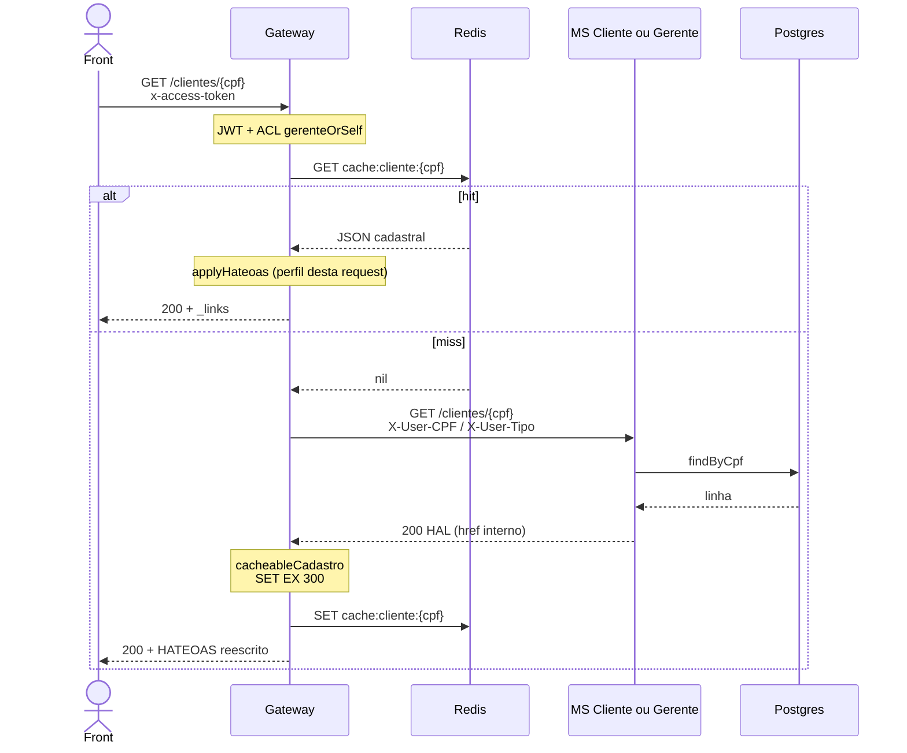

# Tutorial — Redis cache (cadastro)

Como o Gateway usa Redis como **cache-aside** de dados cadastrais, por que só isso entra no cache, onde as chaves nascem e morrem, e o fluxo miss → MS → hit.

Pipeline geral do Gateway: [00-GATEWAY.md](./00-GATEWAY.md). Redis também guarda sessão JWT e jobs 202 — isso **não** é cache de cadastro (ver §1).

Fontes: [agente gateway](../.cursor/agents/gateway.md) · [`cache.ts`](../backend/gateway/src/redis/cache.ts) · [`proxy.ts`](../backend/gateway/src/routes/proxy.ts)

---

## 0. Por que existe

Consultar `GET /clientes/{cpf}` ou `GET /gerentes/{cpf}` bate no Postgres a cada tela (cadastro, HATEOAS `self`, composition de login). Cadastro muda pouco; saldo muda o tempo todo.

O enunciado pede Redis para **cache** ([`docs/bantads.md`](../docs/bantads.md)). A regra do projeto é estreita:

| Entra no cache | Não entra |
|---|---|
| JSON cadastral de **um** cliente (`cache:cliente:{cpf}`) | Saldo, extrato, lista R11 |
| JSON cadastral de **um** gerente (`cache:gerente:{cpf}`) | `quantidadeClientes` (R12 vem do MS Conta na hora) |
| TTL 5 min | Jobs, sessões (outras chaves Redis) |

Se o Gateway cacheasse saldo, R4/R5/R6 + CQRS eventual deixariam a UI mentindo. Por isso [`cachedGet`](../backend/gateway/src/routes/proxy.ts) só envolve as duas rotas de cadastro por CPF.

---

## 1. Redis no BANTADS: três usos, um servidor

Um contêiner [`redis:7-alpine`](../docker-compose.yml) (`maxmemory 100mb`, política **`noeviction`**: se encher, `SET` falha em vez de apagar sessão). Gateway e MS Saga compartilham o **mesmo** Redis — a invalidação da SAGA apaga as mesmas chaves que o Gateway lê.

| Prefixo | TTL | Módulo | Tutorial |
|---|---|---|---|
| `cache:cliente:` / `cache:gerente:` | 5 min | cache-aside | **este arquivo** |
| `sessao:` / `sessao:cpf:` / `revogado:` | 30 min / resto do JWT | sessão | [00-JWT.md](./00-JWT.md) |
| `job:` | 5 min | polling 202 | [TX-JOB-01](./TX-JOB-01-status.md) |

`CACHE_TTL_SECONDS = 5 * 60` em [`config.ts`](../backend/gateway/src/config.ts).

---

## 2. Onde está o código

| Peça | Arquivo | Papel |
|---|---|---|
| Chaves + GET/SET JSON | [`redis/cache.ts`](../backend/gateway/src/redis/cache.ts) | `clienteCacheKey`, `readCache`, `writeCache` |
| Hit/miss | [`routes/proxy.ts`](../backend/gateway/src/routes/proxy.ts) `cachedGet` | Único leitor do cache de cadastro |
| Rotas | mesmo `proxy.ts` | `GET /clientes/:cpf`, `GET /gerentes/:cpf` |
| Invalidar no PUT | `PUT /gerentes/:cpf` no `proxy.ts` | `DEL cache:gerente:{cpf}` se o MS devolver 200 |
| Invalidar na SAGA | [`RedisCacheInvalidator.kt`](../backend/services/saga/src/main/kotlin/br/ufpr/dac/bantads/saga/store/RedisCacheInvalidator.kt) | R9 cliente; R13/R15 gerente |
| Limpar tudo | [`reboot.ts`](../backend/gateway/src/routes/reboot.ts) | `FLUSHDB` depois do seed |

O MS Cliente/Gerente **não** fala com Redis. Só o Gateway escreve cache; o orquestrador só **apaga**.

---

## 3. Padrão cache-aside (passo a passo)

Não é write-through nem cache no MS. O Redis é um atalho **na frente** do GET:



Código:

```84:116:backend/gateway/src/routes/proxy.ts
async function cachedGet(
  request: FastifyRequest,
  reply: FastifyReply,
  deps: ProxyDeps,
  baseUrl: string,
  cacheKey: string,
): Promise<void> {
  const hit = await readCache(deps.store, cacheKey);
  if (hit) {
    reply.code(200).send(
      applyHateoas(hit, {
        publicUrl: deps.config.publicUrl,
        user: request.user,
        requestUrl: request.url.startsWith('/') ? request.url : `/${request.url}`,
      }),
    );
    return;
  }
  const forwarded = await forward(request, deps, baseUrl);
  if (forwarded.status !== 200) {
    sendForwarded(reply, forwarded, request, deps.config.publicUrl);
    return;
  }
  const stored = cacheableCadastro(forwarded.body, deps.config.publicUrl);
  await writeCache(deps.store, cacheKey, stored);
  reply.code(200).send(
    applyHateoas(stored, { /* ... user desta request ... */ }),
  );
}
```

Detalhes importantes:

1. **404/403 do MS não são cacheados.** Só `status === 200` chama `writeCache`.
2. O valor gravado passa por [`cacheableCadastro`](../backend/gateway/src/http/hateoas.ts): `href` internos viram `GATEWAY_PUBLIC_URL`, e o cadastro ganha `self` + `conta` (cliente) ou `atualizacao`/`remocao` (gerente ativo).
3. No **hit**, o Gateway **não** devolve o JSON cru. Roda `applyHateoas` de novo com o `request.user` atual. Assim um gerente olhando **a si mesmo** perde o rel `remocao` mesmo se o cache tiver sido preenchido por outro gerente (teste em [`hateoas.test.ts`](../backend/gateway/test/hateoas.test.ts)).
4. JWT/ACL rodam **antes** do Redis. Cache hit não fura autorização: cliente A não lê o cadastro de B só porque a chave existe.

Ligação das rotas:

```208:224:backend/gateway/src/routes/proxy.ts
  app.get('/clientes/:cpf', async (request, reply) => {
    const cpf = (request.params as { cpf: string }).cpf;
    await cachedGet(request, reply, deps, deps.config.clienteUrl, clienteCacheKey(cpf));
  });
  // ...
  app.get('/gerentes/:cpf', async (request, reply) => {
    const cpf = (request.params as { cpf: string }).cpf;
    await cachedGet(request, reply, deps, deps.config.gerenteUrl, gerenteCacheKey(cpf));
  });
```

Chaves:

```3:9:backend/gateway/src/redis/cache.ts
export function clienteCacheKey(cpf: string): string {
  return `cache:cliente:${cpf}`;
}
export function gerenteCacheKey(cpf: string): string {
  return `cache:gerente:${cpf}`;
}
```

`writeCache` faz `SET key json EX 300`. JSON podre no Redis → `readCache` apaga a chave e trata como miss.

---

## 4. Invalidação — quando o atalho mente

Cache-aside só é seguro se **todo write** que muda cadastro apagar a chave.

| Evento | Quem apaga | Chave |
|---|---|---|
| SAGA R9 conclui (cliente criado) | [`SagaEngine`](../backend/services/saga/src/main/kotlin/br/ufpr/dac/bantads/saga/engine/SagaEngine.kt) `cache.deleteCliente(cpf)` | `cache:cliente:{cpf}` |
| SAGA R13 conclui (gerente inserido) | `cache.deleteGerente(cpf)` | `cache:gerente:{cpf}` |
| SAGA R15 conclui (gerente inativado) | `cache.deleteGerente(cpf)` | `cache:gerente:{cpf}` |
| `PUT /gerentes/{cpf}` 200 (R14) | Gateway `store.del(gerenteCacheKey(cpf))` | `cache:gerente:{cpf}` |
| `POST /reboot` | `FLUSHDB` | **todas** as chaves Redis do BANTADS |
| TTL 5 min | Redis sozinho | a chave some |

R14 no Gateway:

```225:232:backend/gateway/src/routes/proxy.ts
  app.put('/gerentes/:cpf', async (request, reply) => {
    const cpf = (request.params as { cpf: string }).cpf;
    const forwarded = await forward(request, deps, deps.config.gerenteUrl);
    if (forwarded.status === 200) {
      await deps.store.del(gerenteCacheKey(cpf));
    }
    sendForwarded(reply, forwarded, request, deps.config.publicUrl);
  });
```

SAGA (mesmo Redis que o Gateway):

```11:13:backend/services/saga/src/main/kotlin/br/ufpr/dac/bantads/saga/store/RedisCacheInvalidator.kt
    override fun deleteCliente(cpf: String?) = delete("cache:cliente:", cpf)

    override fun deleteGerente(cpf: String?) = delete("cache:gerente:", cpf)
```

R9 **não** pré-aquece o cache: só deleta. O próximo GET é miss e busca o cliente recém-criado no Postgres.

R15 também chama `deleteSessions(cpf)` no gerente removido (sessão JWT, não cache) — ver [00-JWT.md](./00-JWT.md).

---

## 5. O que deliberadamente não usa cache

| Rota | Por quê |
|---|---|
| `GET /clientes?busca=` (R11) | Composition com **saldos** ao vivo no MS Conta |
| `GET /gerentes` (R12) | `quantidadeClientes` muda em R9/R13/R15 |
| `GET .../conta`, extrato, depósito | Saldo / eventos |
| `GET /solicitacoes` | Estado da aprovação muda na hora |
| Login | Sempre Auth + cadastro fresco para montar `usuario` |

---

## 6. Fluxo HTTP de exemplo

Primeiro `GET /clientes/12912861012` após reboot (miss):

```http
GET /clientes/12912861012 HTTP/1.1
Host: localhost:3000
x-access-token: <jwt>
```

Gateway → `GET cache:cliente:12912861012` → nil → `GET http://cliente:8080/clientes/12912861012` com `X-User-*` → `SET cache:cliente:12912861012 "{...}" EX 300` → 200 ao front.

Segundo GET nos 5 minutos: só Redis + `applyHateoas`. O MS Cliente nem acorda.

---

## Arquivos-chave

- [`backend/gateway/src/redis/cache.ts`](../backend/gateway/src/redis/cache.ts)  
- [`backend/gateway/src/routes/proxy.ts`](../backend/gateway/src/routes/proxy.ts) (`cachedGet`)  
- [`backend/services/saga/src/main/kotlin/br/ufpr/dac/bantads/saga/store/RedisCacheInvalidator.kt`](../backend/services/saga/src/main/kotlin/br/ufpr/dac/bantads/saga/store/RedisCacheInvalidator.kt)  
- Transação: [TX-CAD-01](./TX-CAD-01-consultar-cliente.md) · [TX-CAD-02](./TX-CAD-02-consultar-gerente.md)
