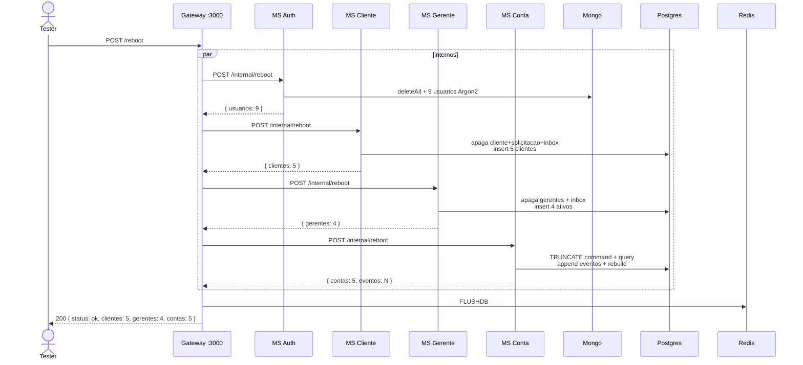

# Tutorial — como o seed enche os bancos

O BANTADS **não** nasce com Catharyna e os gerentes no `docker compose up`. As tabelas existem (Flyway / init SQL); as **linhas** da seção 4 do enunciado entram com `POST /reboot`. Este arquivo segue esse processo banco a banco.

Chamada HTTP: [TX-INFRA-02](./TX-INFRA-02-reboot.md) · HTTPie: [`httpie/TX-INFRA-02-reboot.md`](../httpie/TX-INFRA-02-reboot.md). Dados canônicos: [enunciado §4](../docs/bantads.md) e [agente contrato](../.cursor/agents/contract-api.md).

---

## 0. Por que seed + reboot (e não “INSERT no compose”)

A suíte de aceite (pytest T00, HTTPie) precisa de um **estado conhecido**: 5 clientes, 4 gerentes, 5 contas, senha `tads`, saldos e extrato da seção 4. Depois de R9/R4 o mundo muda. `POST /reboot` **apaga e recria** esse estado — idempotente (segundo reboot = mesmo JSON).

Também:

- Limpa solicitações pendentes, inbox de SAGA, jobs e sessões JWT (`FLUSHDB`).
- No MS Conta, o saldo do seed **não** é um `UPDATE saldo`. É replay de eventos no event store + projeção CQRS.

Flyway / `db/postgres/init/` só criam **schemas e users**. Mongo sobe vazio. Sem reboot, login `cli1@bantads.com.br` / `tads` falha.

---

## 1. O que o init cria (vazio)

| Persistência | Quem cria a estrutura | Dados de negócio |
|---|---|---|
| Postgres schemas `cliente`, `gerente`, `conta_command`, `conta_query` | [`db/postgres/init/01-extensions-schemas.sql`](../db/postgres/init/01-extensions-schemas.sql) + users em [`02-users.sh`](../db/postgres/init/02-users.sh) | nenhum |
| Tabelas JPA | Flyway de cada MS no **próprio** schema | nenhum até reboot |
| Mongo `usuarios` | Spring Data no MS Auth | nenhum até reboot |
| Redis | contêiner vazio | reboot dá `FLUSHDB` no fim |

Saga e Email **não** têm seed de domínio (filas Rabbit já vêm de `definitions.json`).

---

## 2. O disparo: Gateway `POST /reboot`

Rota **pública** (sem JWT). Timeout 60 s por MS (Argon2 × 9 hashes + truncar event store).



[`reboot.ts`](../backend/gateway/src/routes/reboot.ts) dispara os quatro `POST /internal/reboot` em **paralelo** (`Promise.all`). Se algum status não for 2xx → 500 `"Falha ao recriar o seed"` e **não** deveria ser usado como “quase seed”. Em sucesso: `flushdb()` e o JSON do contrato (**sem** `_links`, **sem** contar usuários Auth — o tester só vê clientes/gerentes/contas).

Os MSs **não** são públicos: só o Gateway alcança `/internal/reboot`.

---

## 3. MS Auth → Mongo

Constantes: [`SeedUsers.kt`](../backend/services/auth/src/main/kotlin/br/ufpr/dac/bantads/auth/seed/SeedUsers.kt). Senha em claro **só** a constante `tads`; no banco vai Argon2id (`$argon2id$...`).

```64:78:backend/services/auth/src/main/kotlin/br/ufpr/dac/bantads/auth/user/AuthService.kt
    fun reboot(): Int {
        usuarios.deleteAll()
        val senhaHash = passwordEncoder.encode(SeedUsers.SENHA)
        SeedUsers.ALL.forEach { seed ->
            usuarios.save(
                Usuario(
                    cpf = seed.cpf,
                    login = normalizeLogin(seed.login),
                    senhaHash = senhaHash,
                    tipo = seed.tipo,
                    ativo = true,
                ),
            )
        }
        return SeedUsers.ALL.size
    }
```

O controller também `sagaInbox.deleteAll()` ([`RebootController`](../backend/services/auth/src/main/kotlin/br/ufpr/dac/bantads/auth/reboot/RebootController.kt)).

| CPF | login | tipo |
|---|---|---|
| 12912861012 | cli1@bantads.com.br | CLIENTE |
| 09506382000 | cli2@… | CLIENTE |
| 85733854057 | cli3@… | CLIENTE |
| 58872160006 | cli4@… | CLIENTE |
| 76179646090 | cli5@… | CLIENTE |
| 98574307084 | ger1@bantads.com.br | GERENTE |
| 64065268052 | ger2@… | GERENTE |
| 23862179060 | ger3@… | GERENTE |
| 40501740066 | ger4@… | GERENTE |

Argon2 no `application.yml`: ~19 MiB, 2 iterações, parallelism 1 (cabe no `mem_limit` do MS). O hash é **o mesmo objeto** reutilizado nos 9 saves (mesmo salt daquela chamada `encode` — um encode, nove documentos). Login depois usa `passwordEncoder.matches("tads", hash)`.

Nome da pessoa **não** está no Mongo. O login composition busca no Postgres Cliente/Gerente ([TX-R2A](./TX-R2A-login.md)).

---

## 4. MS Cliente → Postgres schema `cliente`

[`SeedClientes.kt`](../backend/services/cliente/src/main/kotlin/br/ufpr/dac/bantads/cliente/seed/SeedClientes.kt) + [`CadastroService.reboot`](../backend/services/cliente/src/main/kotlin/br/ufpr/dac/bantads/cliente/cadastro/CadastroService.kt):

1. `clientes.deleteAll()`  
2. `solicitacoes.deleteAll()` — **zero** pendências R1 no seed  
3. `sagaInbox.deleteAll()` no controller  
4. Insert dos 5 cadastros (endereço Curitiba/PR, salários do enunciado)

| Nome | CPF | e-mail | salário (cadastro, **não** saldo) |
|---|---|---|---|
| Catharyna | 12912861012 | cli1@… | `10000.00` |
| Cleuddônio | 09506382000 | cli2@… | `20000.00` |
| Catianna | 85733854057 | cli3@… | `3000.00` |
| Cutardo | 58872160006 | cli4@… | `500.00` |
| Coândrya | 76179646090 | cli5@… | `1500.00` |

Saldo da conta é outra coisa (próxima seção). Telefone/logradouro são escolhas do time (“você escolhe” no enunciado), cravadas nestas constantes para os testes serem estáveis.

---

## 5. MS Gerente → Postgres schema `gerente`

[`SeedGerentes.kt`](../backend/services/gerente/src/main/kotlin/br/ufpr/dac/bantads/gerente/seed/SeedGerentes.kt): quatro **ativos**.

| Nome | CPF | e-mail | contas no seed (R12) |
|---|---|---|---|
| Geniéve | 98574307084 | ger1@… | 2 (1291, 5887) |
| Godophredo | 64065268052 | ger2@… | 2 (0950, 7617) |
| Gyândula | 23862179060 | ger3@… | 1 (8573) |
| Gadamântio | 40501740066 | ger4@… | **0** |

`quantidadeClientes` **não** é coluna seedada no gerente: R12 composition pergunta ao MS Conta `/internal/contagem-por-gerente`.

---

## 6. MS Conta → CQRS (dois schemas)

Este é o seed mais trabalhoso. Não há `INSERT INTO conta (saldo)`. [`SeedContas.kt`](../backend/services/conta/src/main/kotlin/br/ufpr/dac/bantads/conta/command/seed/SeedContas.kt) lista **eventos** (criação + depósitos/saques/transferência da seção 4). [`toStored()`](../backend/services/conta/src/main/kotlin/br/ufpr/dac/bantads/conta/command/seed/SeedContas.kt) vira `StoredEvent` com versão 1..N por número de conta e UUID determinístico (`UUID.nameUUIDFromBytes("conta:{numero}:{versao}")`) — reboot duas vezes gera os **mesmos** ids.

[`RebootService`](../backend/services/conta/src/main/kotlin/br/ufpr/dac/bantads/conta/reboot/RebootService.kt):

```24:48:backend/services/conta/src/main/kotlin/br/ufpr/dac/bantads/conta/reboot/RebootService.kt
    fun resetAndSeed() = run {
        entityManager
            .createNativeQuery("TRUNCATE TABLE conta_command.saga_inbox, conta_command.evento RESTART IDENTITY")
            .executeUpdate()
        // ...
        val seeded = SeedContas.toStored()
        seeded.forEach { store.append(it) }
        seeded
    }
    fun reboot(): RebootResponse {
        val seeded = commandReboot.resetAndSeed()
        projector.rebuild(seeded)
        val contas = seeded.map { it.objetoId }.distinct().size
        return RebootResponse(contas = contas, eventos = seeded.size)
    }
```

`EventProjector.rebuild`: `TRUNCATE` em `conta_query.conta`, `movimentacao`, `projecao_aplicada` e aplica cada evento na ordem (saldo começa `0.00` no `CRIADO` e anda com DEPOSITO/SAQUE/TRANSFERÊNCIA).

Saldos finais que os testes cravam:

| Conta | Cliente | Gerente | Saldo |
|---|---|---|---|
| `1291` | Catharyna | Geniéve | `800.00` |
| `0950` | Cleuddônio | Godophredo | `10000.00` |
| `8573` | Catianna | Gyândula | `200.00` |
| `5887` | Cutardo | Geniéve | `150000.00` |
| `7617` | Coândrya | Godophredo | `1500.00` |

A transferência Catharyna → Cleuddônio `1700.00` gera **dois** eventos (`TRANSFERENCIA_ORIGEM` em 1291 e `TRANSFERENCIA_DESTINO` em 0950), senão o extrato de um lado ficaria mudo.

---

## 7. Redis no final

Depois dos quatro 2xx, o Gateway `FLUSHDB`:

- sessões JWT (precisa logar de novo)  
- `revogado:*`  
- `cache:cliente:` / `cache:gerente:` ([00-REDIS-CACHE.md](./00-REDIS-CACHE.md))  
- `job:*`  

Estado do orquestrador no Redis (SAGA em voo) também some — reboot no meio de um 202 não é cenário de teste.

---

## 8. O que o seed **não** inclui

- Solicitações de autocadastro (R1). Depois do reboot a lista R8 está vazia até alguém POST `/solicitacoes`.  
- Senhas geradas por R9 (as do seed são sempre `tads`).  
- 5º gerente / contas reatribuídas de R13–R15.  
- E-mails no outbox (`MAIL_DEV`) — arquivos em `outbox/` não são apagados pelo reboot dos MSs.

---

## 9. Fluxo para o aluno / tester

1. `docker compose up` — bancos vazios de negócio, health UP.  
2. `POST http://localhost:3000/reboot` (timeout ≥ 90 s no HTTPie).  
3. Esperar `{ "status": "ok", "clientes": 5, "gerentes": 4, "contas": 5 }`.  
4. `POST /login` `{ "email": "cli1@bantads.com.br", "senha": "tads" }`.  
5. Conferir `GET /contas/1291` saldo `"800.00"`.

Segundo reboot deve devolver o **mesmo** JSON (T00). Isso prova truncate+replay, não “INSERT de novo em cima”.

---

## Arquivos-chave

- [`backend/gateway/src/routes/reboot.ts`](../backend/gateway/src/routes/reboot.ts)  
- [`SeedUsers.kt`](../backend/services/auth/src/main/kotlin/br/ufpr/dac/bantads/auth/seed/SeedUsers.kt)  
- [`SeedClientes.kt`](../backend/services/cliente/src/main/kotlin/br/ufpr/dac/bantads/cliente/seed/SeedClientes.kt)  
- [`SeedGerentes.kt`](../backend/services/gerente/src/main/kotlin/br/ufpr/dac/bantads/gerente/seed/SeedGerentes.kt)  
- [`SeedContas.kt`](../backend/services/conta/src/main/kotlin/br/ufpr/dac/bantads/conta/command/seed/SeedContas.kt)  
- [`RebootService.kt`](../backend/services/conta/src/main/kotlin/br/ufpr/dac/bantads/conta/reboot/RebootService.kt) (command + query)  
- Init vazio: [`db/postgres/init/`](../db/postgres/init/)
