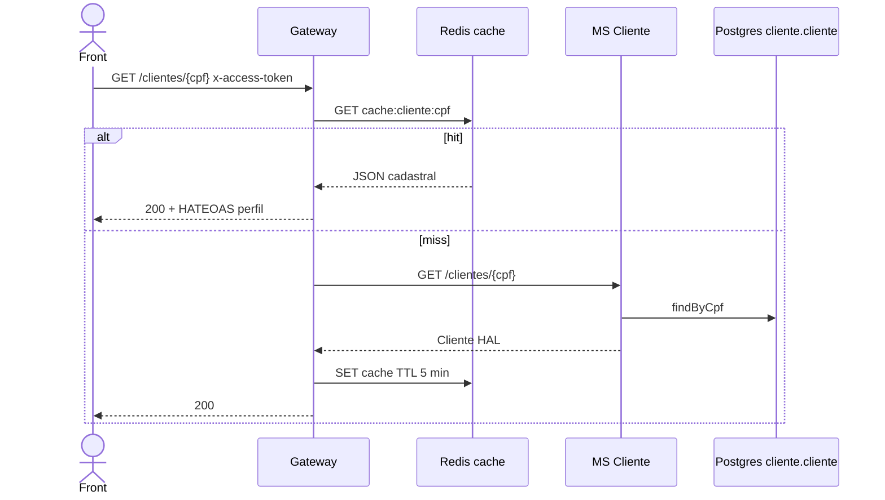

# TX-CAD-01 — Consultar cliente (cadastro)

**ID:** `TX-CAD-01`  
**HTTPie:** [`../httpie/TX-CAD-01-consultar-cliente.md`](../httpie/TX-CAD-01-consultar-cliente.md)

Dados cadastrais (sem saldo). Cache-aside no Gateway. É o recurso do job R9 (`dominio=clientes`).

## Diagrama de sequência



## O que acontece

### 1. Front

Cliente: só o próprio CPF. Gerente: qualquer cliente (após R9, após busca R11). Links `self` e `conta`.

### 2. Gateway cache-aside

[`cachedGet`](../backend/gateway/src/routes/proxy.ts) + chave [`cache:cliente:{cpf}`](../backend/gateway/src/redis/cache.ts):

```84:115:backend/gateway/src/routes/proxy.ts
async function cachedGet(
  request: FastifyRequest,
  reply: FastifyReply,
  deps: ProxyDeps,
  baseUrl: string,
  cacheKey: string,
): Promise<void> {
  const hit = await readCache(deps.store, cacheKey);
  if (hit) {
    reply.code(200).send(applyHateoas(hit, { /* ... */ }));
    return;
  }
  // miss: REST no MS, writeCache, applyHateoas
}
```

Invalidação: SAGA R9 (`CacheInvalidator`). **Nunca** cacheia saldo.

### 3. MS Cliente + Postgres

[`CadastroController.obter`](../backend/services/cliente/src/main/kotlin/br/ufpr/dac/bantads/cliente/cadastro/CadastroController.kt) — `Identity.requireGerenteOrSelf` — tabela `cliente` ([schema](../backend/services/cliente/src/main/resources/db/migration/V1__cliente_schema.sql)).

### 4. Reply

Salário string; `_links.conta` aponta para [TX-R3A](./TX-R3A-consultar-conta-cpf.md).

## Arquivos-chave

- [`CadastroController.kt`](../backend/services/cliente/src/main/kotlin/br/ufpr/dac/bantads/cliente/cadastro/CadastroController.kt)  
- [`cache.ts`](../backend/gateway/src/redis/cache.ts)  
- [`proxy.ts`](../backend/gateway/src/routes/proxy.ts) (`GET /clientes/:cpf`)
