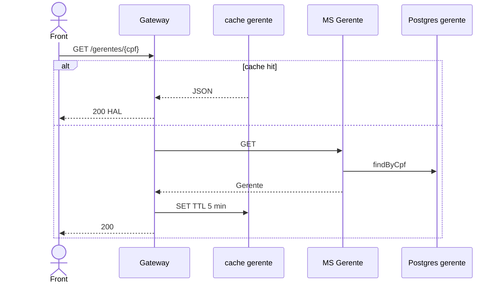

# TX-CAD-02 — Consultar um gerente

**ID:** `TX-CAD-02`  
**HTTPie:** [`../httpie/TX-CAD-02-consultar-gerente.md`](../httpie/TX-CAD-02-consultar-gerente.md)

Recurso `GET /gerentes/{cpf}` (job R13). Cache `cache:gerente:{cpf}`. `quantidadeClientes` pode ser nula aqui.

## Diagrama de sequência

## O que acontece

Mesmo padrão de [TX-CAD-01](./TX-CAD-01-consultar-cliente.md): [`cachedGet`](../backend/gateway/src/routes/proxy.ts) com [`gerenteCacheKey`](../backend/gateway/src/redis/cache.ts). MS: [`GerenteController.obter`](../backend/services/gerente/src/main/kotlin/br/ufpr/dac/bantads/gerente/cadastro/GerenteController.kt). Invalidação em R13/R14/R15.

`remocao` omitida se for o próprio autenticado ([`hateoas.ts`](../backend/gateway/src/http/hateoas.ts)).

## Arquivos-chave

- [`GerenteController.kt`](../backend/services/gerente/src/main/kotlin/br/ufpr/dac/bantads/gerente/cadastro/GerenteController.kt)  
- [`cache.ts`](../backend/gateway/src/redis/cache.ts)
