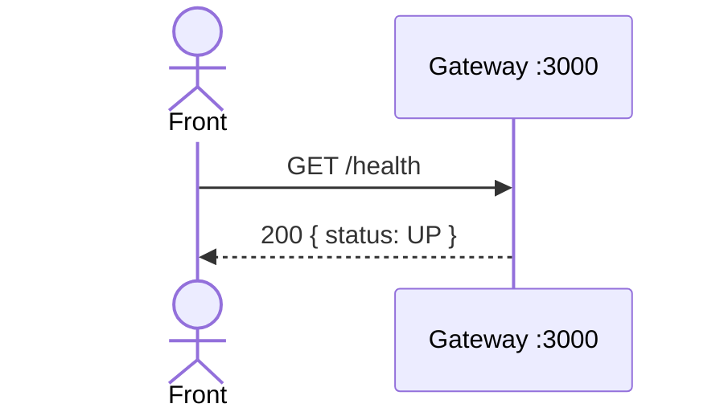

# TX-INFRA-01 — Health check do Gateway

**ID:** `TX-INFRA-01`  
**HTTPie:** [`../httpie/TX-INFRA-01-health.md`](../httpie/TX-INFRA-01-health.md)

O front (ou o Docker healthcheck) pergunta se o **único ponto de entrada** está no ar. Não há banco, JWT nem `_links`.

## Diagrama de sequência



Os microsserviços têm o próprio `GET /health` **interno** (Compose), não exposto no Gateway.

## O que acontece

### 1. Request do front

O SPA/HTTPie chama só `http://localhost:3000/health`. Rota pública em [`acl.ts`](../backend/gateway/src/auth/acl.ts) — o hook JWT **não** corre.

### 2. Gateway

Registrado em [`app.ts`](../backend/gateway/src/app.ts):

```42:42:backend/gateway/src/app.ts
  app.get('/health', async () => ({ status: 'UP' }));
```

Não consulta Redis nem MSs. O Compose usa `wget` nesse path no healthcheck do serviço `gateway` em [`docker-compose.yml`](../docker-compose.yml).

### 3. Reply

JSON `{ "status": "UP" }` sem `_links`. Se o front não recebe isso, o restante das transações nem deve começar.

## Arquivos-chave

- [`backend/gateway/src/app.ts`](../backend/gateway/src/app.ts) — rota  
- [`backend/gateway/src/auth/acl.ts`](../backend/gateway/src/auth/acl.ts) — lista pública  
- Health dos MSs, ex.: [`HealthController.kt` (cliente)](../backend/services/cliente/src/main/kotlin/br/ufpr/dac/bantads/cliente/health/HealthController.kt)
