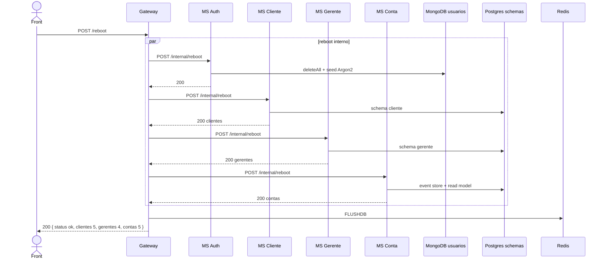

# TX-INFRA-02 — Reboot (recriar o seed)

**ID:** `TX-INFRA-02`  
**HTTPie:** [`../httpie/TX-INFRA-02-reboot.md`](../httpie/TX-INFRA-02-reboot.md)

Primeira chamada da suíte de testes: devolve o sistema ao estado da seção 4 do enunciado (5 clientes, 4 gerentes, 5 contas) e **apaga sessões/jobs/cache** no Redis.

## Diagrama de sequência



## O que acontece

### 1. Front

`POST /reboot` **público** (sem token). Tokens antigos no HTTPie deixam de valer depois do `FLUSHDB`.

### 2. Gateway dispara os quatro MSs em paralelo

[`reboot.ts`](../backend/gateway/src/routes/reboot.ts):

```18:53:backend/gateway/src/routes/reboot.ts
  app.post('/reboot', async (_request, reply) => {
    const targets = [
      { url: deps.config.authUrl },
      { url: deps.config.clienteUrl },
      { url: deps.config.gerenteUrl },
      { url: deps.config.contaUrl },
    ];
    const results = await Promise.all(
      targets.map((target) =>
        msRequest({
          baseUrl: target.url,
          method: 'POST',
          path: '/internal/reboot',
          timeoutMs: 60_000,
          fetchImpl: deps.fetchImpl,
        }),
      ),
    );
    // ...
    await deps.store.flushdb();
    return reply.code(200).send({
      status: 'ok',
      clientes: countOf(cliente?.body, 'clientes'),
      gerentes: countOf(gerente?.body, 'gerentes'),
      contas: countOf(conta?.body, 'contas'),
    });
  });
```

### 3. Bancos

| MS | Código | Persistência |
|---|---|---|
| Auth | [`AuthService.reboot`](../backend/services/auth/src/main/kotlin/br/ufpr/dac/bantads/auth/user/AuthService.kt) | Mongo coleção [`usuarios`](../backend/services/auth/src/main/kotlin/br/ufpr/dac/bantads/auth/user/Usuario.kt) |
| Cliente | [`RebootController`](../backend/services/cliente/src/main/kotlin/br/ufpr/dac/bantads/cliente/reboot/RebootController.kt) | Postgres schema `cliente` — solicitações + cadastro |
| Gerente | [`RebootController`](../backend/services/gerente/src/main/kotlin/br/ufpr/dac/bantads/gerente/reboot/RebootController.kt) | schema `gerente` |
| Conta | [`RebootController`](../backend/services/conta/src/main/kotlin/br/ufpr/dac/bantads/conta/reboot/RebootController.kt) | `conta_command` (event store) **e** `conta_query` (projeção) a partir de [`SeedContas`](../backend/services/conta/src/main/kotlin/br/ufpr/dac/bantads/conta/command/seed/SeedContas.kt) |

### 4. Volta ao front

`{ status: "ok", clientes: 5, gerentes: 4, contas: 5 }` sem `_links`. O front deve **logar de novo** ([TX-R2A](./TX-R2A-login.md)).

## Arquivos-chave

- [`backend/gateway/src/routes/reboot.ts`](../backend/gateway/src/routes/reboot.ts)  
- [`backend/services/auth/src/main/kotlin/br/ufpr/dac/bantads/auth/reboot/RebootController.kt`](../backend/services/auth/src/main/kotlin/br/ufpr/dac/bantads/auth/reboot/RebootController.kt)  
- [`backend/services/conta/src/main/kotlin/br/ufpr/dac/bantads/conta/command/seed/SeedContas.kt`](../backend/services/conta/src/main/kotlin/br/ufpr/dac/bantads/conta/command/seed/SeedContas.kt)
