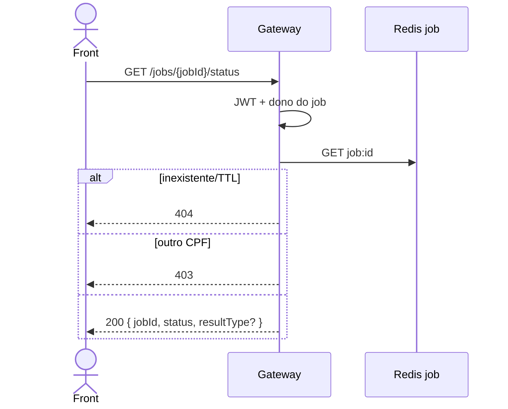

# TX-JOB-01 — Polling do status do job

**ID:** `TX-JOB-01`  
**HTTPie:** [`../httpie/TX-JOB-01-status.md`](../httpie/TX-JOB-01-status.md)

O front acompanha R9, R13, R15 e R16. O estado vive no Redis (`job:{uuid}`), TTL 5 min. Sem `_links`.

## Diagrama de sequência

## O que acontece

### 1. Front

Header `Location` do 202 ou `jobId` do body. Poll até `CONCLUIDO` ou `FALHA`. Se `resource`, GET no domínio; se `inline`, [TX-JOB-02](./TX-JOB-02-result.md).

### 2. Gateway

[`registerJobs`](../backend/gateway/src/routes/jobs.ts) + [`jobStatusBody`](../backend/gateway/src/redis/jobs.ts) (só inclui `resultType`/`dominio`/`resourceId`/`erro` se não nulos).

Nas SAGAs o **orquestrador** atualiza o mesmo UUID no Redis ([`SagaEngine.complete`](../backend/services/saga/src/main/kotlin/br/ufpr/dac/bantads/saga/engine/SagaEngine.kt)). No R16 o próprio Gateway atualiza.

### 3. Redis

Não há Postgres nesta transação. Chave `job:{jobId}`.

### 4. Reply

`PENDENTE` / `CONCLUIDO` / `FALHA`. Campos extras só quando a operação terminou.

## Arquivos-chave

- [`jobs.ts`](../backend/gateway/src/routes/jobs.ts)  
- [`redis/jobs.ts`](../backend/gateway/src/redis/jobs.ts)
