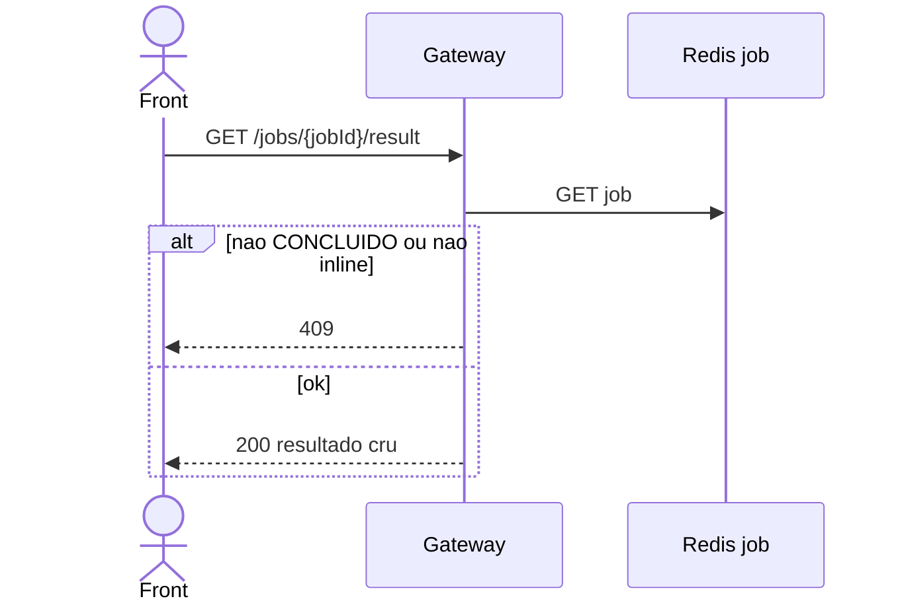

# TX-JOB-02 — Resultado inline do job

**ID:** `TX-JOB-02`  
**HTTPie:** [`../httpie/TX-JOB-02-result.md`](../httpie/TX-JOB-02-result.md)

Só R15 (mensagem) e R16 (lista). Jobs `resource` (R9/R13) **não** usam este endpoint.

## Diagrama de sequência



## O que acontece

### 1. Front

Depois de [TX-JOB-01](./TX-JOB-01-status.md) com `resultType=inline`.

### 2. Gateway

```20:35:backend/gateway/src/routes/jobs.ts
  app.get('/jobs/:jobId/result', async (request, reply) => {
    const job = await readJob(store, jobId);
    if (!job) return reply.code(404).send(Erros.notFound('Job inexistente ou expirado'));
    if (!isJobOwner(job, request.user?.cpf)) {
      return reply.code(403).send(Erros.forbidden('Job não pertence ao usuário autenticado'));
    }
    if (job.status !== JobStatus.CONCLUIDO || job.resultType !== ResultType.INLINE) {
      return reply.code(409).send(Erros.conflict('Job ainda não concluído, falhou ou não é inline'));
    }
    return reply.code(200).send(job.resultado ?? {});
  });
```

O payload foi gravado pelo orquestrador (R15) ou por [`runRelatorio`](../backend/gateway/src/routes/relatorio.ts) (R16). Sem rewrite HATEOAS.

### 3. Reply

R15: `{ mensagem }`. R16: `{ clientes: [ ... ] }`.

## Arquivos-chave

- [`jobs.ts`](../backend/gateway/src/routes/jobs.ts)  
- [`SagaEngine.kt`](../backend/services/saga/src/main/kotlin/br/ufpr/dac/bantads/saga/engine/SagaEngine.kt) (grava `resultado` no R15)  
- [`relatorio.ts`](../backend/gateway/src/routes/relatorio.ts)
