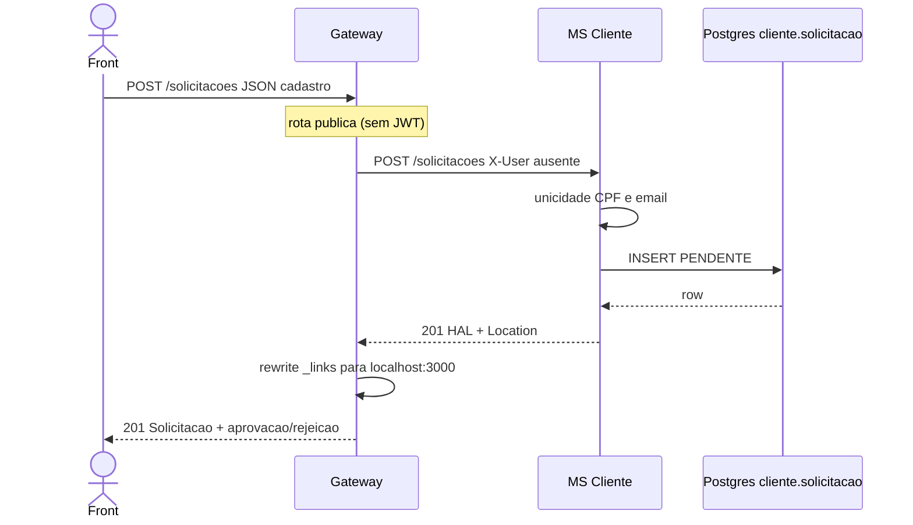

# TX-R1 — Autocadastro

**ID:** `TX-R1`  
**HTTPie:** [`../httpie/TX-R1-autocadastro.md`](../httpie/TX-R1-autocadastro.md)

Candidato pede conta. É **síncrono**: só grava solicitação `PENDENTE`. Sem senha, sem linha em Auth, sem conta. Aprovação é [TX-R9](./TX-R9-aprovar-cliente.md).

## Diagrama de sequência



## O que acontece

### 1. Front

Tela pública de autocadastro. Ao 201, mostra “solicitação enviada” — **não** há login ainda. JSON: CPF 11 dígitos, salário string `"4500.00"`, endereço. Contrato: [`swagger_bantads.md`](../docs/swagger_bantads.md) (`AutocadastroInput`).

### 2. Gateway faz proxy

Público em [`acl.ts`](../backend/gateway/src/auth/acl.ts). [`registerProxy`](../backend/gateway/src/routes/proxy.ts) encaminha ao `CLIENTE_URL`:

```202:202:backend/gateway/src/routes/proxy.ts
  app.post('/solicitacoes', cliente);
```

[`forward`](../backend/gateway/src/routes/proxy.ts) replica método/path/body. [`applyHateoas`](../backend/gateway/src/http/hateoas.ts) reescreve `href` internos (`cliente:8080`) para o Gateway.

### 3. MS Cliente + Postgres

[`SolicitacaoController.criar`](../backend/services/cliente/src/main/kotlin/br/ufpr/dac/bantads/cliente/solicitacao/SolicitacaoController.kt) → [`SolicitacaoService.criar`](../backend/services/cliente/src/main/kotlin/br/ufpr/dac/bantads/cliente/solicitacao/SolicitacaoService.kt):

- CPF já em `solicitacao` → 409 `"CPF já possui solicitação"`  
- CPF já em `cliente` → 409 `"CPF já possui cadastro de cliente"`  
- e-mail em solicitação ou cliente → 409 `"E-mail já usado em outra solicitação"`

Tabela: [`V1__cliente_schema.sql`](../backend/services/cliente/src/main/resources/db/migration/V1__cliente_schema.sql) (`solicitacao`, unique de e-mail).

HATEOAS: [`ClienteAssembler.solicitacao`](../backend/services/cliente/src/main/kotlin/br/ufpr/dac/bantads/cliente/hateoas/ClienteAssembler.kt) acrescenta `aprovacao` e `rejeicao` só se `PENDENTE` — é isso que a tela do gerente usa como botões.

### 4. Reply ao front

**201** + `Location: /solicitacoes/{cpf}` + corpo com `_links` apontando ao Gateway. O gerente, depois do login, segue esses rels em [TX-R8A](./TX-R8A-listar-solicitacoes.md).

## Arquivos-chave

- [`backend/gateway/src/routes/proxy.ts`](../backend/gateway/src/routes/proxy.ts)  
- [`SolicitacaoController.kt`](../backend/services/cliente/src/main/kotlin/br/ufpr/dac/bantads/cliente/solicitacao/SolicitacaoController.kt)  
- [`SolicitacaoService.kt`](../backend/services/cliente/src/main/kotlin/br/ufpr/dac/bantads/cliente/solicitacao/SolicitacaoService.kt)  
- [`ClienteAssembler.kt`](../backend/services/cliente/src/main/kotlin/br/ufpr/dac/bantads/cliente/hateoas/ClienteAssembler.kt)
