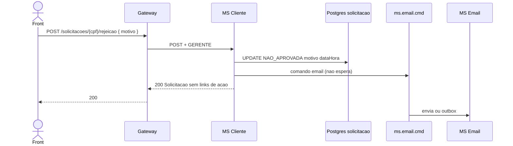

# TX-R10 — Rejeitar cliente

**ID:** `TX-R10`  
**HTTPie:** [`../httpie/TX-R10-rejeitar-cliente.md`](../httpie/TX-R10-rejeitar-cliente.md)

Síncrono: a solicitação já volta `NAO_APROVADA` no **200**. O e-mail com o motivo é **fire-and-forget** (não aborta a rejeição).

## Diagrama de sequência



## O que acontece

### 1. Front

Modal de motivo; POST no rel `rejeicao`. Espera **200**, não 202.

### 2. Gateway

Proxy [`POST /solicitacoes/:cpf/rejeicao`](../backend/gateway/src/routes/proxy.ts). ACL gerente.

### 3. MS Cliente

[`SolicitacaoController.rejeitar`](../backend/services/cliente/src/main/kotlin/br/ufpr/dac/bantads/cliente/solicitacao/SolicitacaoController.kt) → [`rejeitar`](../backend/services/cliente/src/main/kotlin/br/ufpr/dac/bantads/cliente/solicitacao/SolicitacaoService.kt):

```67:80:backend/services/cliente/src/main/kotlin/br/ufpr/dac/bantads/cliente/solicitacao/SolicitacaoService.kt
    fun rejeitar(cpf: String, motivo: String): SolicitacaoEntity {
        if (!SolicitacaoRules.canProcess(solicitacao.status)) {
            throw ApiException(ErroBody.conflict("Solicitação não está PENDENTE"))
        }
        solicitacao.status = StatusSolicitacao.NAO_APROVADA
        solicitacao.motivo = motivo.trim()
        solicitacao.dataHoraProcessamento = DateTimes.parse(DateTimes.now())
        val saved = solicitacoes.save(solicitacao)
        emailPublisher.publishRejeicao(saved.email, saved.nome, saved.motivo.orEmpty())
        return saved
    }
```

Não passa pelo orquestrador SAGA. [`EmailCommandPublisher`](../backend/services/cliente/src/main/kotlin/br/ufpr/dac/bantads/cliente/email/EmailCommandPublisher.kt) publica na mesma fila do MS Email.

### 4. Reply

HATEOAS sem `aprovacao`/`rejeicao`. Segunda rejeição: 409.

## Arquivos-chave

- [`SolicitacaoService.kt`](../backend/services/cliente/src/main/kotlin/br/ufpr/dac/bantads/cliente/solicitacao/SolicitacaoService.kt)  
- [`EmailCommandListener.kt`](../backend/services/email/src/main/kotlin/br/ufpr/dac/bantads/email/amqp/EmailCommandListener.kt)
