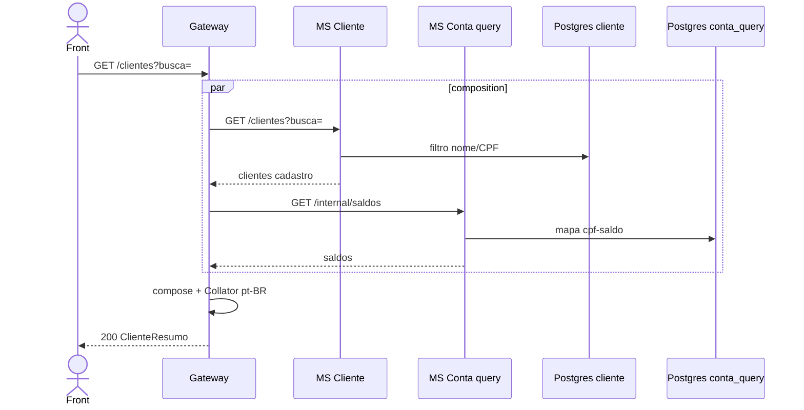

# TX-R11 — Consultar todos os clientes (composition)

**ID:** `TX-R11`  
**HTTPie:** [`../httpie/TX-R11-consultar-clientes.md`](../httpie/TX-R11-consultar-clientes.md)

O Gateway **agrega** cadastro (MS Cliente) com **saldo** (MS Conta query) e ordena pt-BR. Nenhum MS sozinho devolve essa linha.

## Diagrama de sequência



## O que acontece

### 1. Front

Campo busca “Cat”. Tabela: CPF, nome, cidade, estado, saldo. Link `conta` / `self`.

### 2. Gateway composition

[`listarClientes`](../backend/gateway/src/routes/composition.ts):

```230:266:backend/gateway/src/routes/composition.ts
export async function listarClientes(...) {
  const [lista, saldos] = await Promise.all([
    msRequest({ baseUrl: clienteUrl, path: request.url, ... }),
    msRequest({ baseUrl: contaUrl, path: '/internal/saldos', ... }),
  ]);
  reply.code(200).send(applyHateoas(composeClientes(lista.body, saldos.body, publicUrl), ...));
}
```

[`composeClientes`](../backend/gateway/src/routes/composition.ts) junta cidade/UF do endereço com saldo string. Sort: [`pt-br.ts`](../backend/gateway/src/http/pt-br.ts).

### 3. Bancos

Cliente: [`CadastroController.listar`](../backend/services/cliente/src/main/kotlin/br/ufpr/dac/bantads/cliente/cadastro/CadastroController.kt). Conta: endpoint interno de saldos (não cacheado).

### 4. Reply

Sem paginação. Saldo pode estar defasado microsegundos após um depósito (CQRS).

## Arquivos-chave

- [`composition.ts`](../backend/gateway/src/routes/composition.ts)  
- [`CadastroController.kt`](../backend/services/cliente/src/main/kotlin/br/ufpr/dac/bantads/cliente/cadastro/CadastroController.kt)  
- [`InternalQueryController.kt`](../backend/services/conta/src/main/kotlin/br/ufpr/dac/bantads/conta/query/http/InternalQueryController.kt)
