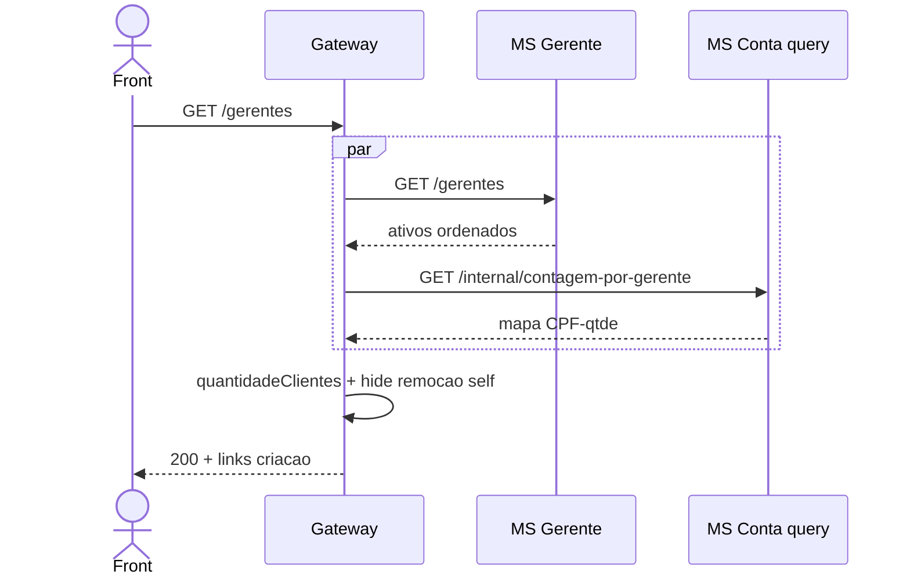

# TX-R12 — Listagem de gerentes (composition)

**ID:** `TX-R12`  
**HTTPie:** [`../httpie/TX-R12-listar-gerentes.md`](../httpie/TX-R12-listar-gerentes.md)

Gerentes **ativos** + `quantidadeClientes` do lado query da conta. O Gateway esconde `remocao` do próprio CPF.

## Diagrama de sequência

## O que acontece

### 1. Front

CRUD: botão criar se `_links.criacao`; editar/remover pelos rels de cada linha.

### 2. Gateway

[`listarGerentes`](../backend/gateway/src/routes/composition.ts) + [`composeGerentes`](../backend/gateway/src/routes/composition.ts). [`hateoas.ts`](../backend/gateway/src/http/hateoas.ts): sem `remocao` se `user.cpf === resource.cpf`. Lista ganha `criacao`.

### 3. MSs

[`GerenteController.listar`](../backend/services/gerente/src/main/kotlin/br/ufpr/dac/bantads/gerente/cadastro/GerenteController.kt) — Postgres `gerente` ativos. Contagem: replay/query das contas (não cachear).

### 4. Reply

Collation pt-BR (Gadamântio, Geniéve, …).

## Arquivos-chave

- [`composition.ts`](../backend/gateway/src/routes/composition.ts) (`listarGerentes`)  
- [`GerenteController.kt`](../backend/services/gerente/src/main/kotlin/br/ufpr/dac/bantads/gerente/cadastro/GerenteController.kt)  
- [`hateoas.ts`](../backend/gateway/src/http/hateoas.ts)
