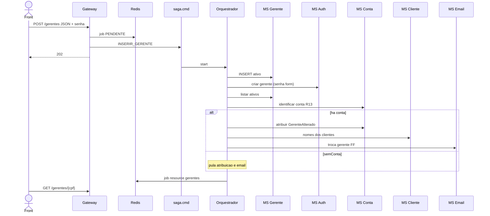

# TX-R13 — Inserção de gerente (SAGA)

**ID:** `TX-R13`  
**HTTPie:** [`../httpie/TX-R13-inserir-gerente.md`](../httpie/TX-R13-inserir-gerente.md)

Cria gerente + Auth (senha **do formulário**). Pode transferir **uma** conta (regra R13) ou terminar sem contas. E-mail duplicado = job `FALHA` (o 202 já saiu).

## Diagrama de sequência

Definição: [`SagaRegistry.inserirGerente`](../backend/services/saga/src/main/kotlin/br/ufpr/dac/bantads/saga/engine/SagaRegistry.kt) (`skipIfTrue = "semConta"`).

## O que acontece

### 1. Front

Formulário com senha. 202 → poll → `GET /gerentes/{resourceId}`. Login do novo gerente usa a senha digitada (não e-mail).

### 2. Gateway

[`inserir-gerente.ts`](../backend/gateway/src/routes/inserir-gerente.ts) valida [`gerenteInputSchema`](../backend/gateway/src/types/schemas.ts), grava job, publica SAGA. **Não** checa e-mail único (isso é o MS Auth no passo 2).

### 3. Seleção da conta

[`R13Selecao`](../backend/services/conta/src/main/kotlin/br/ufpr/dac/bantads/conta/command/r13/R13Selecao.kt) / [`identificarR13`](../backend/services/conta/src/main/kotlin/br/ufpr/dac/bantads/conta/command/http/ContaCommandService.kt): gerente com mais contas; empate → menor soma de saldos; transfere a conta de **menor** saldo; nunca zera um gerente que só tem 1.

Evento `GerenteAlterado` → projector atualiza `cpfGerente` no read model ([TX-R4](./TX-R4-deposito.md) mesmo pipeline de eventos).

### 4. Auth

[`AuthService.criarGerente`](../backend/services/auth/src/main/kotlin/br/ufpr/dac/bantads/auth/user/AuthService.kt) — senha clara **não** volta no reply (só hash no Mongo). Duplicata de login → falha + compensação (apaga gerente órfão).

### 5. Front depois

Job `CONCLUIDO` `dominio=gerentes`. Cache gerente invalidado. Conta transferida: reconsultar [TX-R3B](./TX-R3B-consultar-conta-numero.md) até `cpfGerente` mudar.

## Arquivos-chave

- [`inserir-gerente.ts`](../backend/gateway/src/routes/inserir-gerente.ts)
- [`SagaRegistry.kt`](../backend/services/saga/src/main/kotlin/br/ufpr/dac/bantads/saga/engine/SagaRegistry.kt)
- [`R13Selecao.kt`](../backend/services/conta/src/main/kotlin/br/ufpr/dac/bantads/conta/command/r13/R13Selecao.kt)
- [`AuthService.kt`](../backend/services/auth/src/main/kotlin/br/ufpr/dac/bantads/auth/user/AuthService.kt)
