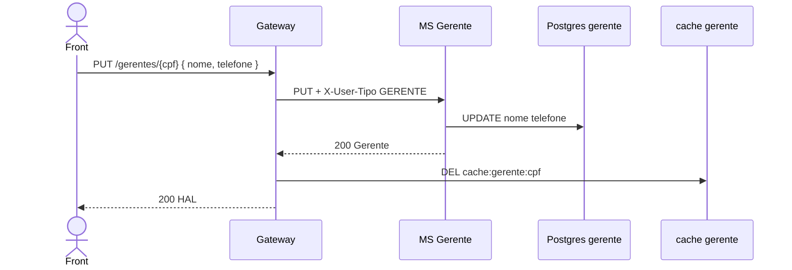

# TX-R14 — Atualização de gerente

**ID:** `TX-R14`  
**HTTPie:** [`../httpie/TX-R14-atualizar-gerente.md`](../httpie/TX-R14-atualizar-gerente.md)

Síncrono: só **nome** e **telefone**. CPF e e-mail (login) imutáveis. Invalida o cache cadastral.

## Diagrama de sequência



## O que acontece

### 1. Front

Segue `_links.atualizacao` (mesmo href PUT). Não envia e-mail/CPF diferentes.

### 2. Gateway

[`PUT /gerentes/:cpf`](../backend/gateway/src/routes/proxy.ts):

```225:232:backend/gateway/src/routes/proxy.ts
  app.put('/gerentes/:cpf', async (request, reply) => {
    const forwarded = await forward(request, deps, deps.config.gerenteUrl);
    if (forwarded.status === 200) {
      await deps.store.del(gerenteCacheKey(cpf));
    }
    sendForwarded(reply, forwarded, request, deps.config.publicUrl);
  });
```

### 3. MS + Postgres

[`GerenteController.atualizar`](../backend/services/gerente/src/main/kotlin/br/ufpr/dac/bantads/gerente/cadastro/GerenteController.kt) → [`GerenteService.atualizar`](../backend/services/gerente/src/main/kotlin/br/ufpr/dac/bantads/gerente/cadastro/GerenteService.kt): se body trouxer e-mail/CPF distintos → 400 `"CPF e e-mail são imutáveis"`.

### 4. Reply

200 com nome novo. Relatórios/listagens passam a mostrar o nome atualizado na próxima composition (não há cache de lista).

## Arquivos-chave

- [`proxy.ts`](../backend/gateway/src/routes/proxy.ts)  
- [`GerenteService.kt`](../backend/services/gerente/src/main/kotlin/br/ufpr/dac/bantads/gerente/cadastro/GerenteService.kt)
