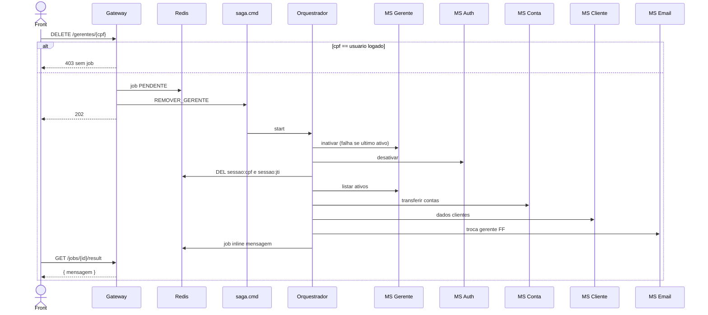

# TX-R15 — Remoção de gerente (SAGA)

**ID:** `TX-R15`  
**HTTPie:** [`../httpie/TX-R15-remover-gerente.md`](../httpie/TX-R15-remover-gerente.md)

Remoção lógica: inativa gerente e Auth, **logout forçado** no Redis, transfere contas ao ativo com menos clientes, e-mails FF. Resultado **inline**. Auto-remoção é 403 **antes** da SAGA.

## Diagrama de sequência



Passos: [`SagaRegistry.removerGerente`](../backend/services/saga/src/main/kotlin/br/ufpr/dac/bantads/saga/engine/SagaRegistry.kt) (`SAGA_INVALIDAR_SESSAO` é passo **LOCAL** no orquestrador).

## O que acontece

### 1. Front

Não mostra botão `remocao` no próprio card ([TX-R12](./TX-R12-listar-gerentes.md)). Poll + [TX-JOB-02](./TX-JOB-02-result.md).

### 2. Gateway — pré-condição

[`remover-gerente.ts`](../backend/gateway/src/routes/remover-gerente.ts):

```17:21:backend/gateway/src/routes/remover-gerente.ts
    if (request.user?.cpf === cpf) {
      return reply.code(403).send(Erros.forbidden('Não é permitido remover a si mesmo'));
    }
```

### 3. SAGA

Inativar no Postgres; `AuthService.desativar` no Mongo (`ativo=false` → login 401). Logout forçado usa a chave reversa de [TX-R2A](./TX-R2A-login.md). Transferência: [`transferirContasDoGerente`](../backend/services/conta/src/main/kotlin/br/ufpr/dac/bantads/conta/command/http/ContaCommandService.kt) + eventos `GerenteAlterado`.

Job sucesso: `resultType=inline`, mensagem `"Gerente removido; N contas transferidas para {nome}"` ([`SagaEngine.complete`](../backend/services/saga/src/main/kotlin/br/ufpr/dac/bantads/saga/engine/SagaEngine.kt)). Cache gerente apagado.

Último ativo: job `FALHA` `"Não é permitido remover o último gerente ativo"` — DELETE ainda foi 202.

### 4. Front depois

GET result; tentativas de login do removido falham; clientes migrados mudam `cpfGerente` na query.

## Arquivos-chave

- [`remover-gerente.ts`](../backend/gateway/src/routes/remover-gerente.ts)  
- [`SagaRegistry.kt`](../backend/services/saga/src/main/kotlin/br/ufpr/dac/bantads/saga/engine/SagaRegistry.kt)  
- [`session.ts`](../backend/gateway/src/redis/session.ts) (chaves que o orquestrador apaga)  
- [`ContaCommandService.kt`](../backend/services/conta/src/main/kotlin/br/ufpr/dac/bantads/conta/command/http/ContaCommandService.kt) (`transferirContasDoGerente`)
