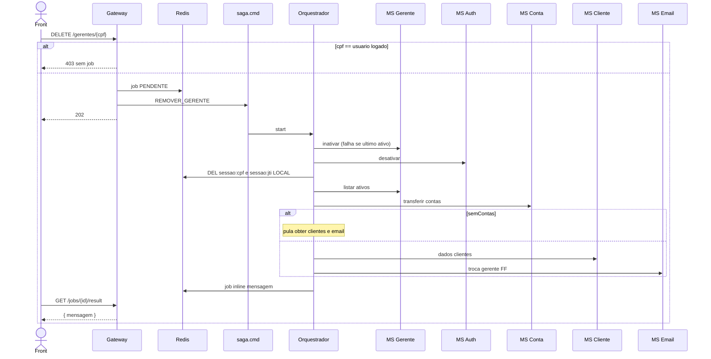

# TX-R15 — Remoção de gerente (SAGA)

**ID:** `TX-R15`  
**HTTPie:** [`../httpie/TX-R15-remover-gerente.md`](../httpie/TX-R15-remover-gerente.md)

Remoção lógica: inativa gerente e Auth, **logout forçado** no Redis, transfere contas ao ativo com menos clientes, e-mails FF. Resultado **inline**. Auto-remoção é 403 **antes** da SAGA.

## Diagrama de sequência



Definição: [`SagaRegistry.removerGerente`](../backend/services/saga/src/main/kotlin/br/ufpr/dac/bantads/saga/engine/SagaRegistry.kt) (`SAGA_INVALIDAR_SESSAO` é passo **LOCAL** no orquestrador).

## O que acontece

### 1. Front

Não mostra o rel `remocao` no próprio card ([TX-R12](./TX-R12-listar-gerentes.md)). Trata 202: poll ([TX-JOB-01](./TX-JOB-01-status.md)). `resultType=inline` → [TX-JOB-02](./TX-JOB-02-result.md). O gerente some da lista; não existe `GET /gerentes/{cpf}` de sucesso.

### 2. Gateway — 403 síncrono

[`remover-gerente.ts`](../backend/gateway/src/routes/remover-gerente.ts) compara CPF do JWT com o path **antes** de criar job:

```17:21:backend/gateway/src/routes/remover-gerente.ts
    const cpf = (request.params as { cpf: string }).cpf;
    if (request.user?.cpf === cpf) {
      return reply.code(403).send(Erros.forbidden('Não é permitido remover a si mesmo'));
    }
```

Senão: job Redis + `saga.cmd` `REMOVER_GERENTE` + 202 + `Location: /jobs/{id}/status`. CPF inexistente ou já inativo **também** é 202; a falha vai no job.

### 3. Orquestrador

Passos em [`SagaRegistry.removerGerente`](../backend/services/saga/src/main/kotlin/br/ufpr/dac/bantads/saga/engine/SagaRegistry.kt):

| # | Comando | Nota |
|---|---|---|
| 1 | `GERENTE_INATIVAR` | FALHA se inexistente ou último ativo; compensação `GERENTE_REATIVAR` |
| 2 | `AUTH_DESATIVAR` | `ativo=false` no Mongo; login vira `"Login inválido!"` |
| 3 | `SAGA_INVALIDAR_SESSAO` | **LOCAL**: `DEL sessao:cpf:{cpf}` e `sessao:{jti}` |
| 4 | `GERENTE_LISTAR_ATIVOS` | Destino ≠ removido |
| 5 | `CONTA_TRANSFERIR_CONTAS_DO_GERENTE` | Eventos `GerenteAlterado`; compensação reassocia |
| 6 | `CLIENTE_OBTER_POR_CPFS` | `skipIfTrue = semContas` |
| 7 | `EMAIL_TROCA_GERENTE` | FF; `skipIfTrue = semContas` |

Sucesso em [`SagaEngine`](../backend/services/saga/src/main/kotlin/br/ufpr/dac/bantads/saga/engine/SagaEngine.kt): job `inline` `{ mensagem: "Gerente removido; N contas transferidas para {Nome}" }` + `DEL cache:gerente:{cpf}`.

Seed puro + Gadamântio (`40501740066`): N=0, destino típico Gyândula.

### 4. Front depois

GET result; login do removido 401; token antigo 401; contas migradas mudam `cpfGerente` na query ([TX-R3B](./TX-R3B-consultar-conta-numero.md)). Job `FALHA` → result 409 ([TX-JOB-02](./TX-JOB-02-result.md)); o `erro` está no status.

## Arquivos-chave

- [`remover-gerente.ts`](../backend/gateway/src/routes/remover-gerente.ts)
- [`SagaRegistry.kt`](../backend/services/saga/src/main/kotlin/br/ufpr/dac/bantads/saga/engine/SagaRegistry.kt)
- [`SagaEngine.kt`](../backend/services/saga/src/main/kotlin/br/ufpr/dac/bantads/saga/engine/SagaEngine.kt)
- [`session.ts`](../backend/gateway/src/redis/session.ts) (chaves que o passo LOCAL apaga)
