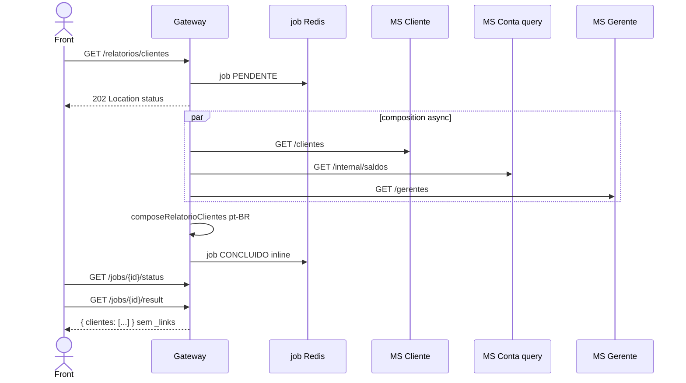

# TX-R16 — Relatório de clientes (composition assíncrona)

**ID:** `TX-R16`  
**HTTPie:** [`../httpie/TX-R16-relatorio-clientes.md`](../httpie/TX-R16-relatorio-clientes.md)

Não é SAGA: o Gateway cria um job e monta a lista em background (Cliente + Conta + Gerente). O front trata igual às SAGAs (202 + poll + result inline).

## Diagrama de sequência



## O que acontece

### 1. Front

Tela de relatório: GET (não POST). Poll rápido (costuma < 5 s). Linhas **sem** HATEOAS (exceção de jobs).

### 2. Gateway

[`relatorio.ts`](../backend/gateway/src/routes/relatorio.ts):

```17:27:backend/gateway/src/routes/relatorio.ts
  app.get('/relatorios/clientes', async (request, reply) => {
    const jobId = randomUUID();
    await saveJob(deps.store, { jobId, status: PENDENTE, cpf: request.user?.cpf });
    setImmediate(() => { void runRelatorio(deps, jobId, headers); });
    reply.header('Location', `/jobs/${jobId}/status`);
    return reply.code(202).send({ jobId, status: PENDENTE });
  });
```

[`collectRelatorioClientes` / `composeRelatorioClientes`](../backend/gateway/src/routes/composition.ts) junta salário, conta, saldo, CPF/nome do gerente.

### 3. Bancos

Somente **leituras**: `cliente`, `conta_query`, `gerente`. Nada no event store.

### 4. Reply final

[TX-JOB-02](./TX-JOB-02-result.md). TTL 5 min.

## Arquivos-chave

- [`relatorio.ts`](../backend/gateway/src/routes/relatorio.ts)  
- [`composition.ts`](../backend/gateway/src/routes/composition.ts)  
- [`jobs.ts`](../backend/gateway/src/routes/jobs.ts)
