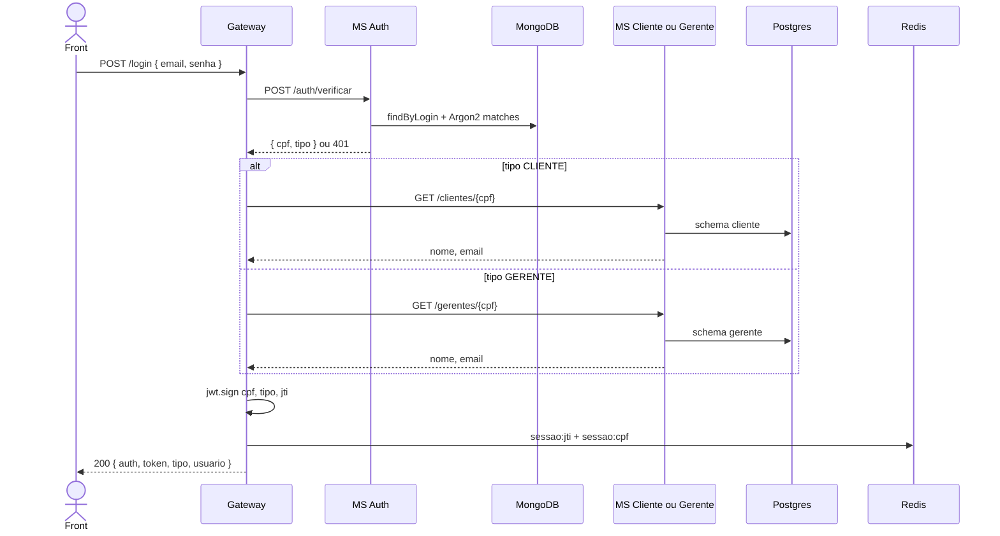

# TX-R2A — Login (R2)

**ID:** `TX-R2A`  
**HTTPie:** [`../httpie/TX-R2A-login.md`](../httpie/TX-R2A-login.md)

O front autentica por e-mail/senha. O JWT nasce **só no Gateway**. O MS Auth só verifica hash Argon2id no Mongo; nome e e-mail vêm do MS Cliente ou Gerente (composition de login).

## Diagrama de sequência



## O que acontece

### 1. Front

Tela de login envia `{ email, senha }` (nunca `login` no JSON). Interceptor ainda não tem token. Contrato: [agente frontend](../.cursor/agents/frontend-angular.md). O SPA guarda o JWT no browser (permitido) e **não** persiste saldo/cadastro em Local Storage.

### 2. Gateway valida o body e fala com o Auth

[`login.ts`](../backend/gateway/src/routes/login.ts):

```52:85:backend/gateway/src/routes/login.ts
  app.post('/login', async (request, reply) => {
    const parsed = loginInputSchema.safeParse(request.body);
    // ...
    const auth = await msRequest({
      baseUrl: deps.config.authUrl,
      method: 'POST',
      path: '/auth/verificar',
      body: parsed.data,
      fetchImpl: deps.fetchImpl,
    });
    // ...
    const usuario = await loadUsuario(deps.config, deps.fetchImpl, cpf, tipoRaw);
    const jti = randomUUID();
    const token = signAccessToken(deps.config.jwtSecret, { cpf, tipo: tipoRaw, jti });
    await createSession(deps.store, { cpf, tipo: tipoRaw, jti, exp });
    return reply.code(200).send({ auth: true, token, tipo: tipoRaw, usuario });
  });
```

Assinatura JWT: [`jwt.ts`](../backend/gateway/src/auth/jwt.ts) (`cpf`, `tipo`, `jti`, `expiresIn` absoluto).

### 3. MS Auth + Mongo

[`AuthController`](../backend/services/auth/src/main/kotlin/br/ufpr/dac/bantads/auth/user/AuthController.kt) → [`AuthService.verificar`](../backend/services/auth/src/main/kotlin/br/ufpr/dac/bantads/auth/user/AuthService.kt):

```16:24:backend/services/auth/src/main/kotlin/br/ufpr/dac/bantads/auth/user/AuthService.kt
    fun verificar(
        email: String,
        senha: String,
    ): VerificarResponse? {
        val user = usuarios.findByLogin(normalizeLogin(email)) ?: return null
        if (!user.ativo) return null
        if (!passwordEncoder.matches(senha, user.senhaHash)) return null
        return VerificarResponse(cpf = user.cpf, tipo = user.tipo)
    }
```

Documento: [`Usuario`](../backend/services/auth/src/main/kotlin/br/ufpr/dac/bantads/auth/user/Usuario.kt) (`@Document("usuarios")`). Inativo (R15) ou senha errada → o Gateway responde `"Login inválido!"`.

### 4. Cadastro (nome para a UI)

[`loadUsuario`](../backend/gateway/src/routes/login.ts) busca `GET /clientes/{cpf}` ou `GET /gerentes/{cpf}` com headers internos `X-User-*`. Postgres: tabela `cliente` ou `gerente`.

### 5. Redis e reply

[`createSession`](../backend/gateway/src/redis/session.ts) grava `sessao:{jti}` e a chave reversa `sessao:cpf:{cpf}` (TTL 30 min, sliding nas próximas requests). O front recebe `{ auth, token, tipo, usuario }` **sem** `_links` e passa a mandar `x-access-token`.

## Arquivos-chave

- [`backend/gateway/src/routes/login.ts`](../backend/gateway/src/routes/login.ts)  
- [`backend/gateway/src/auth/jwt.ts`](../backend/gateway/src/auth/jwt.ts)  
- [`backend/gateway/src/redis/session.ts`](../backend/gateway/src/redis/session.ts)  
- [`backend/services/auth/src/main/kotlin/br/ufpr/dac/bantads/auth/user/AuthService.kt`](../backend/services/auth/src/main/kotlin/br/ufpr/dac/bantads/auth/user/AuthService.kt)
