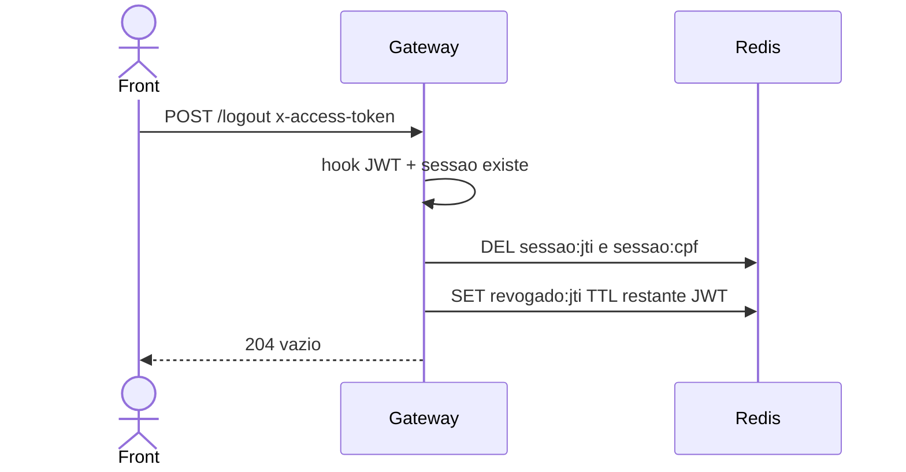

# TX-R2B — Logout (R2)

**ID:** `TX-R2B`  
**HTTPie:** [`../httpie/TX-R2B-logout.md`](../httpie/TX-R2B-logout.md)

O front encerra a sessão. O JWT ainda poderia verificar assinatura até o `exp`, mas o Gateway exige a sessão Redis **e** recusa `jti` na lista de revogados.

## Diagrama de sequência



## O que acontece

### 1. Front

Interceptor envia o token atual. Após 204, o SPA apaga o JWT da memória/storage e redireciona ao login.

### 2. Hook autentica

Rota `auth` em [`acl.ts`](../backend/gateway/src/auth/acl.ts). [`hook.ts`](../backend/gateway/src/auth/hook.ts) lê `x-access-token`, verifica JWT, sessão e revogação.

### 3. Redis

[`logout.ts`](../backend/gateway/src/routes/logout.ts) chama [`revokeSession`](../backend/gateway/src/redis/session.ts):

```41:49:backend/gateway/src/redis/session.ts
export async function revokeSession(
  store: KeyValueStore,
  user: Pick<GatewayUser, 'cpf' | 'jti' | 'exp'>,
  nowSeconds: number,
): Promise<void> {
  await store.del(sessionKey(user.jti), sessionByCpfKey(user.cpf));
  const remaining = Math.max(1, user.exp - nowSeconds);
  await store.set(revokedKey(user.jti), '1', remaining);
}
```

### 4. Reply

**204** sem corpo. Reusar o mesmo token em qualquer GET autenticado → 401 `"Falha ao autenticar o token."` (sessão sumiu ou `revogado:{jti}`).

Na SAGA R15 o orquestrador faz logout **forçado** da mesma chave `sessao:cpf:{cpf}` sem o gerente clicar em sair — ver [TX-R15](./TX-R15-remover-gerente.md).

## Arquivos-chave

- [`backend/gateway/src/routes/logout.ts`](../backend/gateway/src/routes/logout.ts)  
- [`backend/gateway/src/redis/session.ts`](../backend/gateway/src/redis/session.ts)  
- [`backend/gateway/src/auth/hook.ts`](../backend/gateway/src/auth/hook.ts)
