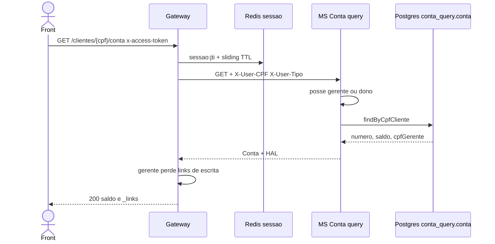

# TX-R3A — Consultar conta por CPF (tela inicial R3)

**ID:** `TX-R3A`  
**HTTPie:** [`../httpie/TX-R3A-consultar-conta-cpf.md`](../httpie/TX-R3A-consultar-conta-cpf.md)

Depois do login, o cliente monta a home: número da conta, saldo e menu a partir dos `_links`. Leitura no **lado query** do CQRS (Postgres `conta_query`). **Não** cachear.

## Diagrama de sequência



## O que acontece

### 1. Front

O SPA usa o CPF do `usuario` do login. Interceptor: `x-access-token`. Botões Depósito/Saque/Transferência/Extrato **só** se existirem os rels (HATEOAS). Gerente autenticado na mesma URL não vê esses rels.

### 2. Gateway: JWT e proxy

[`hook.ts`](../backend/gateway/src/auth/hook.ts) + ACL `gerenteOrSelf` em [`acl.ts`](../backend/gateway/src/auth/acl.ts). [`proxy.ts`](../backend/gateway/src/routes/proxy.ts) linha `GET /clientes/:cpf/conta` → `contaUrl`. Injeta `X-User-CPF` / `X-User-Tipo`. [`applyConditionalLinks`](../backend/gateway/src/http/hateoas.ts) remove `deposito|saque|transferencia|extrato` se `tipo === GERENTE`.

### 3. MS Conta query + Postgres

[`ClienteContaQueryController`](../backend/services/conta/src/main/kotlin/br/ufpr/dac/bantads/conta/query/http/ClienteContaQueryController.kt) → [`ContaQueryService.obterPorCpf`](../backend/services/conta/src/main/kotlin/br/ufpr/dac/bantads/conta/query/http/ContaQueryService.kt):

```34:41:backend/services/conta/src/main/kotlin/br/ufpr/dac/bantads/conta/query/http/ContaQueryService.kt
    fun obterPorCpf(
        cpf: String,
        userCpf: String,
        userTipo: String,
    ): ContaView {
        Identity.requireGerenteOrSelf(userTipo, userCpf, cpf)
        val conta = contas.findByCpfCliente(cpf) ?: throw ApiException(ErroBody.notFound("Conta não encontrada"))
        return toView(conta)
    }
```

Read model: entidade JPA no schema `conta_query` (saldo projetado dos eventos). Links de dono: [`ContaQueryAssembler`](../backend/services/conta/src/main/kotlin/br/ufpr/dac/bantads/conta/query/http/ContaQueryAssembler.kt).

### 4. Reply

O front mostra saldo (`decimal.js`) e segue `self` = `/contas/{numero}` ([TX-R3B](./TX-R3B-consultar-conta-numero.md)). Após R4/R5/R6 o saldo pode atrasar instantes (consistência eventual).

## Arquivos-chave

- [`ClienteContaQueryController.kt`](../backend/services/conta/src/main/kotlin/br/ufpr/dac/bantads/conta/query/http/ClienteContaQueryController.kt)  
- [`ContaQueryService.kt`](../backend/services/conta/src/main/kotlin/br/ufpr/dac/bantads/conta/query/http/ContaQueryService.kt)  
- [`hateoas.ts`](../backend/gateway/src/http/hateoas.ts)
