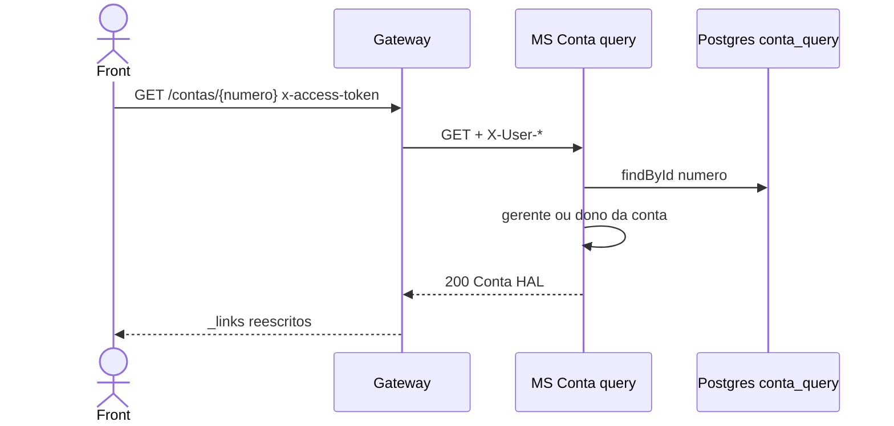

# TX-R3B — Consultar conta pelo número

**ID:** `TX-R3B`  
**HTTPie:** [`../httpie/TX-R3B-consultar-conta-numero.md`](../httpie/TX-R3B-consultar-conta-numero.md)

Mesmo DTO da tela inicial; é o `self` canônico da conta. Usado para reconsultar saldo depois de um movimento.

## Diagrama de sequência

## O que acontece

### 1. Front

Segue `_links.self` ou `_links.conta` de uma operação. ACL no Gateway: `gerenteOrSelf` para `GET /contas/{4 dígitos}` — para o **cliente**, a posse fina (conta de outro número) é no MS (`requireGerenteOrOwner`).

### 2. Gateway

[`proxy.ts`](../backend/gateway/src/routes/proxy.ts) `GET /contas/:numero` → MS Conta. Sem cache (regra CQRS).

### 3. MS + banco

[`ContaQueryController.obter`](../backend/services/conta/src/main/kotlin/br/ufpr/dac/bantads/conta/query/http/ContaQueryController.kt) → [`obterPorNumero`](../backend/services/conta/src/main/kotlin/br/ufpr/dac/bantads/conta/query/http/ContaQueryService.kt) lê `conta_query.conta`. 403 se o CPF do header não for o dono (e não for gerente).

### 4. Reply

Igual a [TX-R3A](./TX-R3A-consultar-conta-cpf.md). Gerente sem links de escrita.

## Arquivos-chave

- [`ContaQueryController.kt`](../backend/services/conta/src/main/kotlin/br/ufpr/dac/bantads/conta/query/http/ContaQueryController.kt)  
- [`proxy.ts`](../backend/gateway/src/routes/proxy.ts)
