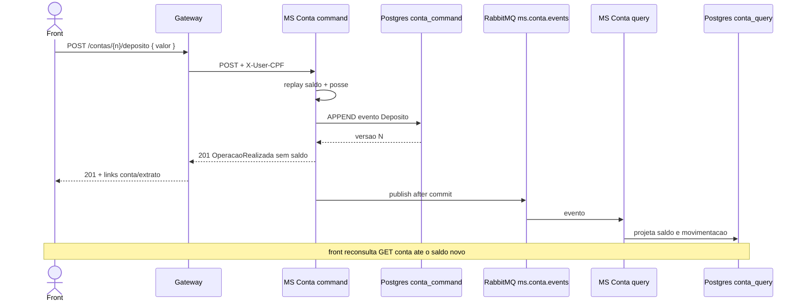

# TX-R4 — Depósito

**ID:** `TX-R4`  
**HTTPie:** [`../httpie/TX-R4-deposito.md`](../httpie/TX-R4-deposito.md)

O cliente credita a **própria** conta. Command: event store. Query: atualiza depois, via fila. A resposta **201 não traz saldo novo**.

## Diagrama de sequência



## O que acontece

### 1. Front

Segue `_links.deposito`. Body `{ "valor": "10.00" }` com `decimal.js`. **Não** usa saldo da resposta. Poll em `_links.conta` ([TX-R3B](./TX-R3B-consultar-conta-numero.md)).

### 2. Gateway

ACL `cliente` em [`acl.ts`](../backend/gateway/src/auth/acl.ts). Proxy puro para o MS Conta ([`proxy.ts`](../backend/gateway/src/routes/proxy.ts)).

### 3. Command + event store

[`ContaCommandController.depositar`](../backend/services/conta/src/main/kotlin/br/ufpr/dac/bantads/conta/command/http/ContaCommandController.kt) → [`writeMoney`](../backend/services/conta/src/main/kotlin/br/ufpr/dac/bantads/conta/command/http/ContaCommandService.kt):

```216:246:backend/services/conta/src/main/kotlin/br/ufpr/dac/bantads/conta/command/http/ContaCommandService.kt
    private fun writeMoney(...): OperacaoRealizadaView {
        requirePositive(valor)
        return retry {
            tx.execute {
                val state = requireExisting(numero)
                Identity.requireClienteOwner(userTipo, userCpf, state.cpfCliente)
                // saque: saldo insuficiente 422
                val event = store.append(store.newEvent(numero, tipoEvento, payload, versao+1, agora))
                publishAfterCommit(listOf(event.toStored()))
                operacao(numero, tipoHttp, agora, valor, null)
            }!!
        }
    }
```

O saldo do command é **replay dos eventos**, não o read model. Persistência: schema `conta_command` (event sourcing). Após commit: [`ContaEventPublisher`](../backend/services/conta/src/main/kotlin/br/ufpr/dac/bantads/conta/command/publish/ContaEventPublisher.kt).

### 4. Query (assíncrono)

[`ContaEventListener`](../backend/services/conta/src/main/kotlin/br/ufpr/dac/bantads/conta/query/amqp/ContaEventListener.kt) na fila `ms.conta.events` → [`EventProjector.apply`](../backend/services/conta/src/main/kotlin/br/ufpr/dac/bantads/conta/query/project/EventProjector.kt) (`DEPOSITO` credita `conta_query.conta` e insere `movimentacao`). Idempotência: `projecao_aplicada`.

### 5. Reply ao front

201 + `_links.conta` / `extrato` ([`OperacaoAssembler`](../backend/services/conta/src/main/kotlin/br/ufpr/dac/bantads/conta/command/http/OperacaoAssembler.kt)). Sem campo `saldo`.

## Arquivos-chave

- [`ContaCommandController.kt`](../backend/services/conta/src/main/kotlin/br/ufpr/dac/bantads/conta/command/http/ContaCommandController.kt)  
- [`ContaCommandService.kt`](../backend/services/conta/src/main/kotlin/br/ufpr/dac/bantads/conta/command/http/ContaCommandService.kt)  
- [`EventProjector.kt`](../backend/services/conta/src/main/kotlin/br/ufpr/dac/bantads/conta/query/project/EventProjector.kt)  
- [`ContaEventListener.kt`](../backend/services/conta/src/main/kotlin/br/ufpr/dac/bantads/conta/query/amqp/ContaEventListener.kt)
