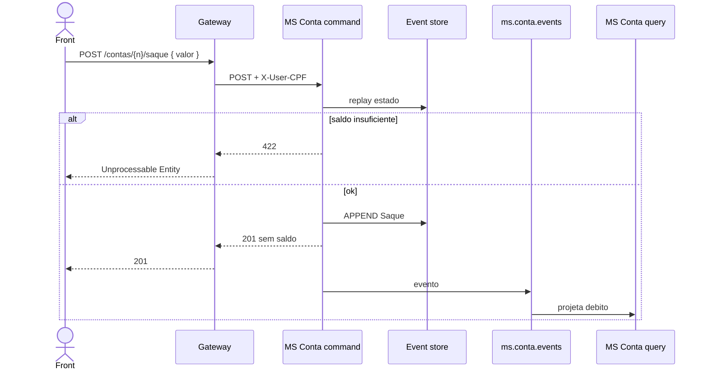

# TX-R5 — Saque

**ID:** `TX-R5`  
**HTTPie:** [`../httpie/TX-R5-saque.md`](../httpie/TX-R5-saque.md)

Igual ao depósito no pipeline CQRS, com validação de saldo **no command** (replay). Insuficiente → **422** síncrono, sem evento.

## Diagrama de sequência



## O que acontece

### 1. Front

Link `saque`. Se 422, mostra `mensagem`. Se 201, reconsulta a conta (não há saldo no body).

### 2. Gateway

Mesmo proxy de R4; perfil **CLIENTE** dono ([`acl.ts`](../backend/gateway/src/auth/acl.ts)).

### 3. Command

[`ContaCommandController.sacar`](../backend/services/conta/src/main/kotlin/br/ufpr/dac/bantads/conta/command/http/ContaCommandController.kt) usa o mesmo [`writeMoney`](../backend/services/conta/src/main/kotlin/br/ufpr/dac/bantads/conta/command/http/ContaCommandService.kt) com `EventTypes.SAQUE`. Trecho da regra:

```229:231:backend/services/conta/src/main/kotlin/br/ufpr/dac/bantads/conta/command/http/ContaCommandService.kt
                if (tipoEvento == EventTypes.SAQUE && !Money.gte(state.saldo, valor)) {
                    throw ApiException(ErroBody.unprocessable("Saldo insuficiente para a operação"))
                }
```

### 4. Query

Projector débito (`credito = false`) em [`EventProjector`](../backend/services/conta/src/main/kotlin/br/ufpr/dac/bantads/conta/query/project/EventProjector.kt). Extrato ([TX-R7](./TX-R7-extrato.md)) passa a listar a linha `SAQUE`.

### 5. Reply

201 `tipo: SAQUE` ou 422; 403 se outra conta.

## Arquivos-chave

- [`ContaCommandController.kt`](../backend/services/conta/src/main/kotlin/br/ufpr/dac/bantads/conta/command/http/ContaCommandController.kt)  
- [`ContaCommandService.kt`](../backend/services/conta/src/main/kotlin/br/ufpr/dac/bantads/conta/command/http/ContaCommandService.kt) (`writeMoney`)
