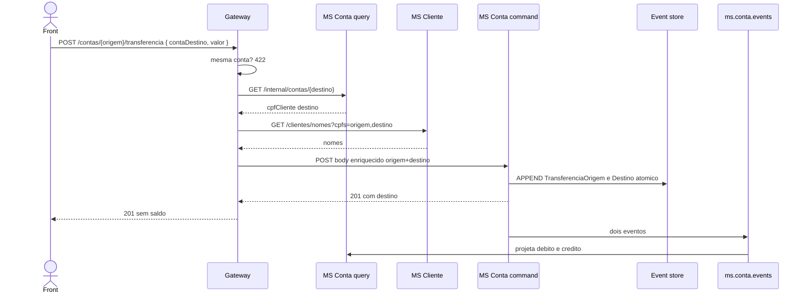

# TX-R6 — Transferência

**ID:** `TX-R6`  
**HTTPie:** [`../httpie/TX-R6-transferencia.md`](../httpie/TX-R6-transferencia.md)

**Não é SAGA.** O Gateway **enriquece** CPF/nomes; o MS Conta grava origem e destino **na mesma transação** do event store.

## Diagrama de sequência



## O que acontece

### 1. Front

Só envia `{ contaDestino, valor }` (Swagger). Nomes no extrato vêm do enrich do Gateway, não do form.

### 2. Gateway — composition pontual

[`transferir` em proxy.ts](../backend/gateway/src/routes/proxy.ts):

```130:191:backend/gateway/src/routes/proxy.ts
async function transferir(...) {
  // valida body; 422 se destino == origem
  const destino = await msRequest({ path: `/internal/contas/${parsed.data.contaDestino}`, ... });
  const nomes = await msRequest({
    path: `/clientes/nomes?cpfs=${user.cpf},${cpfDestino}`,
    baseUrl: deps.config.clienteUrl,
    ...
  });
  const command = await msRequest({
    path: `/contas/${numero}/transferencia`,
    body: { valor, origem: { numeroConta, cpf, nome }, destino: { ... } },
  });
  sendForwarded(reply, command, ...);
}
```

Interno query: [`InternalQueryController`](../backend/services/conta/src/main/kotlin/br/ufpr/dac/bantads/conta/query/http/InternalQueryController.kt). Nomes: [`CadastroController.nomes`](../backend/services/cliente/src/main/kotlin/br/ufpr/dac/bantads/cliente/cadastro/CadastroController.kt).

### 3. Command atômico

[`ContaCommandService.transferir`](../backend/services/conta/src/main/kotlin/br/ufpr/dac/bantads/conta/command/http/ContaCommandService.kt): posse da origem, destino existe no **event store**, saldo suficiente, dois `append` no mesmo `tx.execute`. Não há orquestrador.

### 4. Query

Dois eventos → projector `TRANSFERENCIA_ORIGEM` (débito) e `TRANSFERENCIA_DESTINO` (crédito). O front reconsulta as duas contas.

### 5. Reply

201 com objeto `destino` (número, CPF, nome) para a UI/extrato.

## Arquivos-chave

- [`backend/gateway/src/routes/proxy.ts`](../backend/gateway/src/routes/proxy.ts) (`transferir`)  
- [`ContaCommandService.kt`](../backend/services/conta/src/main/kotlin/br/ufpr/dac/bantads/conta/command/http/ContaCommandService.kt) (`transferir`)  
- [`CadastroController.kt`](../backend/services/cliente/src/main/kotlin/br/ufpr/dac/bantads/cliente/cadastro/CadastroController.kt) (`/clientes/nomes`)
