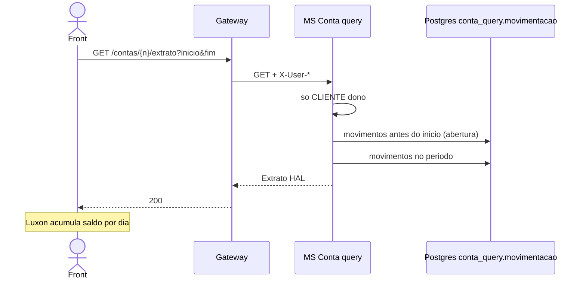

# TX-R7 — Extrato

**ID:** `TX-R7`  
**HTTPie:** [`../httpie/TX-R7-extrato.md`](../httpie/TX-R7-extrato.md)

O MS devolve **saldo de abertura + movimentações**. O front (Luxon) monta a linha do tempo **dia a dia**, inclusive dias sem movimento.

## Diagrama de sequência



## O que acontece

### 1. Front

Default: últimos 30 dias (query omitida). Máx. 365. Cores: saída vermelha / entrada azul comparando CPF logado com `origem`/`destino`. Agente: [frontend-angular.md](../.cursor/agents/frontend-angular.md).

### 2. Gateway

ACL **somente CLIENTE** para extrato ([`acl.ts`](../backend/gateway/src/auth/acl.ts) — gerente 403). Proxy para MS Conta.

### 3. Query + banco

[`ContaQueryController.extrato`](../backend/services/conta/src/main/kotlin/br/ufpr/dac/bantads/conta/query/http/ContaQueryController.kt) → [`ContaQueryService.extrato`](../backend/services/conta/src/main/kotlin/br/ufpr/dac/bantads/conta/query/http/ContaQueryService.kt):

```51:78:backend/services/conta/src/main/kotlin/br/ufpr/dac/bantads/conta/query/http/ContaQueryService.kt
    fun extrato(...): ExtratoView {
        Identity.requireClienteOwner(...)
        val (de, ate) = ExtratoRegras.periodo(inicio, fim, hoje)
        val antes = movimentacoes.findByNumeroContaAndDataHoraLessThan...
        val periodo = movimentacoes.findByNumeroContaAndDataHoraGreaterThanEqualAndDataHoraLessThan...
        return ExtratoView(
            saldoAbertura = ExtratoRegras.saldoAbertura(numero, antes),
            movimentacoes = periodo.map { it.toView() },
        )
    }
```

Regras 422: [`ExtratoRegras.kt`](../backend/services/conta/src/main/kotlin/br/ufpr/dac/bantads/conta/query/extrato/ExtratoRegras.kt).

Histórico nasceu das projeções de R4/R5/R6 e do seed ([`SeedContas`](../backend/services/conta/src/main/kotlin/br/ufpr/dac/bantads/conta/command/seed/SeedContas.kt)).

### 4. Reply

O front **não** recebe saldo consolidado por dia — calcula localmente a partir de `saldoAbertura`.

## Arquivos-chave

- [`ContaQueryService.kt`](../backend/services/conta/src/main/kotlin/br/ufpr/dac/bantads/conta/query/http/ContaQueryService.kt)  
- [`ExtratoRegras.kt`](../backend/services/conta/src/main/kotlin/br/ufpr/dac/bantads/conta/query/extrato/ExtratoRegras.kt)  
- [`ContaQueryAssembler.kt`](../backend/services/conta/src/main/kotlin/br/ufpr/dac/bantads/conta/query/http/ContaQueryAssembler.kt)
