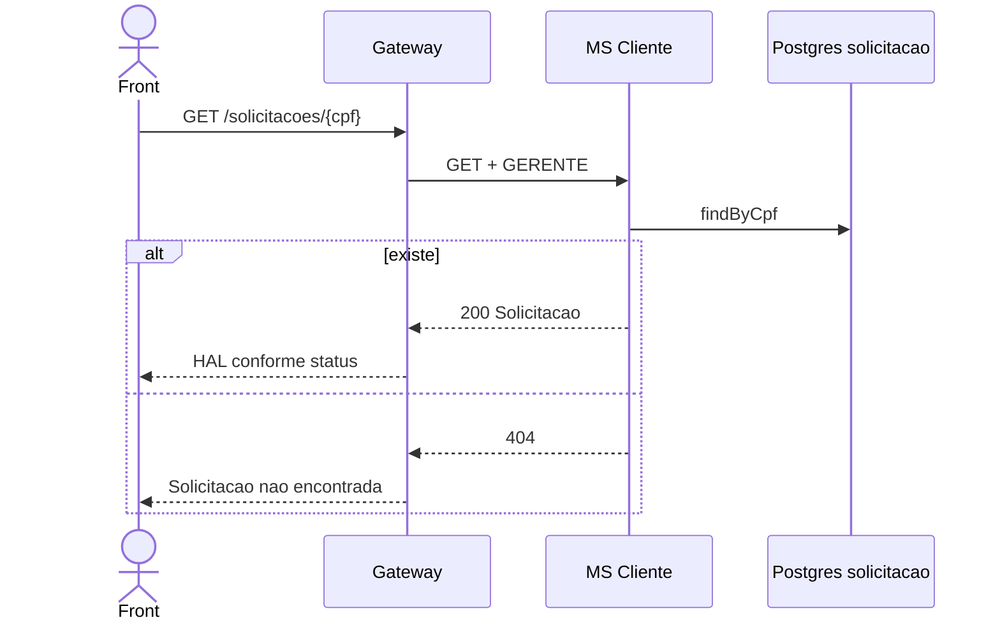

# TX-R8B — Consultar uma solicitação

**ID:** `TX-R8B`  
**HTTPie:** [`../httpie/TX-R8B-consultar-solicitacao.md`](../httpie/TX-R8B-consultar-solicitacao.md)

`GET /solicitacoes/{cpf}` — o `self` de cada linha da lista R8 e o recurso após rejeitar/aprovar (status).

## Diagrama de sequência

## O que acontece

Front segue `_links.self`. Gateway proxy. [`SolicitacaoController.obter`](../backend/services/cliente/src/main/kotlin/br/ufpr/dac/bantads/cliente/solicitacao/SolicitacaoController.kt) → [`obter`](../backend/services/cliente/src/main/kotlin/br/ufpr/dac/bantads/cliente/solicitacao/SolicitacaoService.kt). Processada: só `self`, sem botões.

No caso especial R9 (e-mail de gerente), o front recarrega esta URL e vê `NAO_APROVADA` + motivo `"E-mail já cadastrado"`.

## Arquivos-chave

- [`SolicitacaoController.kt`](../backend/services/cliente/src/main/kotlin/br/ufpr/dac/bantads/cliente/solicitacao/SolicitacaoController.kt)  
- [`SolicitacaoService.kt`](../backend/services/cliente/src/main/kotlin/br/ufpr/dac/bantads/cliente/solicitacao/SolicitacaoService.kt)
