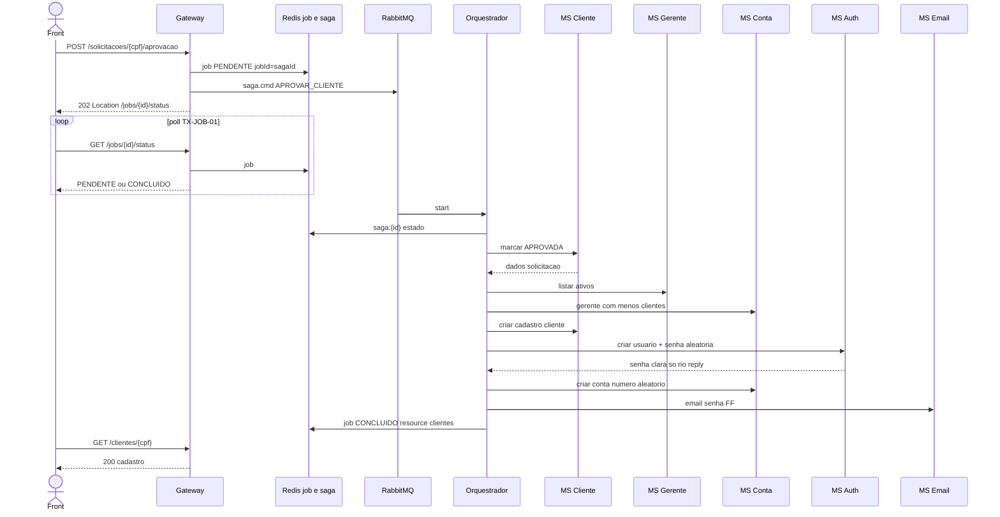

# TX-R9 — Aprovar cliente (SAGA)

**ID:** `TX-R9`  
**HTTPie:** [`../httpie/TX-R9-aprovar-cliente.md`](../httpie/TX-R9-aprovar-cliente.md)

Única transação que cria **cliente + conta aleatória + usuário Auth + e-mail da senha**. O POST do gerente retorna **202 na hora**; o trabalho corre no orquestrador.

## Diagrama de sequência



Passos canônicos: [`SagaRegistry.aprovarCliente`](../backend/services/saga/src/main/kotlin/br/ufpr/dac/bantads/saga/engine/SagaRegistry.kt).

## O que acontece

### 1. Front

Clique no rel `aprovacao`. Trata 202: polling ([TX-JOB-01](./TX-JOB-01-status.md)). `resultType=resource` → `GET /clientes/{resourceId}` ([TX-CAD-01](./TX-CAD-01-consultar-cliente.md)). Senha **não** vem no JSON; em `MAIL_DEV` está em `outbox/`.

### 2. Gateway não pré-valida PENDENTE

[`aprovacao.ts`](../backend/gateway/src/routes/aprovacao.ts):

```16:37:backend/gateway/src/routes/aprovacao.ts
  app.post('/solicitacoes/:cpf/aprovacao', async (request, reply) => {
    const jobId = randomUUID();
    await saveJob(deps.store, { jobId, status: PENDENTE, cpf: request.user?.cpf });
    await deps.publisher.publish({
      sagaId: jobId,
      tipo: CommandTypes.APROVAR_CLIENTE,
      payload: { cpf, solicitadoPorCpf: request.user?.cpf },
    });
    reply.header('Location', `/jobs/${jobId}/status`);
    return reply.code(202).send({ jobId, status: PENDENTE });
  });
```

Publicação: [`publisher.ts`](../backend/gateway/src/amqp/publisher.ts) fila `saga.cmd`.

### 3. Orquestrador

[`SagaCommandListener`](../backend/services/saga/src/main/kotlin/br/ufpr/dac/bantads/saga/amqp/SagaCommandListener.kt) → [`SagaEngine.start`](../backend/services/saga/src/main/kotlin/br/ufpr/dac/bantads/saga/engine/SagaEngine.kt): estado Redis `saga:{id}` **sem senha**; timeout 30 s por passo transacional; e-mail FF sem timeout.

Cada MS consome `ms.*.cmd` e responde `orquestrador.reply` (inbox idempotente). Compensação inversa se falhar. **E-mail duplicado no Auth:** marca solicitação `NAO_APROVADA` (não volta a PENDENTE) — [`SagaEngine`](../backend/services/saga/src/main/kotlin/br/ufpr/dac/bantads/saga/engine/SagaEngine.kt).

Sucesso: job `resource` + `DEL cache:cliente:{cpf}`:

```410:421:backend/services/saga/src/main/kotlin/br/ufpr/dac/bantads/saga/engine/SagaEngine.kt
            CommandTypes.APROVAR_CLIENTE -> {
                jobs.save(... resultType = RESOURCE, dominio = "clientes", resourceId = cpf)
                cache.deleteCliente(cpf)
            }
```

### 4. Bancos envolvidos

| Passo | Persistência |
|---|---|
| Marcar/criar cliente | Postgres `cliente.solicitacao` / `cliente.cliente` |
| Escolher gerente / criar conta | Event store + projeção `conta_query` (evento `Criado`, número aleatório) |
| Auth | Mongo `usuarios` Argon2id |
| E-mail | SMTP ou arquivo `outbox/` |

### 5. Volta ao front

O 202 inicial **não** espera a SAGA. O usuário só vê o cliente criado depois do job `CONCLUIDO` e do GET cadastral.

## Arquivos-chave

- [`aprovacao.ts`](../backend/gateway/src/routes/aprovacao.ts)  
- [`SagaRegistry.kt`](../backend/services/saga/src/main/kotlin/br/ufpr/dac/bantads/saga/engine/SagaRegistry.kt)  
- [`SagaEngine.kt`](../backend/services/saga/src/main/kotlin/br/ufpr/dac/bantads/saga/engine/SagaEngine.kt)  
- [`AuthService.criarCliente`](../backend/services/auth/src/main/kotlin/br/ufpr/dac/bantads/auth/user/AuthService.kt)  
- [`EmailCommandListener.kt`](../backend/services/email/src/main/kotlin/br/ufpr/dac/bantads/email/amqp/EmailCommandListener.kt)
